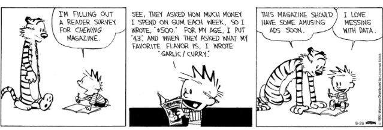
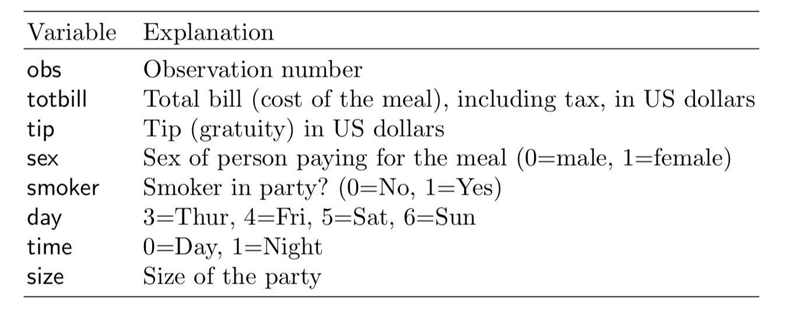

```{r, include = FALSE}
source("../setup.R")
```

## About this unit {.transition-slide .center style="text-align: center;"}

## Teaching team [1/2]{.smallest}

:::: {.columns}
::: {.column width="35%" style="font-size: 80%;"}


Di Cook <br>
*Professor* <br> 
Monash University <br>

<br>

🌐 https://dicook.org/ 

✉️ ETC5521.Clayton-x@monash.edu

🦣 @visnut@aus.social
 @visnut.bsky.social

:::

::: {.column width="65%" style="font-size: 80%;"}

* I have a PhD from Rutgers University, NJ, and a Bachelor of Science from University of New England
* I am a Fellow of the American Statistical Association, elected member of the the R Foundation and International Statistical Institute, Past-Editor of the Journal of Computational and Graphical Statistics, and the R Journal.
* My research is in data visualisation, statistical graphics and computing, with application to sports, ecology and bioinformatics. I likes to develop new methodology and software. 

* My students work on methods and software that is generally useful for the world. They have been responsible for bringing you the tidyverse suite, knitr, plotly, and many other R packages we regularly use. 

:::
::::

## Teaching team [2/2]{.smallest}

:::: {.columns}
::: {.column width="40%" style="font-size: 80%;"}


Krisanat Anukarnsakulchularp <br> 
Master of Business Analytics <br>
Monash University <br>

<br>

🌐 https://github.com/KrisanatA

✉️ ETC5521.Clayton-x@monash.edu


:::

::: {.column width="60%" style="font-size: 80%;"}

* He has a Bachelor of Actuarial Science, Monash University, 2018 - 2021
* and a Master of Business Analytics, Monash University | 2022 - 2023.
* He has published the R package [animbook](https://krisanata.github.io/animbook/)
* and is a first year PhD student at Monash, working on data structures, visualisation and models for spatiotemporal networks.
* This is his fifth semester tutoring at Monash, and the only unit working on this semester.

:::
::::

## Got a question, or a comment?

<br><br>

✋ Ask directly in live lecture.

<br><br>

💻 Post questions in the discussion forum.

<br><br>

🔡 Come to a consultation, or ask the tutor during tutorial.

💻 Ask your AI expert!

## Welcome!

:::: {.columns}
::: {.column}
### Synopsis

Beyond modelling and prediction, [data might have many more stories]{.monash-blue} to tell. Exploring data to uncover patterns and structures, involves both numerical and visual techniques designed to [reveal interesting information that may be unexpected]{.monash-blue}. However, an analyst must be cautious not to over-interpret apparent patterns, and to use [randomisation tools to assess]{.monash-blue} whether the patterns are [real or spurious]{.monash-blue}.

::: 
::: {.column width=5%}
:::

::: {.column style="font-size: 80%; width: 45%;"}

### Learning objectives

::: {.incremental}

1. [learn to use modern data exploration tools]{.monash-blue} with many different types of contemporary data to uncover interesting structures, unusual relationships and anomalies.
2. [understand how to map out]{.monash-blue} appropriate analyses for a given data set and description, define what we would expect to see in the data, and whether what we see is contrary to expectations.
3. [be able to compute null samples]{.monash-blue} in order to test apparent patterns, and to interpret the results using computational methods for statistical inference. 
4. [critically assess]{.monash-blue} the strength and adequacy of data analysis.
:::

:::
::::

## 📅 Unit Structure 

<br>

- [2 hour lecture]{.monash-blue2} 👩‍🏫 Tue 9.00 - 11:00am, CAULFIELD Building B, Room B220, *Class is more fun if you can attend in-person, I promise!*

- [1 hour workshop]{.monash-blue2} Tue 11:00am - noon, on same room. 

- [1 hour on-campus tutorial]{.monash-blue2} 🛠️
Thu 1:00-2:00pm, 2:00-3:00pm and 3:00-4:00pm  CL_Anc-19.LTB_387 *Attendance is expected - this is the chance to practice and get help with assignments from your tutor.* 

## 📚 Resources

🏡 **Course homepage**: this is where you find the course materials <br> (lecture slides, tutorials and tutorial solutions)
[https://ddde.numbat.space/](https://ddde.numbat.space/)

<br>

🈴 **Moodle**: this is where you find discussion forum, zoom links, and marks
[https://learning.monash.edu/course/view.php?id=46718](https://learning.monash.edu/course/view.php?id=46718)

<br>

🧰 **GitHub classroom look-alike**: this is where you will find assignments, but links to each will be available in moodle.

## 💯 Assessment [Part 1/2]{.smaller}

- Exercises 1 (**25%**), through GitHub classroom lookalike,  Due: Aug 21, 11:55pm. This is an individual assessment. 
<br>

- Mid-semester test (**25%**),  Scheduled Monday  Sep 7, 10:00am-noon. This is an individual assessment, to be completed IN-PERSON. 
<br>

- Project, parts 1 and 2 (**25%** each), through GitHub classroom look-alike, Due: Oct 9, 11:55pm and Oct 23, 11:55pm. This is a group assessment, but your individual contribution to the group work will be assessed, too.


## GitHub Classroom

We are going to use GitHub Classroom look-alike to distribute assignment templates and keep track of your assignment progress. 

## What does it mean to explore data?

<center>


<br>

::: {style="font-size: 60%;"}

[https://www.gocomics.com/calvinandhobbes/2015/08/26](https://www.gocomics.com/calvinandhobbes/2015/08/26)

:::

## A simple example to illustrate "exploratory data analysis" contrasted with a "confirmatory data analysis"  {.transition-slide .center}

## What are the factors that affect tipping behaviour? {background-image="https://images-na.ssl-images-amazon.com/images/I/51WO7SYkeQL._SX331_BO1,204,203,200_.jpg" background-size="18%" background-position="15% 90%"}

:::: {.columns}
::: {.column width=50% style="font-size: 70%;"}

In one restaurant, a food server recorded the following data on all customers they served during an interval of two and a half months in early 1990.

Food servers’ tips in restaurants may be influenced by many factors, including the nature of the restaurant, size of the party, and table locations in the restaurant. Restaurant managers need to know which factors matter when they assign tables to food servers.

:::

::: {.column width="50%"}

<br>

```{r}
library(tidyverse)
#tips <- read_csv("http://ggobi.org/book/data/tips.csv")
load(here::here("data/tips.rda"))
```



:::
::::

## What is tipping?

- When you're dining at a full-service restaurant
    - Tip 20 percent of your full bill.
- When you grab a cup of coffee
    - Round up or add a dollar if you’re a regular or ordered a complicated drink.
- When you have lunch at a food truck
    - Drop a few dollars into the tip jar, but a little less than you would at a dine-in spot.
- When you use a gift card
    - Tip on the total value of the meal, not just what you paid out of pocket.

<br><br>

::: {style="font-size: 70%;"}

[The basic rules of tipping that everyone should know about](https://www.washingtonpost.com/news/going-out-guide/wp/2016/09/15/tipping-can-be-complicated-these-are-the-basic-rules-you-should-know-about/)
:::

## Activity: Brainstorm your own questions {.activity-slide .center}

```{r}
#| echo: false
countdown::countdown(10)
```

Let's see what AI says we should do to analyse the tips data:

- prompt your AI, can be any free chatbot, your choice, by pointing [the tips explanation slide](https://ddde.numbat.space/week1/slides.html#/what-are-the-factors-that-affect-tipping-behaviour) and asking for 
    - questions that might be answered with this data
    - plots to make
    - models to fit
    - a plan for the analysis
    - maybe even what the expected answers to the questions?

Ideally we come up with:

- a set of questions you would want to answer with this data
- for each, what result would you **expect** to find, and why

## Recommended procedure in the book

- *Step 1*: Develop a model
    - Should the response be `tip` alone and use the total bill as a predictor?
    - Should you create a new variable `tip rate` and use this as the response?
- *Step 2*: Fit the full model with sex, smoker, day, time and size as predictors
- *Step 3*: Refine model: Should some variables should be dropped?
- *Step 4*: Check distribution of residuals
- *Step 5*: Summarise the model, if X=something, what would be the expected tip


## Step 1

Calculate tip % as tip/total bill $\times$ 100

<br>
<br>
<br>


```{r echo = TRUE}
tips <- tips |>
  mutate(tip_pct = tip/totbill * 100) 
```

<br><br>

::: { style="font-size: 70%;"}
**Note**: Creating new variables (sometimes called feature engineering), is a common step in any data analysis.
:::


## Step 2 Fit

Fit the full model with all variables

<br>
<br>

```{r echo = TRUE}
tips_lm <- tips |>
  select(tip_pct, sex, smoker, day, time, size) %>% # one place where magrittr pipe must be used!
  lm(tip_pct ~ ., data=.) 
```


## Step 2 Model summary

:::: {.columns}
::: {.column}

```{r modela, echo=TRUE, results="hide"}
library(broom)
library(kableExtra)
tidy(tips_lm) |> 
  kable(digits=2) |> 
  kable_styling() 
```

```{r modelb, echo=TRUE, results="hide"}
glance(tips_lm) |> 
  select(r.squared, statistic, 
         p.value) |> 
  kable(digits=3)
```

:::

::: {.column style="font-size: 70%;"}


```{r ref.label="modela", echo=FALSE}
```
<br>
```{r ref.label="modelb", echo=FALSE}
```


🤔 Which variable(s) would be considered important for predicting tip %?

:::
::::

## Activity: Which variables matter? {.activity-slide .center}

```{r}
#| echo: false
countdown::countdown(3)
```

Looking at the full model summary on the previous slide:

- Which coefficients would you keep?
- Which would you drop, and why?
- Compare your choice with the refined model on the next slide

## Step 3: Refine model

:::: {.columns}
::: {.column}

```{r model_smalla, echo=TRUE, results='hide'}
tips_lm <- tips |>
  select(tip_pct, size) %>% # one place where magrittr pipe must be used!
  lm(tip_pct ~ ., data=.) 
tidy(tips_lm) |> 
  kable(digits=2) |> 
  kable_styling() 
```

```{r model_smallb, echo=TRUE, results='hide'}
glance(tips_lm) |> 
  select(r.squared, statistic, p.value) |> 
  kable(digits=3)
```

:::
::: {.column style="font-size: 70%;"}
<br>
```{r ref.label="model_smalla", echo=FALSE}
```
<br>
```{r ref.label="model_smallb", echo=FALSE}
```

:::
::::


## Model summary

<br>
<br>

$$\widehat{tip %} = 18.44 - 0.92 \times size$$

::: {.fragment}

<br>
<br>

As the size of the dining party increases by one person the tip decreases by approximately 1%.
:::


## Model assessment

<br>
<br>
<br>
$R^2 = 0.02$.

::: {.fragment}

<br>
<br>
This dropped by half from the full model, even though no other variables contributed significantly to the model. It might be a good step to examine interaction terms. 


What does $R^2 = 0.02$ mean?
:::

## Model assessment

$R^2 = 0.02$ means that size explains just 2% of the variance in tip %. This is a [very weak model]{.monash-blue2}. 

::: {.fragment}

And $R^2 = 0.04$ is [also a very weak model]{.monash-blue2}.

What do the $F$ statistic and $p$-value mean?

What do the $t$ statistics and $p$-value associated with model coefficients mean?

:::

## Activity: What does R² = 0.02 tell you? {.activity-slide .center}

```{r}
#| echo: false
countdown::countdown(5)
```

In plain language (no jargon), write one or two sentences explaining what $R^2 = 0.02$ means for:

- the restaurant manager
- a food server deciding where to work

## Overall model significance

Assume that we have a random sample from a population. Assume that the model for the population is 

$$ \widehat{tip %} = \beta_0 + \beta_1 sexM + ... + \beta_7 size $$
and we have observed

$$ \widehat{tip %} = b_0 + b_1  sexM + ... + b_7 size $$
The $F$ statistic refers to 

$$ H_o: \beta_1 = ... = \beta_7 = 0 ~~ vs ~~ H_a: \text{at least one is not 0}$$
The $p$-value is the probability that we observe the given $F$ value or larger, computed assuming $H_o$ is true.


## Term significance

Assume that we have a random sample from a population. Assume that the model for the population is 

$$ \widehat{tip %} = \beta_0 + \beta_1 sexM + ... + \beta_7 size $$
and we have observed

$$ \widehat{tip %} = b_0 + b_1  sexM + ... + b_7 size $$

The $t$ statistics in the coefficient summary refer to 

$$ H_o: \beta_k = 0 ~~ vs ~~ H_a: \beta_k \neq 0 $$
The $p$-value is the probability that we observe the given $t$ value or more extreme, computed assuming $H_o$ is true.


## Model diagnostics (MD)

Normally, the final model summary would be accompanied diagnostic plots

- [observed vs fitted values]{.monash-blue2} to check strength and appropriateness of the fit
- [univariate plot, and normal probability plot, of residuals]{.monash-blue2} to check for normality
- in the simple final model like this, the [observed vs predictor]{.monash-blue2}, with model overlaid would be advised to assess the model relative to the variability around the model
- when the final model has more terms, using a [partial dependence plot]{.monash-blue2} to check the relative relationship between the response and predictors would be recommended.


## Residual plots

:::: {.columns}
::: {.column}

```{r res_hist, echo=TRUE, fig.show='hide'}
tips_aug <- augment(tips_lm)
ggplot(tips_aug, 
    aes(x=.resid)) + 
  geom_histogram() +
  xlab("residuals") 
```

:::

::: {.column}
```{r res_hist2, ref.label="res_hist", echo=FALSE}
```
:::
::::


## Residual normal probability plots

:::: {.columns}
::: {.column}

```{r res_qq, echo=TRUE, fig.show='hide'}
ggplot(tips_aug, 
    aes(sample=.resid)) + 
  stat_qq() +
  stat_qq_line() +
  xlab("residuals") +
  theme(aspect.ratio=1)
```

:::
::: {.column}
```{r res_qq2, ref.label="res_qq", echo=FALSE}
```
:::
::::

## Fitted vs observed

:::: {.columns}
::: {.column}

```{r obs_fitted, echo=TRUE, fig.show='hide'}
ggplot(tips_aug, 
    aes(x=.fitted, y=tip_pct)) + 
  geom_point() +
  geom_smooth(method="lm", se=FALSE) +
  xlab("observed") +
  ylab("fitted")
```

:::
::: {.column}

```{r obs_fitted2, ref.label="obs_fitted", echo=FALSE}
```
:::
::::

## "Model-in-the-data-space"

:::: {.columns}
::: {.column}

```{r fitted_model, echo=TRUE, fig.show='hide'}
ggplot(tips_aug, 
    aes(x=size, y=tip_pct)) + 
  geom_point() +
  geom_smooth(method="lm", se=FALSE) +
  ylab("tip %")
```

::: {.info}
The fitted model is overlaid on a plot of the data. This is called "model-in-the-data-space" ([Wickham et al, 2015](https://doi.org/10.1002/sam.11271)).
:::

All the plots on the previous three slides: [histogram of residuals, normal probability plot, fitted vs residuals]{.monash-orange2} are considered to be ["data-in-the-model-space"]{.monash-orange2}. *Stay tuned for more discussion on this later.*

:::

::: {.column}
```{r fitted_model2, ref.label="fitted_model", echo=FALSE}
```

:::
::::

## {background-image="images/receipt.png" background-size="30%" background-position="90% 90%"}

:::: {.columns}
::: {.column width="60%"}
The result of this work might leave us with

<br>

**a model that could be used to impose a dining/tipping policy in restaurants** (see [here](https://travel.stackexchange.com/questions/40543/can-i-refuse-to-pay-auto-gratuity-in-a-restaurant))

::: {.fragment}

<br>


but it should also leave us with an [unease]{.monash-orange2} that this policy is based on [weak support]{.monash-orange2}.

:::
:::
::::

## Summary

:::: {.columns}
::: {.column}

::: {.info}
Plots as we have just seen, associated with pursuit of an answer to a specific question may be best grouped into the category of "model diagnostics (MD)".  
:::

There are additional categories of plots for data analysis that include [initial data analysis (IDA)]{.monash-blue2}, [descriptive statistics]{.monash-blue2}. Stay tuned for more on these.


:::
::: {.column}

::: {.fragment}

A separate and big area for plots of data is for communication, where we already know what is in the data and we want to communicate the information as best possible. 

::: {.info}
When exploring data, we are using data plots to discover things we **didn't already know**. 
:::

:::
:::
::::

## What did this analysis miss? {.transition-slide .center style="text-align: center;"}

## General strategy for EXPLORING DATA

:::: {.columns}
::: {.column}

It's a good idea to examine the data description, the explanation of the variables, and how the data was collected. 

You need to know what [type of variables]{.monash-blue2} are in the data in order to decide appropriate choice of plots, and calculations to make. 

Data description should have information about [data collection methods]{.monash-blue2}, so that the extent of what we learn from the data might apply to new data. 

:::
::: {.column}

::: {.fragment}


What does that look like here?

```{r}
#| echo: false
options(width = 50)
```

```{r}
glimpse(tips)
```

::: {.smaller}
Look at the distribution of [quantitative]{.monash-orange2} variables tips, total bill.
:::

:::

::: {.fragment .smaller}

Examine the distributions across [categorical]{.monash-orange2} variables.

:::

::: {.fragment .smaller}

Examine [quantitative]{.monash-orange2} variables relative to [categorical]{.monash-orange2} variables

:::
:::
::::

## Distributions of tips

:::: {.columns}
::: {.column}

```{r tips_hist, echo=TRUE, fig.show='hide'}
ggplot(tips, 
    aes(x=tip)) + 
  geom_histogram(
    colour="white")  
```
:::
::: {.column}
```{r tips_hist2, ref.label="tips_hist", echo=FALSE}
```
:::
::::

## Activity: Predict the next histogram {.activity-slide .center}

```{r}
#| echo: false
countdown::countdown(3)
```

Before the next slide, sketch what you expect the histogram of `tip` to look like with a much larger or much narrower binwidth (e.g. 10 cent bins).

- Will it still look skewed?
- Will any new features appear?

## Because, one binwidth is never enough ... {.center}

## Distributions of tips

:::: {.columns}
::: {.column}

```{r tips_hist_fat, echo=TRUE, fig.show='hide'}
ggplot(tips, 
    aes(x=tip)) +
  geom_histogram(
    breaks=seq(0.5,10.5,1),  
    colour="white") + 
  scale_x_continuous(
    breaks=seq(0,11,1))
```

[Big fat bins.]{.monash-orange2} Tips are skewed, which means most tips are relatively small.

:::
::: {.column}
```{r tips_hist_fat2, ref.label="tips_hist_fat", echo=FALSE}
```
:::
::::

## Distributions of tips

:::: {.columns}
::: {.column}

```{r tips_hist_skinny, echo=TRUE, fig.show='hide'}
ggplot(tips, 
    aes(x=tip)) + 
  geom_histogram(
    breaks=seq(0.5,10.5,0.1), 
    colour="white") +
  scale_x_continuous(
    breaks=seq(0,11,1))
```

[Skinny bins.]{.monash-orange2} Tips are multimodal, and occurring at the full dollar and 50c amounts.

:::
::: {.column}
```{r tips_hist_skinny2, ref.label="tips_hist_skinny", echo=FALSE}
```

:::
::::

## We could also look at total bill this way {.center}

but I've already done this, and we don't learn anything more about the multiple peaks than waht is learned by plotting tips.

## Relationship between tip and total

:::: {.columns}
::: {.column}

```{r tips_tot, echo=TRUE, fig.show='hide'}
p <- ggplot(tips, 
    aes(x= totbill, y=tip)) + 
  geom_point() + 
  scale_y_continuous(
    breaks=seq(0,11,1))
p
```

Why is total on the x axis?
<br>

Should we add a guideline?

:::
::: {.column}

```{r tips_tot_b, ref.label="tips_tot", echo=FALSE}
```

:::
::::


## Add a guideline indicating common practice

:::: {.columns}
::: {.column}

```{r tips_tot2, echo=TRUE, fig.show='hide'}
p <- p + geom_abline(intercept=0, 
              slope=0.2) + 
  annotate("text", x=45, y=10, 
           label="20% tip") 
p
```

::: {.fragment}

<br><br>

- Most tips less than 20%: Skin flints vs generous diners
- A couple of big tips
- Banding horizontally is the rounding seen previously
:::

:::
::: {.column}

```{r tips_tot2b, ref.label="tips_tot2", echo=FALSE}
```
:::
::::

## Activity: Read the scatterplot {.activity-slide .center}

```{r}
#| echo: false
countdown::countdown(5)
```


Looking at tip vs total bill with the 20% guideline:

- Describe the pattern in one sentence
- Identify anything that surprises you
- What would you check next?

## We should examine bar charts and mosaic plots of the categorical variables next {.center}

but I've already done that, and there's not too much of interest there.

## Relative to categorical variables

:::: {.columns}
::: {.column width="70%"}

```{r tips_sexsmoke, echo=TRUE, fig.show='hide'}
p + facet_grid(smoker~sex) 
```

```{r tips_sexsmokeb, ref.label="tips_sexsmoke", echo=FALSE, fig.width=9, fig.height=6, out.width="100%"}
```
:::
::: {.column width="30%" .fragment}

- The bigger bills tend to be paid by men (and females that smoke).
- Except for three diners, female non-smokers are very consistent tippers, probably around 15-18% though.
- The variability in the smokers is much higher than for the non-smokers.

:::
::::

## Isn't this interesting? {.transition-slide .center style="text-align: center;"}

## Procedure of EDA

- We gained a wealth of insight in a short time. 
- Using nothing but graphical methods we investigated univariate, bivariate, and multivariate relationships. 
- We found both global features and local detail. We saw that 
    - tips were rounded; then we saw the obvious  
    - correlation between the tip and the size of the bill, noting the scarcity of generous tippers; finally we 
    - discovered differences in the tipping behavior of male and female smokers and non-smokers.

[These are unexpected insights]{.monash-orange2} were missed from the analysis that focused solely on the primary question.

## Activity: What else would you explore? {.activity-slide .center}

```{r}
#| echo: false
countdown::countdown(5)
```


The tips analysis uncovered rounding, weak bill/tip correlation, and gender/smoking differences.

- List two more questions this data could still answer
- What additional data (if any) would you want to collect?

## What can go wrong? {.transition-slide .center  style="text-align: center;"}

## How was data collected?

:::: {.columns}
::: {.column}
*In one restaurant, a food server recorded the following data on all customers they served during an interval of two and a half months in early 1990.*
:::
::: {.column}
How much can you [infer about tipping more broadly]{.monash-blue2}?

::: {.fragment}
- Tip has a weak but significant relationship with total bill?
- Tips have a skewed distribution? (More small tips and fewer large tips?)
- Tips tend to be made in nice round numbers.
- People generally under-tip?
- Smokers are less reliable tippers.
:::

:::
::::

## Ways to verify, support or refute generalisations

:::: {.columns}
::: {.column}
- external information
- other studies/samples
- good choice of calculations and plots
- all the permutations and subsets of measured variables
- computational re-sampling methods (we'll see these soon)
:::

::: {.column}

::: {.info}
Poor data collection methods affects every analysis, including statistical or computational modeling.
:::

<br><br>

For this waiter and the restaurant manager, there is some useful information. Like what? 

::: {.fragment style="font-size: 70%;"}
- Service fee for smokers to ensure consistency?
- Assign waiter to variety of party sizes and composition.
- Shifts on different days or time of day (not shown).
:::

:::
::::

## Activity: How do we check our findings? {.activity-slide .center}

```{r}
#| echo: false
countdown::countdown(8)
```


Pick a claim: *"Smokers are less reliable tippers."* Discuss with each other

- how would you verify this finding? 
- can you check the claim using the current sample of data?

## Words of wisdom {.transition-slide .center}

*False discovery* is the lesser danger when compared to non-discovery. **Non-discovery** is the failure to identify meaningful structure, and it may result in false or incomplete modeling. In a healthy scientific enterprise, the **fear of non-discovery** should be at least as great as the *fear of false discovery*.

## Guide

:::: {.columns}
::: {.column .incremental}
1. Read the data description to understand the context, and the extent of the data collection. 
2. Understand the types of variables that have been measured.
3. Brainstorm a set of questions that might be interesting to answer with this data.
4. For each of your question, write down what you EXPECT to find.
5. Map out the possible plots and numerical summaries to make, that could be made, but particularly, what needs to be computed in order to answer the questions. 
:::

::: {.column .incremental}
6. What potential errors might be in the data? Missing values, not recorded data, errors in coding, and think about the strategy to deal with them.
7. Start on your analysis. Think about the results suggested and whether they match or contradict what you expected.
8. Use randomisation methods to learn whether what you have observed is possibly spurious.
9. Communicate findings.
:::
::::

## Topics to be covered

- Methods for single, bivariate, multivariate
    - numerical variables
    - categorical variables
- Methods to accommodate temporal and spatial (maybe also networks) context
- How to make effective comparisons
- Utilising computational methods to assess what you see is "real"

## Resources

- Cook and Swayne (2007) Interactive and Dynamic Graphics for Data Analysis, [Introduction](http://ggobi.org/book/intro.pdf)
- Donoho (2017) [50 Years of Data Science](https://www.tandfonline.com/doi/full/10.1080/10618600.2017.1384734)
- Staniak and Biecek (2019) [The Landscape of R Packages for Automated Exploratory Data Analysis](https://arxiv.org/pdf/1904.02101.pdf)
