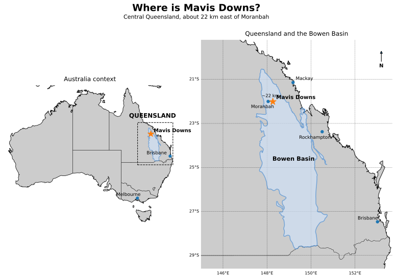
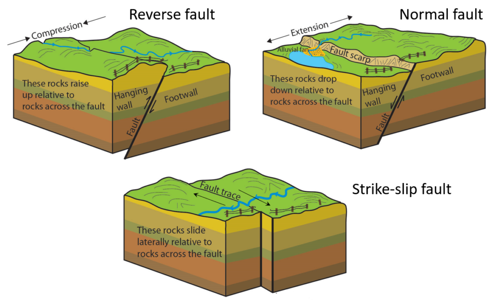

```{r}
#| label: setup
#| code-fold: true
#| include: false

source("../setup.R")

knitr::opts_chunk$set(warning = FALSE, message = FALSE)

library(sf)
library(ggplot2)
library(dplyr)
library(gstat)

# -----------------------------------------------------------------------------
# Project structure
# -----------------------------------------------------------------------------
data_root <- "../data"

all_data_files <- list.files(
  data_root,
  recursive = TRUE,
  full.names = TRUE
)

find_data_file <- function(filename) {
  hits <- all_data_files[basename(all_data_files) == filename]

  if (length(hits) == 0) {
    stop("Could not find required file under ../data: ", filename)
  }

  if (length(hits) > 1) {
    stop(
      "Found more than one copy of ", filename,
      " under ../data. Keep only one copy or specify the path explicitly."
    )
  }

  hits[[1]]
}

# -----------------------------------------------------------------------------
# Teaching data
# -----------------------------------------------------------------------------
teaching_data <- read.csv(
  find_data_file("synthetic_l_seam_rc_v4.csv"),
  check.names = FALSE
)

required_columns <- c(
  "Borehole_Name", "Easting", "Northing",
  "Ash_ad_pct", "RD_is", "Seam"
)

missing_columns <- setdiff(required_columns, names(teaching_data))

if (length(missing_columns) > 0) {
  stop(
    "synthetic_l_seam_rc_v4.csv is missing required column(s): ",
    paste(missing_columns, collapse = ", ")
  )
}

# AGD84 / AMG Zone 55
target_crs <- 20355

boreholes <- st_as_sf(
  teaching_data,
  coords = c("Easting", "Northing"),
  crs = target_crs,
  remove = FALSE
)

# Ordered ash classes for mapping.
# Keep categorical mapping for readability and direct comparison between maps,
# but split the upper tail so the very high fault-associated observation does
# not disappear inside one broad >=15% class.
ash_breaks <- c(-Inf, 10, 11, 12, 13, 14, 15, 18, Inf)
ash_labels <- c(
  "<10%", "10-<11%", "11-<12%", "12-<13%",
  "13-<14%", "14-<15%", "15-<18%", "≥18%"
)
ash_palette <- c(
  "<10%" = "#2166AC",
  "10-<11%" = "#4393C3",
  "11-<12%" = "#92C5DE",
  "12-<13%" = "#FEE090",
  "13-<14%" = "#FDAE61",
  "14-<15%" = "#F46D43",
  "15-<18%" = "#D73027",
  "≥18%" = "#7F0000"
)

boreholes <- boreholes |>
  mutate(
    ash_class = cut(
      Ash_ad_pct,
      breaks = ash_breaks,
      labels = ash_labels,
      include.lowest = TRUE,
      right = FALSE,
      ordered_result = TRUE
    )
  )

# -----------------------------------------------------------------------------
# Spatial context
# -----------------------------------------------------------------------------
leases <- st_read(
  find_data_file("MLpermitgranted_wkid_GDA94MGAZone55.shp"),
  quiet = TRUE
) |>
  st_transform(target_crs)

domain_faults <- st_read(
  find_data_file("mav_lu_sr_domain_faults.shp"),
  quiet = TRUE
) |>
  st_zm(drop = TRUE) |>
  st_transform(target_crs)

seismic_faults <- st_read(
  find_data_file("mav_lu_sr_3dseis_faults.shp"),
  quiet = TRUE
) |>
  st_zm(drop = TRUE) |>
  st_transform(target_crs)

point_bbox <- st_bbox(boreholes)
map_buffer <- 450

map_xlim <- c(
  unname(point_bbox["xmin"]) - map_buffer,
  unname(point_bbox["xmax"]) + map_buffer
)

map_ylim <- c(
  unname(point_bbox["ymin"]) - map_buffer,
  unname(point_bbox["ymax"]) + map_buffer
)

map_window <- st_as_sfc(
  st_bbox(
    c(
      xmin = map_xlim[1],
      xmax = map_xlim[2],
      ymin = map_ylim[1],
      ymax = map_ylim[2]
    ),
    crs = st_crs(target_crs)
  )
)

leases_plot <- suppressWarnings(st_crop(leases, st_bbox(map_window)))
domain_faults_plot <- suppressWarnings(st_crop(domain_faults, st_bbox(map_window)))
seismic_faults_plot <- suppressWarnings(st_crop(seismic_faults, st_bbox(map_window)))

# -----------------------------------------------------------------------------
# Sampling-pattern comparison
# -----------------------------------------------------------------------------
# Compare the observed drilling with an idealised, regularly spaced reference
# pattern inside the same convex hull. The reference grid is not a proposed
# drilling design; it is a visual baseline for recognising clustering, gaps,
# preferred directions and uneven coverage in the observed drilling.
sampling_hull <- boreholes |>
  st_union() |>
  st_convex_hull()

sampling_hull_sf <- st_sf(geometry = sampling_hull)

# Choose square-grid spacing so the reference pattern has approximately the
# same point density as the observed 90-hole program, then retain only grid
# centres that fall within the observed drilling footprint.
reference_spacing <- sqrt(
  as.numeric(st_area(sampling_hull)) / nrow(boreholes)
)

regular_sampling_points <- st_make_grid(
  sampling_hull_sf,
  cellsize = reference_spacing,
  what = "centers",
  square = TRUE
)

regular_sampling_sf <- st_sf(
  Pattern = "Regular reference pattern",
  geometry = regular_sampling_points
) |>
  st_filter(sampling_hull_sf, .predicate = st_within)

observed_sampling_sf <- boreholes |>
  select(geometry) |>
  mutate(Pattern = "Observed drilling")

sampling_comparison_sf <- rbind(
  observed_sampling_sf,
  regular_sampling_sf
)

sampling_comparison_sf$Pattern <- factor(
  sampling_comparison_sf$Pattern,
  levels = c("Observed drilling", "Regular reference pattern")
)

# -----------------------------------------------------------------------------
# Shared plotting helpers
# -----------------------------------------------------------------------------
map_background_layers <- function() {
  list(
    geom_sf(
      data = leases_plot,
      fill = "grey98",
      colour = NA
    )
  )
}

map_overlay_layers <- function() {
  list(
    geom_sf(
      data = leases_plot,
      fill = NA,
      colour = "grey70",
      linewidth = 0.5
    ),
    geom_sf(
      data = domain_faults_plot,
      fill = NA,
      colour = "black",
      linewidth = 0.9
    ),
    geom_sf(
      data = seismic_faults_plot,
      fill = NA,
      colour = "grey30",
      linewidth = 0.45,
      linetype = "dashed"
    )
  )
}

context_layers <- function() {
  c(map_background_layers(), map_overlay_layers())
}

map_theme <- theme_bw(base_size = 12) +
  theme(
    panel.grid.major = element_line(colour = "grey90", linewidth = 0.3),
    panel.grid.minor = element_blank(),
    legend.position = "right"
  )

# Consistent styling for all diagnostic boxplots
boxplot_fill <- "#A6CEE3"
boxplot_width <- 0.28
flag_colour <- "red4"

# -----------------------------------------------------------------------------
# Conventional EDA helpers
# -----------------------------------------------------------------------------
ash_q1 <- quantile(boreholes$Ash_ad_pct, 0.25)
ash_q3 <- quantile(boreholes$Ash_ad_pct, 0.75)
ash_iqr <- ash_q3 - ash_q1
lower_fence <- ash_q1 - 1.5 * ash_iqr
upper_fence <- ash_q3 + 1.5 * ash_iqr

conventional_outliers <- boreholes |>
  filter(Ash_ad_pct < lower_fence | Ash_ad_pct > upper_fence) |>
  arrange(desc(Ash_ad_pct))

main_boxplot_outlier <- if (nrow(conventional_outliers) > 0) {
  conventional_outliers$Borehole_Name[1]
} else {
  NA_character_
}

# -----------------------------------------------------------------------------
# Variogram helpers
# -----------------------------------------------------------------------------
make_variogram <- function(data_sf, lag_width = 250, cutoff = 3000) {
  gstat::variogram(
    Ash_ad_pct ~ 1,
    data = data_sf,
    cutoff = cutoff,
    width = lag_width
  )
}

fit_variogram_bundle <- function(data_sf, lag_width = 250, cutoff = 3000) {
  empirical <- make_variogram(data_sf, lag_width = lag_width, cutoff = cutoff)

  sample_var <- stats::var(data_sf$Ash_ad_pct, na.rm = TRUE)
  initial_model <- gstat::vgm(
    psill = max(sample_var * 0.65, 0.1),
    model = "Sph",
    range = max(cutoff / 3, lag_width * 2),
    nugget = max(sample_var * 0.25, 0.05)
  )

  fitted_model <- try(
    gstat::fit.variogram(empirical, initial_model, fit.method = 2),
    silent = TRUE
  )

  if (inherits(fitted_model, "try-error") || anyNA(fitted_model$psill)) {
    fitted_model <- initial_model
  }

  fitted_model$psill <- pmax(fitted_model$psill, 0)

  if ("Nug" %in% fitted_model$model) {
    nugget <- fitted_model$psill[fitted_model$model == "Nug"][1]
  } else {
    nugget <- 0
  }

  partial_sill <- sum(fitted_model$psill[fitted_model$model != "Nug"])
  total_sill <- nugget + partial_sill
  range_value <- max(fitted_model$range[fitted_model$model != "Nug"], na.rm = TRUE)

  nugget_pct <- if (total_sill > 0) 100 * nugget / total_sill else NA_real_
  structured_pct <- if (total_sill > 0) 100 * partial_sill / total_sill else NA_real_

  stats_tbl <- tibble::tibble(
    Nugget = round(nugget, 2),
    `Partial sill` = round(partial_sill, 2),
    `Total sill` = round(total_sill, 2),
    `Range (m)` = round(range_value, 0),
    `Nugget / sill (%)` = round(nugget_pct, 0),
    `Spatially structured (%)` = round(structured_pct, 0)
  )

  list(
    empirical = empirical,
    model = fitted_model,
    stats = stats_tbl
  )
}

plot_variogram <- function(bundle, title_text) {
  model_line <- gstat::variogramLine(
    bundle$model,
    maxdist = max(bundle$empirical$dist, na.rm = TRUE),
    n = 300
  )

  stats_label <- paste0(
    "Nugget = ", bundle$stats$Nugget,
    " | Total sill = ", bundle$stats$`Total sill`,
    " | Range = ", bundle$stats$`Range (m)`, " m",
    " | Structured = ", bundle$stats$`Spatially structured (%)`, "%"
  )

  ggplot(bundle$empirical, aes(x = dist, y = gamma)) +
    geom_point(
      shape = 21,
      size = 2.8,
      stroke = 0.35,
      fill = "#2C7BB6",
      colour = "white"
    ) +
    geom_line(
      data = model_line,
      aes(x = dist, y = gamma),
      inherit.aes = FALSE,
      colour = "#D7191C",
      linewidth = 1.0
    ) +
    labs(
      title = title_text,
      subtitle = stats_label,
      x = "Lag distance (m)",
      y = "Semivariance"
    ) +
    theme_bw(base_size = 12) +
    theme(
      panel.grid.major = element_line(colour = "grey90", linewidth = 0.3),
      panel.grid.minor = element_blank()
    )
}

# -----------------------------------------------------------------------------
# Prediction helpers
# -----------------------------------------------------------------------------
# The surface is evaluated on a regular grid and then masked to a buffered
# convex hull around the drilling. The important plotting detail is that the
# lease fill is drawn BEFORE the surface, with only lease/fault outlines drawn
# over it. Otherwise the lease polygons hide the kriging surface.
grid_cellsize <- 75

study_area <- boreholes |>
  st_union() |>
  st_convex_hull() |>
  st_buffer(300)

prediction_xy <- expand.grid(
  X = seq(map_xlim[1], map_xlim[2], by = grid_cellsize),
  Y = seq(map_ylim[1], map_ylim[2], by = grid_cellsize)
)

prediction_grid_all <- st_as_sf(
  prediction_xy,
  coords = c("X", "Y"),
  crs = target_crs,
  remove = FALSE
)

inside_study_area <- lengths(st_intersects(prediction_grid_all, study_area)) > 0
prediction_grid_points <- prediction_grid_all[inside_study_area, ]

run_kriging <- function(data_sf, model) {
  kr_points <- gstat::krige(
    Ash_ad_pct ~ 1,
    locations = data_sf,
    newdata = prediction_grid_points,
    model = model
  )

  xy <- st_coordinates(kr_points)

  result <- cbind(
    st_drop_geometry(kr_points),
    X = xy[, 1],
    Y = xy[, 2],
    kriging_se = sqrt(pmax(kr_points$var1.var, 0))
  )

  result$pred_ash_class <- cut(
    result$var1.pred,
    breaks = ash_breaks,
    labels = ash_labels,
    include.lowest = TRUE,
    right = FALSE,
    ordered_result = TRUE
  )

  result
}

# -----------------------------------------------------------------------------
# Spatial anomaly diagnostic: nearest-neighbour leave-one-out residuals
# -----------------------------------------------------------------------------
# For anomaly screening we deliberately use only the single nearest neighbour.
# The question is not "what is the best interpolator?" but "is this hole very
# different from the closest local support available to it?" This is a
# deliberately sensitive EDA screen, not a formal hypothesis test.
loocv_idw <- function(data_sf, nmax = 1, idp = 2) {
  distance_matrix <- units::drop_units(st_distance(data_sf))
  diag(distance_matrix) <- Inf

  results <- lapply(seq_len(nrow(data_sf)), function(i) {
    train_sf <- data_sf[-i, ]
    test_sf <- data_sf[i, ]

    pred <- NULL
    invisible(capture.output(
      pred <- suppressWarnings(
        gstat::idw(
          Ash_ad_pct ~ 1,
          locations = train_sf,
          newdata = test_sf,
          nmax = nmax,
          idp = idp
        )
      )
    ))

    nearest_index <- which.min(distance_matrix[i, ])

    data.frame(
      Borehole_Name = data_sf$Borehole_Name[i],
      observed = data_sf$Ash_ad_pct[i],
      nearest_neighbor = data_sf$Borehole_Name[nearest_index],
      nearest_distance_m = distance_matrix[i, nearest_index],
      predicted = pred$var1.pred[1],
      residual = data_sf$Ash_ad_pct[i] - pred$var1.pred[1]
    )
  })

  bind_rows(results)
}

loocv_results <- loocv_idw(boreholes, nmax = 1, idp = 2)

# Robust residual standardisation. R's mad() returns a robust estimate of
# standard deviation after multiplying the median absolute deviation by 1.4826.
cv_resid_center <- median(loocv_results$residual, na.rm = TRUE)
cv_resid_scale <- stats::mad(
  loocv_results$residual,
  center = cv_resid_center,
  constant = 1.4826,
  na.rm = TRUE
)

if (!is.finite(cv_resid_scale) || cv_resid_scale == 0) {
  cv_resid_scale <- sd(loocv_results$residual, na.rm = TRUE)
}

spatial_flag_threshold <- 2.0

loocv_results <- loocv_results |>
  mutate(
    robust_z = (residual - cv_resid_center) / cv_resid_scale,
    spatial_flag = abs(robust_z) >= spatial_flag_threshold
  )

spatial_cv_outliers <- loocv_results |>
  filter(spatial_flag) |>
  arrange(desc(abs(robust_z)))

spatial_cv_outliers_sf <- boreholes |>
  filter(Borehole_Name %in% spatial_cv_outliers$Borehole_Name) |>
  left_join(
    spatial_cv_outliers |>
      select(Borehole_Name, observed, nearest_neighbor, nearest_distance_m, predicted, residual, robust_z),
    by = "Borehole_Name"
  )

# -----------------------------------------------------------------------------
# Exact IDW diagnostic surface
# -----------------------------------------------------------------------------
# IDW is used here as an EDA visualisation, not as the final prediction model.
# It is exact at observations and therefore deliberately exposes local
# sample influence and "bullseye" behaviour that kriging tends to smooth.
run_idw_surface <- function(data_sf, idp = 2, nmax = 8) {
  idw_points <- NULL
  invisible(capture.output(
    idw_points <- suppressWarnings(
      gstat::idw(
        Ash_ad_pct ~ 1,
        locations = data_sf,
        newdata = prediction_grid_points,
        idp = idp,
        nmax = nmax
      )
    )
  ))

  xy <- st_coordinates(idw_points)

  result <- cbind(
    st_drop_geometry(idw_points),
    X = xy[, 1],
    Y = xy[, 2]
  )

  result$idw_ash_class <- cut(
    result$var1.pred,
    breaks = ash_breaks,
    labels = ash_labels,
    include.lowest = TRUE,
    right = FALSE,
    ordered_result = TRUE
  )

  result
}

idw_plot_data <- run_idw_surface(boreholes, idp = 2, nmax = 8)

# Use the conventional high outlier as the fault-related modelling case.
focus_anomaly_name <- main_boxplot_outlier

# Pre-computed default variogram bundles for solution text and comparison.
default_bundle_with_high <- fit_variogram_bundle(boreholes, lag_width = 250, cutoff = 3000)
default_bundle_without_high <- fit_variogram_bundle(
  boreholes |>
    filter(Borehole_Name != focus_anomaly_name),
  lag_width = 250,
  cutoff = 3000
)

variogram_comparison <- bind_rows(
  default_bundle_with_high$stats |>
    mutate(Model = "High value retained"),
  default_bundle_without_high$stats |>
    mutate(Model = "High value excluded")
) |>
  select(Model, everything())

# -----------------------------------------------------------------------------
# Candidate sites for the final six-hole selection
# -----------------------------------------------------------------------------
candidate_sites <- data.frame(
  Site = LETTERS[1:12],
  Easting = c(633650, 633700, 633050, 631900, 632550, 630950,
              632150, 631050, 630350, 632900, 631950, 629900),
  Northing = c(7565400, 7564350, 7563000, 7565150, 7564700, 7563950,
               7566800, 7566950, 7565850, 7566100, 7563600, 7566750),
  Target_type = c(
    "Down-dip step-out",
    "Down-dip step-out",
    "Southern infill / edge candidate near mapped fault",
    "Internal infill",
    "Near-fault candidate",
    "Statistically attractive but geologically invalid",
    "Down-dip / northern step-out",
    "Northern down-dip infill",
    "Western internal infill",
    "Close north-eastern infill",
    "Redundant internal infill",
    "Northern continuity / infill"
  ),
  Lecturer_assessment = c(
    "Strong", "Strong", "Conditional - fault proximity", "Strong",
    "Lower priority - fault proximity", "Reject on geology", "Strong",
    "Strong to moderate", "Lower priority - on mapped fault", "Deliberately weak",
    "Deliberately weak", "Moderate"
  ),
  Why_consider = c(
    "Extends down-dip coverage into sparse drilling and tests continuation of the regional trend.",
    "Fills an eastern gap while still acting as a down-dip step-out; useful for trend definition.",
    "Adds useful southern infill/edge support where coverage is weaker, but the fixed location is only about 8 m from a mapped fault.",
    "Provides strong internal infill where kriging standard error remains relatively high despite otherwise reasonable drill coverage.",
    "Could only be justified if resolving very local structural behaviour were an explicit objective.",
    "Looks statistically attractive because it occupies an apparent support gap and may have high model uncertainty if geology is ignored.",
    "Extends support into the sparse northern-eastern area and tests regional continuity.",
    "Fills the broad northern gap between L and G and adds a sensible down-dip infill point within the interpreted coal-bearing side of the deposit.",
    "Adds local support within the western part of the corridor, but the fixed location is placed directly on a mapped fault.",
    "Could refine a local north-eastern area if a specific operational/geological question existed.",
    "Could add another local data point within the established corridor if there were a specific operational reason to drill there.",
    "Tests northern continuity and provides some additional infill support."
  ),
  Why_not = c(
    "Step-out risk is greater than for internal infill; value depends on whether extending down dip is a priority.",
    "Still a step-out, so some uncertainty is exploration risk rather than merely a gap to fill.",
    "The fixed site is only about 8 m from a mapped fault. For coal-quality drilling this adds structural uncertainty; it would be a much stronger southern infill candidate if moved farther from the fault.",
    "It is an infill rather than a footprint-extension hole, but the relatively high kriging error in this locally well-drilled area makes it a strong candidate for reducing internal prediction uncertainty.",
    "It is close to existing drilling and faulting, so it is weak for regional coal-quality coverage and may introduce additional structural uncertainty.",
    "Reject: it lies west of the western bounding fault, where the L seam has cropped out and the target coal is not expected to exist. This is the deliberate example of a statistically attractive but geologically meaningless target.",
    "Can be higher-risk than infill because it extends beyond dense support into a sparse area.",
    "It is useful down-dip infill rather than a major new step-out, so it may add less new footprint than A, B or G if pure extension is the priority.",
    "Existing western support is already comparatively good, and the site is directly on a mapped fault. For this coal-quality program the fault proximity adds another source of uncertainty, making it lower priority than cleaner infill or step-out options.",
    "Very close to existing support; deliberately included as a tempting but spatially redundant option.",
    "Poor choice for this exercise: it sits in an already well-covered area and is not close enough to the mapped fault to justify the redundancy as a fault-definition hole.",
    "Useful but competes with stronger eastern/down-dip and internal-gap targets for a limited six-hole budget."
  ),
  dx = c(90, 90, 90, -110, 90, -90, 0, 0, -90, 90, -90, 0),
  dy = c(105, 95, -110, 105, -110, 95, 110, 115, 95, 95, -110, 110)
) |>
  mutate(
    label_x = Easting + dx,
    label_y = Northing + dy
  )

candidate_sites_sf <- st_as_sf(
  candidate_sites,
  coords = c("Easting", "Northing"),
  crs = target_crs,
  remove = FALSE
)
```

# 🎯 Tutorial objective

You are part of a resource geology team reviewing exploration drilling at the **Mavis Downs** coal deposit in Queensland's Bowen Basin. The original case study is based on publicly available pre-mining exploration data. For this tutorial, the real spatial/geological setting has been retained, but the drilling dataset has been expanded and coal-quality values have been modified to create a controlled teaching example.

The task is deliberately practical:

> **You have funding for only six additional drill holes. Where would you drill them, and why?**

You will not write a geostatistical workflow from scratch. Run the supplied code, inspect the outputs, and discuss what they mean for the drilling decision.

## Where is Mavis Downs?

Before zooming in to drill-hole coordinates, orient yourself geographically. **Mavis Downs is in central Queensland, about 22 km east of Moranbah, within the Bowen Basin.** The map below shows its position first at the scale of Australia and then within Queensland and the Bowen Basin.

{width=100%}

## Meet the study area

Now zoom in to the deposit itself. This is the local map you will use throughout the tutorial. For the moment, just learn the symbols and the overall drilling pattern:

- **open circles:** the 90 existing drill holes;
- **solid black lines:** major/domain faults;
- **dashed grey lines:** faults interpreted from 3D seismic data;
- **light grey boundaries:** mining-lease boundaries.

The geological primer below explains what these structures mean and why the major western bounding fault is especially important to the drilling decision.

```{r}
#| label: study-area-map
#| code-fold: true
#| fig-width: 8.5
#| fig-height: 7
#| out-width: "92%"

study_area_map <- ggplot() +
  context_layers() +
  geom_sf(
    data = boreholes,
    shape = 21,
    fill = "white",
    colour = "black",
    size = 2.4,
    stroke = 0.45
  ) +
  coord_sf(
    xlim = map_xlim,
    ylim = map_ylim,
    expand = FALSE,
    datum = st_crs(target_crs)
  ) +
  labs(
    title = "Mavis Downs study area and existing drilling",
    subtitle = "90 existing drill holes shown with mapped and seismic-interpreted faults",
    x = "Easting (m)",
    y = "Northing (m)",
    caption = "Open circles: drill holes | Solid black: major/domain faults | Dashed grey: 3D seismic faults | Light grey: mining leases"
  ) +
  map_theme +
  theme(legend.position = "none")

study_area_map
```

## Geological primer: what are we actually modelling?

No previous geology or mining knowledge is assumed. Before analysing the drilling and coal-quality data, spend a few minutes understanding what the observations represent and why the geology matters.

### This is a steelmaking-coal deposit

Mavis Downs is a **coal deposit in Queensland's Bowen Basin**, one of Australia's most important metallurgical-coal regions. The Mavis Downs deposit has been reported with **coking-coal and pulverised coal injection (PCI) potential**, both used in conventional steelmaking rather than simply being burned to generate electricity.

That distinction surprises many people. In the 12 months to May 2025, about **61% of Queensland coal production was metallurgical coal**, compared with 39% thermal coal. Thermal coal is mainly used for electricity generation; metallurgical coal is used in iron and steel production.

### How coal is used to make steel

In the conventional **blast-furnace/basic-oxygen-furnace** route, iron first has to be extracted from iron ore.

- **Coking coal** is heated in the absence of oxygen to make **coke**, a strong carbon-rich material. Coke is charged into the blast furnace with iron ore. It supplies heat and carbon, helps remove oxygen from the iron ore, and physically supports the material inside the furnace.
- **PCI coal** is not first converted to coke. It is ground to a fine powder and injected directly into the blast furnace, where it supplies additional heat and carbon and can replace part of the coke requirement.

### What is a coal seam?

Coal is a carbon-rich **sedimentary rock**. It occurs as layers within sequences of other sedimentary rocks such as sandstone, siltstone and mudstone. A layer of coal is called a **coal seam**.

**Stratigraphy** simply means the arrangement and relationships of those rock layers. In this exercise we are sampling one particular target coal layer, the **L, or Leichhardt, seam**. The name itself is not important. What matters is that the drill holes are sampling different locations within the same target geological layer.

This is why the problem is spatial: the 90 Ash observations are not unrelated measurements. They are samples from a geological body that extends through space and may have continuity from one location to another.

### What is a fault?

A **fault** is a fracture in rock along which movement has occurred. Movement can be vertical, lateral, or a combination of both. A fault can therefore offset layers that were once continuous, including a coal seam.

{width=72%}

*Source: National Park Service, adapted by Steven Earle, via BCcampus Physical Geology; public domain.*

That distinction matters for spatial analysis. Two drill holes can be close together on a map but still sit in different structural settings if a fault lies between them. In other words, **geographic distance is not always the same thing as geological continuity**.

Faults are also one reason geologists may deliberately drill several closely spaced holes. Those holes may be testing where a fault lies, how far the seam has been displaced, whether coal continues on both sides, or whether coal quality changes near the structure. A cluster is therefore not automatically wasted or redundant sampling.

### What does Ash mean?

One of the main variables in this tutorial is **Ash (%)**. Coal contains combustible organic material together with non-combustible mineral matter. In a standard laboratory test, the mineral residue left after the coal is heated is reported as **Ash**.

For the metallurgical coal considered here, **lower Ash is generally better** because unwanted mineral material ultimately adds to the material that must be handled and removed during processing and ironmaking. Ash is therefore an important coal-quality variable.

But there is an important distinction for this exercise:

> **Your drilling objective is not simply to find the lowest Ash values.**

A low-Ash area that is already well understood may tell us little if drilled again. A higher-Ash, structurally complicated, or poorly sampled area may provide much more useful new information.

### Geological setting for the drilling decision

You do not need to become a coal geologist to complete the tutorial. Keep these facts in mind when reading the maps:

- the target is one coal seam within a layered sedimentary deposit;
- the target seam reaches the surface, or **crops out**, against the major western bounding fault;
- from there the seam extends and **dips**, meaning becomes deeper, toward the **east**;
- in this exercise there is **no target L-seam coal west of that western bounding fault**;
- faults within the deposit can offset or interrupt geological continuity;
- drilling is denser in some structurally important areas because closely spaced holes can answer geological questions;
- on the maps, **solid black lines** are the major/domain faults and **dashed lines** are faults interpreted from 3D seismic data.

This gives us an important rule for the rest of the tutorial:

> **A statistically attractive location is not automatically a geologically valid drilling target, and a dense cluster is not automatically poor sampling.**

::: {.callout-note title="What are we trying to learn with six new holes?"}
The six-hole program should improve our understanding of the target seam: its spatial continuity, coal-quality variation, important internal gaps, down-dip extent, and uncertainty around geological structures. Different six-hole programs can therefore be defensible if they answer useful but different questions.

The key question is not simply **"Where should we drill?"** It is **"What would we learn by drilling there?"**
:::

::: {.callout-tip title="Before doing any analysis"}
Look at the existing drilling pattern and faults. If you had to choose six new holes **right now**, where would you put them?

You do not need to record an answer yet. Keep your first impression in mind and return to it at the end of the tutorial after you have examined the coal-quality data, spatial structure, prediction and uncertainty.
:::

# 1. How has the deposit been sampled?

Before looking at coal quality, start with the **sampling geometry**. The left panel shows the actual drilling. The right panel is an idealised **regular reference pattern**: equally spaced points on a square grid, clipped to the same general drilling footprint. Its spacing is chosen to give approximately the same overall point density as the 90 observed holes.

The regular grid is **not a recommended drilling design**. It is simply a visual baseline. Against regular coverage, clustering, gaps, preferred directions and changes in sampling density in the real drilling should be much easier to recognise.

```{r}
#| label: sampling-map
#| code-fold: true
#| fig-width: 11.5
#| fig-height: 5.8
#| out-width: "100%"

sampling_map <- ggplot() +
  context_layers() +
  geom_sf(
    data = sampling_hull_sf,
    fill = NA,
    colour = "grey45",
    linewidth = 0.55,
    linetype = "dotted"
  ) +
  geom_sf(
    data = sampling_comparison_sf,
    shape = 21,
    fill = "white",
    colour = "black",
    size = 2.1,
    stroke = 0.4
  ) +
  facet_wrap(~Pattern, nrow = 1) +
  coord_sf(
    xlim = map_xlim,
    ylim = map_ylim,
    expand = FALSE,
    datum = st_crs(target_crs)
  ) +
  labs(
    title = "Observed drilling compared with regular spatial coverage",
    subtitle = paste0(
      nrow(boreholes),
      " observed holes; reference grid has ",
      nrow(regular_sampling_sf),
      " equally spaced points within the same convex hull"
    ),
    x = "Easting (m)",
    y = "Northing (m)",
    caption = "Regular grid = visual reference only | Solid black: major/domain faults | Dashed: 3D seismic faults"
  ) +
  map_theme +
  theme(legend.position = "none")

sampling_map
```

::: {.callout-note title="What about time?"}
Real exploration programs usually evolve through time. Early holes may test a broad concept, followed by infill drilling, step-outs, and targeted drilling around structures. Some clustering can therefore reflect the **sequence of exploration**, not just spatial design. A drilling-date field is not available in this teaching dataset, so temporal sampling patterns are outside the scope of this exercise.
:::

## Question

**What does the actual drilling pattern tell you about how this deposit has been sampled?** Consider clustering, gaps, preferred directions/corridors, changes in sampling density, and whether some clustering near faults could be deliberate.

::: unilur-solution
### Lecturer answer / comments
A strong answer should identify several of the following:

- The real drilling follows an elongated **NW-SE exploration corridor** rather than resembling regular spatial coverage.
- The western/shallow and central parts of the deposit are comparatively well drilled, while coverage becomes **sparser toward the eastern/down-dip side**.
- The observed design contains recognisable **local clusters** and closely spaced holes that stand out clearly against the regular reference grid.
- Some dense drilling occurs around mapped faults. Given the geological primer, students should recognise that this can be purposeful structural drilling rather than accidental duplication.
- The real pattern contains meaningful **internal gaps and edge gaps** where interpolation will depend on more distant observations.
- The major western fault is a **hard geological constraint**: an apparent statistical gap west of the fault is not necessarily a valid drilling target because the target seam is not expected there.

The regular grid is deliberately artificial. It is **not** being presented as the preferred way to drill the deposit. It gives students a simple visual baseline for seeing where the real exploration program departs from approximately even spatial coverage.

**Lecturer point:** the number of observations is not the same thing as the amount of independent spatial information. At the same time, geological questions can make deliberately clustered drilling valuable.
:::

# 2. Conventional EDA: what do we see if we ignore location?

Start exactly as you might with a non-spatial dataset: look at the distribution and potential outliers.

```{r}
#| label: ash-histogram
#| code-fold: true
#| fig-width: 7.5
#| fig-height: 4.8
#| out-width: "82%"

ggplot(st_drop_geometry(boreholes), aes(x = Ash_ad_pct)) +
  geom_histogram(
    bins = 12,
    fill = "#67A9CF",
    colour = "white"
  ) +
  labs(
    title = "Histogram of Ash_ad_pct",
    x = "Ash (%)",
    y = "Count"
  ) +
  theme_bw(base_size = 12)
```

```{r}
#| label: ash-boxplot
#| code-fold: true
#| fig-width: 7.5
#| fig-height: 3.8
#| out-width: "72%"

boxplot_df <- st_drop_geometry(boreholes)
outlier_boxplot_df <- conventional_outliers |>
  st_drop_geometry() |>
  mutate(x = 1.08)

ggplot(boxplot_df, aes(x = 1, y = Ash_ad_pct)) +
  geom_boxplot(
    fill = boxplot_fill,
    width = boxplot_width,
    outlier.shape = NA
  ) +
  geom_point(
    data = outlier_boxplot_df,
    colour = flag_colour,
    size = 2.4
  ) +
  geom_text(
    data = outlier_boxplot_df,
    aes(x = x, label = Borehole_Name),
    hjust = 0,
    colour = flag_colour,
    size = 3.2
  ) +
  scale_x_continuous(breaks = 1, labels = "Ash") +
  coord_cartesian(clip = "off") +
  labs(
    title = "Boxplot of Ash_ad_pct",
    subtitle = "Conventional Tukey-boxplot outlier(s) are labelled",
    x = NULL,
    y = "Ash (%)"
  ) +
  theme_bw(base_size = 12) +
  theme(plot.margin = margin(5.5, 60, 5.5, 5.5))
```


## Question

**What do the histogram and boxplot tell you about the overall Ash distribution and potential outliers? What important information is still missing because location has been ignored?**

::: unilur-solution
### Lecturer answer / comments
The conventional EDA is useful as a first pass. Students should recognise:

- the approximate centre and spread of the data;
- the overall range of ash values;
- the shape of the distribution;
- one **clear high conventional outlier**, `r main_boxplot_outlier`, under the usual 1.5 × IQR boxplot rule.

What is missing is the spatial context. The histogram and boxplot cannot tell us:

- whether the high value is isolated or part of a local geological feature;
- whether other values are unusual **relative to nearby holes** even though they are not globally extreme;
- whether patterns relate to drilling density, faults, boundaries, or direction;
- whether observations close together are spatially correlated.

**Useful prompt:** ask the class, *"If I handed you only this boxplot, would you delete the labelled point? What would you want to know first?"*
:::

# 3. Global outlier, domain outlier, or something geological?

Now add location and geological context back into the problem. The same borehole identified by the conventional boxplot is labelled on the map, and the boreholes are coloured by their Ash values.

```{r}
#| label: ash-map
#| code-fold: true
#| fig-width: 8.5
#| fig-height: 7
#| out-width: "92%"

ash_map <- ggplot() +
  context_layers() +
  geom_sf(
    data = boreholes,
    aes(fill = ash_class),
    shape = 21,
    colour = "black",
    size = 2.9,
    stroke = 0.35
  ) +
  geom_sf(
    data = conventional_outliers,
    shape = 21,
    fill = NA,
    colour = "red4",
    size = 5.0,
    stroke = 1.15
  ) +
  geom_sf_text(
    data = conventional_outliers,
    aes(label = Borehole_Name),
    nudge_y = 95,
    colour = "red4",
    size = 3.1,
    fontface = "bold",
    check_overlap = TRUE
  ) +
  scale_fill_manual(
    values = ash_palette,
    limits = ash_labels,
    breaks = ash_labels,
    drop = FALSE,
    name = "Ash (%)"
  ) +
  coord_sf(
    xlim = map_xlim,
    ylim = map_ylim,
    expand = FALSE,
    datum = st_crs(target_crs)
  ) +
  labs(
    title = "Observed L-seam ash",
    subtitle = "The conventional boxplot outlier is labelled in its spatial context",
    x = "Easting (m)",
    y = "Northing (m)"
  ) +
  map_theme

ash_map
```

## Question

**The boxplot identifies MD_SYN_042 as the global outlier. What changes when you see where this borehole is located? If fault-affected coal represented a different geological domain, would a whole-deposit outlier rule still be appropriate? What else does this map show that the histogram and boxplot missed?**

::: unilur-solution
### Lecturer answer / comments
There is no single sentence students must produce, but a strong answer should make two distinctions.

First, `r main_boxplot_outlier` is no longer just a number at the end of a distribution. It lies in a structurally complicated/faulted part of the deposit. That does **not** prove the value is valid, but it makes a geological explanation plausible and means automatic deletion would be poorly justified. If the fault-affected coal is genuinely a different population, the relevant comparison may be **within that geological domain**, not against the whole deposit.

Second, the map reveals patterns that ordinary EDA cannot:

- broad spatial continuity in ash;
- local groups of elevated or lower values;
- changes close to faulting;
- areas where a value may be locally surprising even though it sits comfortably inside the global boxplot range;
- the effect of clustered versus sparse drilling on how convincing a pattern appears.

**Key teaching link:** think of three different comparisons: **global** (whole dataset), **domain** (geologically comparable population), and **spatial/local** (nearby support). A value can be ordinary under one comparison and unusual under another.
:::

# 4. Spatial outliers: how different is a hole from its nearest neighbour?

The conventional boxplot found one clear global outlier. But a value can be perfectly ordinary in the overall distribution and still be very unusual **for its location**.

Recall from the lecture: a residual is **observed value - predicted value**.

Here we leave each hole out in turn and predict it from its **single nearest neighbouring hole** using one-neighbour IDW. With one neighbour, the prediction is simply that neighbour's value. The residual therefore answers a very intuitive question: **how different is this hole from the closest information available to it?**

We use a robust MAD-based residual scale and flag observations with **|robust z| ≥ 2**. This is a deliberately sensitive **screening diagnostic**, not a formal rule for deleting samples.

```{r}
#| label: loocv-residual-boxplot
#| code-fold: true
#| fig-width: 7.8
#| fig-height: 4.3
#| out-width: "78%"

cv_outlier_labels <- spatial_cv_outliers |>
  mutate(x = 1.08)

cv_lower_screen <- cv_resid_center - spatial_flag_threshold * cv_resid_scale
cv_upper_screen <- cv_resid_center + spatial_flag_threshold * cv_resid_scale

ggplot(loocv_results, aes(x = 1, y = residual)) +
  geom_hline(yintercept = 0, linetype = "dashed", colour = "grey55") +
  geom_hline(
    yintercept = c(cv_lower_screen, cv_upper_screen),
    linetype = "dotted",
    colour = "red4"
  ) +
  geom_boxplot(fill = boxplot_fill, width = boxplot_width, outlier.shape = NA) +
  geom_point(
    data = spatial_cv_outliers,
    colour = flag_colour,
    size = 2.4
  ) +
  geom_text(
    data = cv_outlier_labels,
    aes(x = x, label = Borehole_Name),
    hjust = 0,
    colour = flag_colour,
    size = 3.2
  ) +
  scale_x_continuous(breaks = 1, labels = "Nearest-neighbour residual") +
  coord_cartesian(clip = "off") +
  labs(
    title = "Nearest-neighbour leave-one-out residuals",
    subtitle = paste0(
      "Labels exceed |robust z| ≥ ", spatial_flag_threshold,
      "; dotted lines show the screening threshold"
    ),
    x = NULL,
    y = "Observed - nearest-neighbour Ash (%)"
  ) +
  theme_bw(base_size = 12) +
  theme(plot.margin = margin(5.5, 85, 5.5, 5.5))
```

```{r}
#| label: loocv-residual-table
#| code-fold: true

spatial_cv_outliers |>
  mutate(
    observed = round(observed, 2),
    nearest_distance_m = round(nearest_distance_m, 0),
    predicted = round(predicted, 2),
    residual = round(residual, 2),
    robust_z = round(robust_z, 2)
  ) |>
  select(Borehole_Name, observed, nearest_neighbor, nearest_distance_m, predicted, residual, robust_z) |>
  knitr::kable(
    col.names = c(
      "Borehole", "Observed ash", "Nearest neighbour", "Distance (m)",
      "Nearest-neighbour ash", "Residual", "Robust z"
    )
  )
```

```{r}
#| label: loocv-residual-map
#| code-fold: true
#| fig-width: 8.5
#| fig-height: 7
#| out-width: "92%"

loocv_map <- ggplot() +
  context_layers() +
  geom_sf(
    data = boreholes,
    aes(fill = ash_class),
    shape = 21,
    colour = "black",
    size = 2.9,
    stroke = 0.35
  ) +
  geom_sf(
    data = spatial_cv_outliers_sf,
    shape = 21,
    fill = NA,
    colour = "red4",
    size = 5.0,
    stroke = 1.1
  ) +
  geom_sf_text(
    data = spatial_cv_outliers_sf,
    aes(label = Borehole_Name),
    nudge_y = 95,
    colour = "red4",
    size = 3.0,
    fontface = "bold",
    check_overlap = TRUE
  ) +
  scale_fill_manual(
    values = ash_palette,
    limits = ash_labels,
    breaks = ash_labels,
    drop = FALSE,
    name = "Ash (%)"
  ) +
  coord_sf(
    xlim = map_xlim,
    ylim = map_ylim,
    expand = FALSE,
    datum = st_crs(target_crs)
  ) +
  labs(
    title = "Spatially unusual observations",
    subtitle = paste0(
      "Labelled holes exceed |robust z| ≥ ", spatial_flag_threshold,
      " using nearest-neighbour leave-one-out residuals"
    ),
    x = "Easting (m)",
    y = "Northing (m)"
  ) +
  map_theme

loocv_map
```

## Question

**Why can the conventional boxplot and the nearest-neighbour residual screen flag different observations? Which spatially unusual observations would you investigate first, and does this screen tell you which data should be deleted?**

::: unilur-solution
### Lecturer answer / comments
The two approaches answer different questions:

- the conventional boxplot asks whether a value is unusual relative to the **whole dataset**;
- the nearest-neighbour residual asks whether it is unusual relative to its **closest local support**.

So several holes can be spatially surprising even though their absolute ash values sit comfortably inside the global boxplot range. These are exactly the observations conventional EDA can miss.

**What I would look for in a strong answer:**

- identify the largest positive/negative local residuals rather than treating all flags as equally important;
- recognise that a high positive residual means the hole is much higher ash than its nearest neighbour, while a large negative residual means much lower ash;
- relate the flagged holes back to faults, drilling density, and local gradients on the map;
- explicitly state that the screen is a prompt for investigation, **not an instruction to delete data**.

A particularly useful teaching point is that if two very close holes strongly disagree, **both can be flagged**. The diagnostic says there is a local discontinuity; it cannot tell us which observation is wrong, or whether either is wrong.

Useful follow-up information includes core/log review, seam correlation, recovery, laboratory QA/QC, repeat assay if appropriate, structural position, and whether nearby holes lie on the same side of a fault.

The nearest-neighbour residual is intentionally simple and sensitive. It tells us where two nearby observations disagree strongly. The next section asks whether those local disagreements are also visually obvious when the data are propagated with an exact interpolator.
:::

# 5. Exact-interpolator visual check

A useful spatial EDA check is to interpolate the observations with an **exact interpolator**. Here we use IDW. Unlike kriging, IDW does not smooth away the observed values, so strongly influential individual samples often appear as local **bullseyes**.

This is not being presented as the final prediction surface. It is a diagnostic map designed to make local sample influence obvious.

```{r}
#| label: idw-diagnostic-map
#| code-fold: true
#| fig-width: 8.5
#| fig-height: 7
#| out-width: "92%"

idw_map <- ggplot() +
  map_background_layers() +
  geom_tile(
    data = idw_plot_data,
    aes(x = X, y = Y, fill = idw_ash_class),
    width = grid_cellsize,
    height = grid_cellsize
  ) +
  scale_fill_manual(
    values = ash_palette,
    limits = ash_labels,
    breaks = ash_labels,
    drop = FALSE,
    name = "IDW Ash (%)"
  ) +
  map_overlay_layers() +
  geom_sf(
    data = boreholes,
    shape = 21,
    fill = "white",
    colour = "black",
    size = 1.7,
    stroke = 0.3
  ) +
  geom_sf(
    data = spatial_cv_outliers_sf,
    shape = 21,
    fill = NA,
    colour = "black",
    size = 4.8,
    stroke = 1.0
  ) +
  coord_sf(
    xlim = map_xlim,
    ylim = map_ylim,
    expand = FALSE,
    datum = st_crs(target_crs)
  ) +
  labs(
    title = "Exact IDW diagnostic surface",
    subtitle = "Black rings mark holes flagged by the nearest-neighbour residual screen",
    x = "Easting (m)",
    y = "Northing (m)"
  ) +
  map_theme

idw_map
```

*IDW settings: power = 2; maximum 8 neighbours.*

## Question

**Which features look like broad spatial structure, and which look dominated by individual samples? Do the nearest-neighbour residual flags correspond to visible bullseyes? Does a bullseye prove that a value is bad data?**

::: unilur-solution
### Lecturer answer / comments
Students should see that an exact interpolator makes local sample influence much more obvious than a smoothed kriging map. Look for:

- the very high fault-associated observation producing a conspicuous local high;
- other local highs/lows that appear as compact patches around individual holes;
- broader zones that persist across several observations and therefore look more like genuine spatial structure;
- correspondence between some of the nearest-neighbour residual flags and visually strong bullseyes.

A bullseye is **not evidence by itself that the sample is wrong**. It tells us that an observation is exerting strong local influence under an exact interpolator. The appropriate next questions are geological and data-quality questions: is the observation verified, is it supported by nearby data, is it related to faulting or another domain, and should that local behaviour be allowed to propagate into the regional model?

The map also suggests something broader that the global boxplot and single-nearest-neighbour screen do not capture very well. There appears to be:

- a broad **lower-ash southern population**;
- a relatively **higher-ash central population**; and
- another **lower-ash northern population**.

These are **hypotheses, not defined geological domains**. In real work, any domain boundary should be supported independently by geology, structure, stratigraphy, seam splitting or other relevant evidence rather than being drawn simply to make the Ash map look tidy. But the visual pattern is enough to ask an important EDA question: **would some observations that look ordinary in the full dataset become anomalous when compared only with the geological population to which they belong?**

Several compact bullseyes in the southern low-ash area are good candidates for that follow-up. Likewise, the northern low-ash area contains a conspicuous local feature near faulting that is not necessarily highlighted by the global anomaly screens. This is exactly why visual spatial EDA remains valuable: an automated diagnostic can tell us where a particular rule is triggered, while the map can expose additional geological questions that the rule was never designed to ask.

This is why IDW is useful here as a **diagnostic visualisation**, while kriging later serves a different purpose: regional prediction plus model-based uncertainty.
:::

# 6. What changes if we investigate within a candidate domain?

The IDW map suggests that the southern part of the deposit may form a relatively coherent lower-ash population. In real work, a domain would need to be justified independently from geology, structure, stratigraphy or other evidence. Here we isolate this area **only as a demonstration** of why the population used for comparison matters.

```{r}
#| label: southern-domain-screen
#| code-fold: true

# Illustrative teaching boundary only. This is NOT being presented as a
# geologically validated domain boundary.
southern_domain_cutoff <- 7564300

southern_domain <- boreholes |>
  filter(Northing < southern_domain_cutoff)

southern_cv <- loocv_idw(
  southern_domain,
  nmax = 1,
  idp = 2
)

southern_resid_center <- median(southern_cv$residual, na.rm = TRUE)
southern_resid_scale <- stats::mad(
  southern_cv$residual,
  center = southern_resid_center,
  constant = 1.4826,
  na.rm = TRUE
)

if (!is.finite(southern_resid_scale) || southern_resid_scale == 0) {
  southern_resid_scale <- sd(southern_cv$residual, na.rm = TRUE)
}

southern_cv <- southern_cv |>
  mutate(
    robust_z = (residual - southern_resid_center) / southern_resid_scale,
    domain_flag = abs(robust_z) >= spatial_flag_threshold
  )

southern_flags <- southern_cv |>
  filter(domain_flag) |>
  arrange(desc(abs(robust_z)))

southern_flags_sf <- southern_domain |>
  filter(Borehole_Name %in% southern_flags$Borehole_Name) |>
  left_join(
    southern_flags |>
      select(Borehole_Name, observed, nearest_neighbor,
             nearest_distance_m, predicted, residual, robust_z),
    by = "Borehole_Name"
  )

# Illustrative outline used only to show the candidate domain on the IDW map.
southern_domain_outline <- southern_domain |>
  summarise() |>
  st_convex_hull() |>
  st_buffer(220)
```

```{r}
#| label: southern-domain-residual-boxplot
#| code-fold: true
#| fig-width: 7.5
#| fig-height: 4
#| out-width: "75%"

southern_flag_labels <- southern_cv |>
  filter(domain_flag) |>
  mutate(x = 1.08)

ggplot(southern_cv, aes(x = 1, y = residual)) +
  geom_hline(yintercept = 0, linetype = "dashed", colour = "grey55") +
  geom_boxplot(
    fill = boxplot_fill,
    width = boxplot_width,
    outlier.shape = NA
  ) +
  geom_point(
    data = southern_flag_labels,
    colour = flag_colour,
    size = 2.4
  ) +
  geom_text(
    data = southern_flag_labels,
    aes(x = x, label = Borehole_Name),
    hjust = 0,
    colour = flag_colour,
    size = 3.2
  ) +
  scale_x_continuous(breaks = 1, labels = "Candidate southern domain") +
  coord_cartesian(clip = "off") +
  labs(
    title = "Nearest-neighbour residuals within one candidate domain",
    subtitle = "The comparison population has changed; the anomaly rule has not",
    x = NULL,
    y = "Observed - nearest-neighbour Ash (%)"
  ) +
  theme_bw(base_size = 12) +
  theme(plot.margin = margin(5.5, 85, 5.5, 5.5))
```

```{r}
#| label: southern-domain-map
#| code-fold: true
#| fig-width: 8.5
#| fig-height: 7
#| out-width: "92%"

ggplot() +
  map_background_layers() +
  geom_raster(
    data = idw_plot_data,
    aes(x = X, y = Y, fill = idw_ash_class)
  ) +
  geom_sf(
    data = southern_domain_outline,
    fill = NA,
    colour = "black",
    linewidth = 1.0,
    linetype = "22"
  ) +
  geom_sf(
    data = boreholes,
    shape = 21,
    fill = "white",
    colour = "black",
    size = 1.7,
    stroke = 0.3
  ) +
  geom_sf(
    data = southern_flags_sf,
    shape = 21,
    fill = NA,
    colour = "red4",
    size = 5,
    stroke = 1.1
  ) +
  geom_sf_text(
    data = southern_flags_sf,
    aes(label = Borehole_Name),
    nudge_y = -90,
    colour = "red4",
    size = 3.0,
    check_overlap = TRUE
  ) +
  scale_fill_manual(
    values = ash_palette,
    limits = ash_labels,
    breaks = ash_labels,
    drop = FALSE,
    name = "IDW Ash (%)"
  ) +
  map_overlay_layers() +
  coord_sf(
    xlim = map_xlim,
    ylim = map_ylim,
    expand = FALSE,
    datum = st_crs(target_crs)
  ) +
  labs(
    title = "IDW map with one candidate domain highlighted",
    subtitle = "Dashed polygon shows the illustrative southern population; red rings are domain-level flags",
    x = "Easting (m)",
    y = "Northing (m)"
  ) +
  map_theme
```

*Candidate domain is illustrative only; it is not a validated geological boundary.*

## Question

**Did changing the comparison population change which holes look anomalous? What does this tell you about the phrase "outlier"?**

::: unilur-solution
### Lecturer answer / comments
Yes. With the same nearest-neighbour idea and the same robust flagging rule, analysing only the candidate southern population brings out local contrasts that are much less obvious when every hole in the deposit contributes to the residual distribution.

In this demonstration, holes such as **MD_SYN_012**, **MD_SYN_022** and **MV006C1** become notable within the southern population. These correspond well with several of the bullseyes visible on the exact IDW map inside the dashed candidate-domain outline.

The central teaching point is that **“outlier” is conditional on the population being considered**:

- a **global outlier** is unusual relative to the whole dataset;
- a **domain outlier** is unusual relative to the relevant geological population;
- a **spatial outlier** is unusual relative to nearby observations.

Those definitions can identify different holes, and none automatically means “bad data”.

The deliberately artificial boundary is also worth discussing. We should **not define domains from the response variable merely to manufacture cleaner statistics**. The IDW map can suggest hypotheses, but geological evidence should determine whether the southern, central and northern patterns really represent separate structural or stratigraphic populations.

**Lecturer prompt:** ask what independent evidence students would want before accepting the southern zone as a real domain: seam correlation, structure/fault interpretation, stratigraphic splitting, quality trends in other variables, geophysics, or geological logging.
:::

# 7. Is there enough spatial structure to justify kriging?

The variogram has a **specific job in this workflow**. Before using kriging, we need evidence that nearby Ash values are more similar than distant ones. If the experimental variogram were essentially flat or showed no stable distance-dependent structure, there would be little reason to use a spatially correlated predictor such as kriging.

If a usable spatial structure exists, the fitted variogram also gives us a practical scale for the drilling decision:

- the **range** tells us approximately how far spatial correlation persists;
- the **nugget relative to the sill** tells us how much variability remains unresolved even at short distances;
- the **spatially structured percentage** is calculated as **partial sill / total sill × 100** (equivalently, 100 minus the nugget-to-sill percentage). It is the proportion of the fitted variability represented by distance-dependent spatial structure rather than nugget or unresolved very-short-range variation. A higher value indicates greater fitted spatial coherence, but it is not a general “percentage of variance explained”;
- together, these help us judge when another hole is likely to add genuinely new spatial information rather than simply duplicate nearby support.

::: {.callout-note title="Decision checkpoint"}
At the end of this section you should be able to answer two questions:

1. **Is there a spatial signal strong and stable enough that kriging is worth using?**
2. **At approximately what distance does an existing hole stop providing much information about another location?**
:::

```{r}
#| label: default-variogram
#| code-fold: true
#| fig-width: 8
#| fig-height: 5.5
#| out-width: "88%"

lag_width <- 250

vgm_default <- fit_variogram_bundle(
  boreholes,
  lag_width = lag_width,
  cutoff = 3000
)

plot_variogram(
  vgm_default,
  paste0("Experimental variogram: ", lag_width, " m lag width")
)
```

```{r}
#| label: default-variogram-stats
#| code-fold: true

knitr::kable(vgm_default$stats)
```

## Question: Spatial continuity

**Does the variogram provide evidence of spatial dependence strong enough to justify kriging? What do the fitted range, nugget-to-sill proportion and spatially structured percentage imply for the value of additional drilling?**

::: unilur-solution
### Lecturer answer / comments
**Yes, cautiously.** The experimental variogram shows semivariance increasing with separation distance before approaching an approximate sill. In other words, nearby holes are, on average, more similar than holes farther apart. That distance-dependent structure is sufficient to justify using kriging as a simple spatial predictor for this exercise, subject to the modelling caveats below. If the variogram were flat from the origin, highly erratic with no interpretable structure, or effectively pure nugget, there would be little justification for kriging.

For the current fit:

- **Range ≈ `r vgm_default$stats[["Range (m)"]]` m.** Within distances appreciably shorter than this, nearby observations still contain useful information about one another. Beyond roughly this scale, the fitted model treats additional separation as contributing little extra correlation.
- **Nugget / sill ≈ `r vgm_default$stats[["Nugget / sill (%)"]]`%.** This is the proportion of total fitted variability represented as very-short-range or unresolved variability. The relatively large nugget warns us that even closely spaced holes need not agree perfectly.
- **Spatially structured component ≈ `r vgm_default$stats[["Spatially structured (%)"]]`%.** This is calculated as **partial sill / total sill × 100**, so it is the complement of the nugget-to-sill percentage. It tells us how much of the fitted variability is represented by distance-dependent spatial structure. Here the structured component is meaningful but not dominant, which supports cautious use of kriging rather than implying a strongly coherent field.

For the six-hole decision, the range is best thought of as a **scale of information redundancy**, not a prescribed drill spacing. A new hole placed very close to many existing holes may add relatively little regional spatial coverage, whereas a hole in a gap approaching the range can add much more independent information. Geological context still matters: proximity to a fault can reduce the usefulness of a coal-quality hole if the structure introduces another source of local variability.
:::

::: {.callout-warning title="A usable variogram is necessary, not sufficient"}
Seeing spatial continuity gives us a reason to consider kriging, but it does **not** prove that all kriging assumptions are satisfied. The earlier EDA suggested possible trend, fault effects and candidate geological domains. In real work we would also test **directional continuity / anisotropy** rather than automatically accepting one stationary omnidirectional model. Here we deliberately continue with a simple ordinary-kriging model so we can focus on spatial reasoning and the drilling decision.
:::

## Robustness check: does lag choice change that conclusion?

The experimental variogram depends partly on how pairs are grouped. Change only `lag_width` below and try **125 m**, **250 m**, and **500 m**. The purpose is not to find a magical “correct” lag. It is to see whether the **decision-relevant interpretation** survives reasonable analytical choices.

```{r}
#| label: lag-sensitivity
#| code-fold: true
#| fig-width: 8
#| fig-height: 5.5
#| out-width: "88%"

lag_width <- 250   # Try 125, 250, and 500

vgm_lag_test <- fit_variogram_bundle(
  boreholes,
  lag_width = lag_width,
  cutoff = 3000
)

plot_variogram(
  vgm_lag_test,
  paste0("Lag sensitivity: ", lag_width, " m bins")
)
```

```{r}
#| label: lag-sensitivity-stats
#| code-fold: true

knitr::kable(vgm_lag_test$stats)
```

## Question: Lag-width sensitivity

**Across reasonable lag widths, do you still reach the same two conclusions: (1) that spatial continuity exists, and (2) roughly how far it persists? If those conclusions changed dramatically, what would that mean for using kriging to guide drilling?**

::: unilur-solution
### Lecturer answer / comments
The detailed points and fitted parameters move as the lag width changes, because the same pairs are being summarised differently. The key test is whether the **spatial story is robust**.

For this teaching dataset, the broad conclusion should remain: there is interpretable distance-dependent structure at the scale relevant to the drilling pattern, and the practical range remains of the same general order rather than jumping unpredictably between radically different scales.

- **125 m:** shows more short-range detail but can be noisy because some bins have fewer pairs.
- **250 m:** provides a useful compromise between resolution and pair support.
- **500 m:** is smoother but can hide short-range behaviour.

If reasonable lag choices produced completely different answers about whether spatial dependence existed or changed the range by orders of magnitude, the fitted model would be fragile. That would be a warning **not to let kriging variance or a smooth prediction map drive a drilling decision with false precision**.

**Lecturer point:** this is a model-robustness check, not a parameter-tuning competition.
:::

# 8. Does treatment of the fault-associated high change the spatial story?

The earlier EDA showed that the major high-Ash observation is both statistically unusual and geologically interesting because of its structural context. Before committing to kriging, we should ask whether our decision about that value materially changes the spatial model.

Change only `include_fault_high` below.

```{r}
#| label: anomaly-toggle-variogram
#| code-fold: true
#| fig-width: 8
#| fig-height: 5.5
#| out-width: "88%"

include_fault_high <- TRUE   # Change to FALSE to test the alternative

if (include_fault_high) {
  boreholes_model <- boreholes
} else {
  boreholes_model <- boreholes |>
    filter(Borehole_Name != focus_anomaly_name)
}

vgm_selected <- fit_variogram_bundle(
  boreholes_model,
  lag_width = 250,
  cutoff = 3000
)

plot_variogram(
  vgm_selected,
  if (include_fault_high) {
    "Variogram with the fault-associated high value"
  } else {
    "Variogram without the fault-associated high value"
  }
)
```

```{r}
#| label: anomaly-toggle-stats
#| code-fold: true

knitr::kable(vgm_selected$stats)
```

## Question

**Does removing the fault-associated high change the variogram enough to change your drilling strategy? Which part of the spatial model is robust, and which part is sensitive to this modelling decision? Would you keep the observation in the regional prediction?**

::: unilur-solution
### Lecturer answer / comments
The fitted default comparison is:

```{r}
#| code-fold: true
#| echo: false
knitr::kable(variogram_comparison)
```

The most useful interpretation is not simply that “the numbers changed”. Ask **which decision-relevant numbers changed**.

For this dataset, the broad spatial scale/range is much less sensitive than the short-range component. The clearest change is in the balance between nugget and structured variability: removing the fault-associated high increases the **spatially structured component from about 33% to about 62%**. In other words, once that locally fault-affected value is removed, much more of the fitted variability is represented by coherent distance-dependent structure rather than nugget or unresolved very-short-range variation.

That has a direct drilling implication:

- the broad argument for filling large spatial gaps does not disappear when the high value is removed;
- the strong change in spatial coherence reinforces that fault-affected coal can behave differently from the regional population;
- for this **coal-quality** drilling program, that is a reason to be cautious about placing scarce holes directly on mapped faults. A hole on a fault may introduce another source of structural uncertainty rather than cleanly improving regional quality prediction. Targeted fault drilling would make sense only if structural definition itself were the explicit objective.

There is deliberately no single mandatory inclusion decision:

- **Keep it** if it is verified and the model is intended to represent the full observed population, including fault-related deterioration.
- **Exclude/domain it from the regional model** if independent geological evidence indicates it belongs to a separate structural population whose influence should not propagate into unaffected coal.
- In real work, verification and geological domaining are preferable to treating this as a purely statistical delete/keep decision.

The key teaching result is that **the variogram has now done something useful for the final decision**: it has justified moving to kriging, provided a spatial scale for judging information redundancy, and shown which parts of that interpretation are robust to reasonable modelling choices.
:::

# 9. What does the current model predict?

Run ordinary kriging using the modelling decision you made above. The prediction surface is displayed using the **same ash classes and colour scale as the observed points** so the two maps can be compared directly.

```{r}
#| label: kriging-run
#| code-fold: true

kriging_plot_data <- run_kriging(
  boreholes_model,
  vgm_selected$model
)

prediction_min <- min(kriging_plot_data$var1.pred, na.rm = TRUE)
prediction_max <- max(kriging_plot_data$var1.pred, na.rm = TRUE)
```

```{r}
#| label: prediction-surface
#| code-fold: true
#| fig-width: 8.5
#| fig-height: 7
#| out-width: "92%"

prediction_map <- ggplot() +
  map_background_layers() +
  geom_tile(
    data = kriging_plot_data,
    aes(x = X, y = Y, fill = pred_ash_class),
    width = grid_cellsize,
    height = grid_cellsize,
    show.legend = TRUE
  ) +
  scale_fill_manual(
    values = ash_palette,
    limits = ash_labels,
    breaks = ash_labels,
    drop = FALSE,
    name = "Predicted\nAsh (%)"
  ) +
  guides(
    fill = guide_legend(
      override.aes = list(fill = unname(ash_palette))
    )
  ) +
  map_overlay_layers() +
  geom_sf(
    data = boreholes_model,
    shape = 21,
    fill = "white",
    colour = "black",
    size = 1.7,
    stroke = 0.3
  ) +
  coord_sf(
    xlim = map_xlim,
    ylim = map_ylim,
    expand = FALSE,
    datum = st_crs(target_crs)
  ) +
  labs(
    title = "Ordinary kriging prediction surface",
    subtitle = if (include_fault_high) {
      "Fault-associated high value retained"
    } else {
      "Fault-associated high value excluded"
    },
    x = "Easting (m)",
    y = "Northing (m)",
    caption = paste0(
      "Predicted range: ", round(prediction_min, 1), "-",
      round(prediction_max, 1), "% ash. Classes with no predictions remain in the legend for direct comparison."
    )
  ) +
  map_theme

prediction_map
```

## Question

**What features of the prediction surface would influence where you drill? Where might the map be giving you more confidence than the geology deserves?**

::: unilur-solution
### Lecturer answer / comments
Useful observations include:

- The surface shows broad spatial structure plus local highs and lows.
- If the anomalous fault-associated value is retained, it creates a pronounced local prediction feature around the faulted area.
- Ordinary kriging smooths through space and does **not automatically know that a mapped fault may separate geological populations**.
- A smoothly interpolated continuation across a fault can therefore look convincing while being geologically questionable.
- Sparse eastern/down-dip areas are strongly influenced by more distant observations and the assumed variogram model.

A prediction surface is a model, not a geological map of truth. Students should identify places where the model is making a strong statement from weak or structurally complicated support.

:::

## Optional extension: what did the model leave behind?

The lecture introduced another useful diagnostic: after fitting a model, ask whether its **residuals still contain spatial structure**.

At sampled locations, ordinary kriging under this setup is an exact interpolator, so ordinary in-sample residuals would tell us very little. Instead, we use **leave-one-out cross-validation**: remove one hole, predict it from all the others using the selected variogram model, and calculate:

> **residual = observed Ash - predicted Ash**

If the model has captured the important spatial structure, we would hope the residuals show no strong spatial pattern. If nearby residuals remain systematically similar, the model may have left predictable spatial information behind.

```{r}
#| label: kriging-loocv-residuals
#| code-fold: true

kriging_cv <- gstat::krige.cv(
  Ash_ad_pct ~ 1,
  locations = boreholes_model,
  model = vgm_selected$model,
  nfold = nrow(boreholes_model)
)

if (inherits(kriging_cv, "sf")) {
  kriging_cv_sf <- kriging_cv
} else if (inherits(kriging_cv, "Spatial")) {
  kriging_cv_sf <- st_as_sf(kriging_cv)
} else {
  kriging_cv_sf <- boreholes_model
  kriging_cv_sf$var1.pred <- kriging_cv$var1.pred
  kriging_cv_sf$var1.var <- kriging_cv$var1.var
  kriging_cv_sf$observed <- kriging_cv$observed
  kriging_cv_sf$residual <- kriging_cv$residual
  kriging_cv_sf$zscore <- kriging_cv$zscore
}

kriging_cv_sf$Borehole_Name <- boreholes_model$Borehole_Name

kriging_residual_variogram <- gstat::variogram(
  residual ~ 1,
  data = kriging_cv_sf,
  cutoff = 3000,
  width = 250
)
```

```{r}
#| label: kriging-loocv-residual-map
#| code-fold: true
#| fig-width: 8.5
#| fig-height: 6.5
#| out-width: "90%"

ggplot() +
  context_layers() +
  geom_sf(
    data = kriging_cv_sf,
    aes(fill = residual),
    shape = 21,
    colour = "black",
    size = 3.0,
    stroke = 0.35
  ) +
  scale_fill_gradient2(
    midpoint = 0,
    name = "LOO residual\n(obs - pred)"
  ) +
  coord_sf(
    xlim = map_xlim,
    ylim = map_ylim,
    expand = FALSE,
    datum = st_crs(target_crs)
  ) +
  labs(
    title = "Leave-one-out kriging residuals",
    subtitle = "Look for spatial clusters of consistently positive or negative residuals",
    x = "Easting (m)",
    y = "Northing (m)"
  ) +
  map_theme
```

```{r}
#| label: kriging-residual-variogram
#| code-fold: true
#| fig-width: 7.8
#| fig-height: 4.8
#| out-width: "82%"

ggplot(kriging_residual_variogram, aes(x = dist, y = gamma)) +
  geom_point(
    shape = 21,
    size = 2.8,
    stroke = 0.35,
    fill = "#2C7BB6",
    colour = "white"
  ) +
  labs(
    title = "Variogram of leave-one-out kriging residuals",
    subtitle = "Remaining distance-dependent structure is a warning that the model has not explained everything spatially",
    x = "Lag distance (m)",
    y = "Residual semivariance"
  ) +
  theme_bw(base_size = 12) +
  theme(
    panel.grid.major = element_line(colour = "grey90", linewidth = 0.3),
    panel.grid.minor = element_blank()
  )
```

## Question: Optional residual diagnostic

**Do the residual map and residual variogram look approximately spatially structureless, or has the model left a spatial pattern behind? If structure remains, what assumptions would you investigate before simply fitting a more complicated model?**

::: unilur-solution
### Lecturer answer / comments
The diagnostic question is not whether every residual is small. Some prediction error is expected. The important issue is whether the errors themselves still show **systematic spatial structure**.

A well-behaved residual pattern would have no obvious broad zones of consistently positive or negative residuals, and its variogram would show little stable increase with distance beyond very-short-range noise.

If clear structure remains, possible explanations include:

- a broad spatial trend that ordinary kriging with a constant mean has not represented;
- directional continuity or anisotropy that an omnidirectional variogram has averaged away;
- geological boundaries or domains that should not have been modelled together;
- fault-related discontinuities;
- a variogram model that does not represent the relevant spatial scales well;
- or another explanatory variable that has not been included.

Residual structure is therefore a **diagnostic**, not an automatic instruction to add complexity. It tells us to ask what systematic information the model has left unexplained.
:::

# 10. Where are we uncertain?

Kriging also provides a model-based prediction variance. Here we plot its square root, the **kriging standard error**.

```{r}
#| label: uncertainty-surface
#| code-fold: true
#| fig-width: 8.5
#| fig-height: 7
#| out-width: "92%"

uncertainty_map <- ggplot() +
  map_background_layers() +
  geom_tile(
    data = kriging_plot_data,
    aes(x = X, y = Y, fill = kriging_se),
    width = grid_cellsize,
    height = grid_cellsize
  ) +
  scale_fill_viridis_c(
    option = "C",
    direction = -1,
    name = "Kriging\nSE"
  ) +
  map_overlay_layers() +
  geom_sf(
    data = boreholes_model,
    shape = 21,
    fill = "white",
    colour = "black",
    size = 1.7,
    stroke = 0.3
  ) +
  coord_sf(
    xlim = map_xlim,
    ylim = map_ylim,
    expand = FALSE,
    datum = st_crs(target_crs)
  ) +
  labs(
    title = "Model-based prediction uncertainty",
    subtitle = "Kriging standard error: lower near supported locations, higher in gaps and edges",
    x = "Easting (m)",
    y = "Northing (m)"
  ) +
  map_theme

uncertainty_map
```

## Question

**Where is prediction uncertainty highest, and why? Is the area with the lowest kriging error necessarily the area you understand geologically best?**

::: unilur-solution
### Lecturer answer / comments
Kriging standard error is generally:

- low around dense drilling and closely spaced clusters;
- higher in internal gaps;
- higher toward sparsely sampled eastern/down-dip and edge areas;
- sensitive to the assumed variogram model and the geometry of surrounding data.

The second part is the key teaching point: **low kriging variance does not equal low geological uncertainty**.

The fault-targeted cluster can have low kriging standard error because there are many nearby samples, while still being geologically complicated because faulting may invalidate the assumption that all nearby observations belong to one continuous stationary population.

Kriging variance measures uncertainty under the specified spatial model. It does not capture every source of geological uncertainty, data quality risk, domain uncertainty, structural uncertainty or model misspecification.

:::

::: {.callout-warning title="Important terminology"}
Avoid calling this an "error surface" without qualification. At unsampled locations we do not know the actual prediction error. This is a **model-based kriging variance/standard-error surface**.
:::

# 11. Your decision: six new drill holes

Management has approved **six additional drill holes**. No more drilling will be approved this season.

The candidate locations are deliberately mixed: some may address strong spatial or geological questions, while others may be weak or even geologically invalid. **Check geological validity before ranking candidates statistically.** Then consider drilling density, infill versus step-out, variogram range, anomalies/domains, predicted Ash, kriging uncertainty and proximity to faults.

```{r}
#| label: candidate-site-map
#| code-fold: true
#| fig-width: 8.5
#| fig-height: 7
#| out-width: "92%"

ggplot() +
  map_background_layers() +
  geom_tile(
    data = kriging_plot_data,
    aes(x = X, y = Y, fill = kriging_se),
    width = grid_cellsize,
    height = grid_cellsize
  ) +
  scale_fill_viridis_c(
    option = "C",
    direction = -1,
    name = "Kriging\nSE"
  ) +
  map_overlay_layers() +
  geom_sf(
    data = boreholes_model,
    shape = 21,
    fill = "white",
    colour = "black",
    size = 1.7,
    stroke = 0.3
  ) +
  geom_sf(
    data = candidate_sites_sf,
    shape = 23,
    fill = "red",
    colour = "black",
    size = 3.6,
    stroke = 0.5
  ) +
  geom_segment(
    data = candidate_sites,
    aes(x = Easting, y = Northing, xend = label_x, yend = label_y),
    inherit.aes = FALSE,
    colour = "grey25",
    linewidth = 0.3
  ) +
  geom_label(
    data = candidate_sites,
    aes(x = label_x, y = label_y, label = Site),
    inherit.aes = FALSE,
    size = 3.0,
    fontface = "bold",
    fill = "white",
    label.size = 0.2
  ) +
  coord_sf(
    xlim = map_xlim,
    ylim = map_ylim,
    expand = FALSE,
    datum = st_crs(target_crs)
  ) +
  labs(
    title = "Candidate drill sites",
    subtitle = "Choose six site IDs rather than typing raw coordinates",
    x = "Easting (m)",
    y = "Northing (m)"
  ) +
  map_theme
```

The candidate map shows the proposed sites against the current drilling, mapped faults and model-based uncertainty surface.

```{r}
#| label: candidate-site-table
#| code-fold: true

candidate_to_existing <- units::drop_units(
  st_distance(candidate_sites_sf, boreholes_model)
)

nearest_existing_m <- apply(candidate_to_existing, 1, min)
decision_range_m <- vgm_selected$stats[["Range (m)"]]

# Pull the nearest kriging-grid prediction and SE for each candidate.
grid_xy <- as.matrix(kriging_plot_data[, c("X", "Y")])
candidate_xy <- as.matrix(candidate_sites[, c("Easting", "Northing")])

nearest_grid_index <- apply(
  candidate_xy,
  1,
  function(xy) {
    which.min((grid_xy[, 1] - xy[1])^2 + (grid_xy[, 2] - xy[2])^2)
  }
)

candidate_predicted_ash <- kriging_plot_data$var1.pred[nearest_grid_index]
candidate_kriging_se <- kriging_plot_data$kriging_se[nearest_grid_index]

fault_network <- bind_rows(
  domain_faults_plot |> select(geometry),
  seismic_faults_plot |> select(geometry)
) |>
  st_union()

nearest_fault_m <- as.numeric(st_distance(candidate_sites_sf, fault_network))

candidate_decision_table <- candidate_sites |>
  mutate(
    `Nearest hole (m)` = round(nearest_existing_m, 0),
    `Distance / variogram range (%)` = round(
      100 * nearest_existing_m / decision_range_m,
      0
    ),
    `Predicted Ash (%)` = round(candidate_predicted_ash, 1),
    `Kriging SE` = round(candidate_kriging_se, 2),
    `Nearest mapped fault (m)` = round(nearest_fault_m, 0)
  )

candidate_decision_table |>
  select(
    Site,
    `Nearest hole (m)`,
    `Distance / variogram range (%)`,
    `Predicted Ash (%)`,
    `Kriging SE`,
    `Nearest mapped fault (m)`
  ) |>
  knitr::kable()
```

The table gives the main statistical evidence for comparing the candidates: spacing from existing drilling, distance as a proportion of the fitted variogram range, predicted Ash, kriging standard error and proximity to mapped faults.

Before choosing six holes, work through the candidates in this order:

1. **Geological validity:** is the target seam expected to exist at the proposed location?
2. **Sampling role:** is the site internal infill, a down-dip/edge step-out, or another clearly justified target?
3. **Spatial information:** does its distance from existing drilling add materially new information relative to the fitted variogram range?
4. **Model evidence:** what do predicted Ash and kriging SE suggest?
5. **Geological context:** is the site close to mapped faulting, and does that proximity create unwanted uncertainty or answer a clearly defined structural question? For this coal-quality exercise, a site directly on a fault is not automatically desirable.

## Question: Geological validity

**Are any candidate sites inconsistent with the known geology and therefore rejectable regardless of their statistical metrics? Explain why before selecting your six holes.**

::: unilur-solution
### Lecturer answer / comments
Yes. **Site F should be rejected on geology before statistical ranking.** It lies west of the western bounding fault, where the target L seam has cropped out and is not expected to exist. Its apparently attractive spacing or uncertainty therefore does not make it a valid target.

This is the clearest example in the exercise of why **geological validity comes before statistical attractiveness**. A model can assign uncertainty to a location because of sparse support, but it does not know that the target seam is absent unless that geological constraint is explicitly built into the model.
:::

Choose your six sites only after completing the geological-validity check above. Edit only the site IDs in the short code chunk below.

```{r}
#| label: choose-sites
#| code-fold: true
#| echo: true

chosen_sites <- c("", "", "", "", "", "")  # ENTER SIX SITE IDs
```

The supplied plotting code checks the selection and adds the six chosen holes to the uncertainty map.

```{r}
#| label: proposed-holes
#| code-fold: true

selected_sites <- candidate_sites_sf |>
  filter(Site %in% chosen_sites)

if (nrow(selected_sites) != 6) {
  message("Choose exactly six valid site IDs from the candidate-site table above.")
} else {
  ggplot() +
    map_background_layers() +
    geom_tile(
      data = kriging_plot_data,
      aes(x = X, y = Y, fill = kriging_se),
      width = grid_cellsize,
      height = grid_cellsize
    ) +
    scale_fill_viridis_c(
      option = "C",
      direction = -1,
      name = "Kriging\nSE"
    ) +
    map_overlay_layers() +
    geom_sf(
      data = boreholes_model,
      shape = 21,
      fill = "white",
      colour = "black",
      size = 1.7,
      stroke = 0.3
    ) +
    geom_sf(
      data = selected_sites,
      shape = 23,
      fill = "red",
      colour = "black",
      size = 4,
      stroke = 0.55
    ) +
    geom_segment(
      data = candidate_sites |> filter(Site %in% chosen_sites),
      aes(x = Easting, y = Northing, xend = label_x, yend = label_y),
      inherit.aes = FALSE,
      colour = "grey25",
      linewidth = 0.3
    ) +
    geom_label(
      data = candidate_sites |> filter(Site %in% chosen_sites),
      aes(x = label_x, y = label_y, label = Site),
      inherit.aes = FALSE,
      size = 3.1,
      fontface = "bold",
      fill = "white",
      label.size = 0.2
    ) +
    coord_sf(
      xlim = map_xlim,
      ylim = map_ylim,
      expand = FALSE,
      datum = st_crs(target_crs)
    ) +
    labs(
      title = "Your six proposed drill holes",
      subtitle = "Red diamonds are the selected candidate sites",
      x = "Easting (m)",
      y = "Northing (m)"
    ) +
    map_theme
}
```

## Question: Defend your six-hole program

**For each selected site, identify whether it is primarily internal infill, a down-dip/edge step-out, or another justified target, and state the main question that drilling it would answer.**

::: unilur-solution
### Lecturer answer / comments
There is deliberately **no single correct six-hole pattern**, but a defensible program should buy different kinds of information rather than merely filling map space. For this coal-quality exercise I would expect the strongest programs to combine:

- **2-3 down-dip/eastern step-outs** to test continuation into genuinely sparse support;
- **2-3 internal or northern infill/continuity holes** where model uncertainty remains useful to reduce;
- **avoidance of sites directly on mapped faults unless structural definition is itself the objective**. The earlier fault-associated Ash result showed why a structurally affected coal-quality sample can be difficult to interpret as part of the regional quality field.

#### Why each candidate exists

The table below is for lecturer discussion only. Some sites are intentionally weak or redundant.

```{r}
#| code-fold: true
#| echo: false
#| results: asis

lecturer_candidate_table <- candidate_decision_table |>
  select(
    Site,
    Target_type,
    `Nearest hole (m)`,
    `Distance / variogram range (%)`,
    `Predicted Ash (%)`,
    `Kriging SE`,
    `Nearest mapped fault (m)`,
    Lecturer_assessment,
    Why_consider,
    Why_not
  )

knitr::kable(lecturer_candidate_table)
```

A useful way to talk through them is:

- **A:** strong down-dip step-out. Adds sparse eastern support and tests continuation of the regional Ash pattern.
- **B:** strong down-dip/gap target. Similar objective to A but in a different part of the eastern gap.
- **C:** potentially useful southern infill/edge support, but the fixed site is only about **8 m from a mapped fault**. For this coal-quality program that is a significant drawback. C would be a much stronger candidate if it could be moved farther from the fault, but the candidate positions are fixed.
- **D:** strong **internal infill**. Kriging standard error remains relatively high in this area despite reasonably good drill coverage, so another hole can materially improve internal support.
- **E:** intentionally more questionable. It is close to existing drilling and faulting; for a coal-quality program the structural proximity is more likely to complicate regional interpretation than justify sacrificing a stronger regional-information hole.
- **F:** **reject on geology.** It lies west of the western bounding fault, where the target L seam is not expected.
- **G:** strong northern/eastern step-out that tests regional continuity in sparse drilling.
- **H:** good **northern down-dip infill** between L and G. It fills a broad gap in the northern drilling pattern while remaining on the coal-bearing side of the boundary.
- **I:** lower-priority western infill because the fixed site is **directly on a mapped fault**. The western corridor is already comparatively well supported, and the fault introduces another source of geological uncertainty into a coal-quality sample.
- **J:** deliberately weak for this six-hole budget. It is close to existing support and offers little new regional information unless there is a specific local question not represented in the exercise.
- **K:** deliberately weak. It sits in an already well-covered part of the deposit, contributes little new regional information, and has no strong geological question in this exercise.
- **L:** reasonable northern-continuity/infill option. With the candidate positions fixed, it is a cleaner coal-quality target than C because it avoids C's near-fault placement.

A plausible balanced program could be **A, B, D, G, H and L**: two strong eastern/down-dip step-outs, a high-value internal infill at D, and northern continuity/infill support from G, H and L. **C would otherwise be a good southern infill candidate, but at its fixed position the ~8 m fault proximity makes L preferable.** This is illustrative rather than uniquely correct.
:::

## Question: Overall strategy

**How did the variogram range influence your choices? Why is your program better than simply drilling the six locations with the highest kriging standard error?**

::: unilur-solution
### Lecturer answer / comments
The variogram contributes directly to the decision in two ways. First, its existence supports the use of a spatial prediction model at all. Second, its range gives an approximate scale for judging whether another hole is mostly duplicating nearby information or sampling a materially new part of the spatial field.

Use distance as a percentage of the fitted range only as a **decision heuristic**, not as a drilling rule:

- **< ~25% of the range:** highly spatially redundant with the nearest existing hole. A site this close needs a strong geological, structural, operational or QA reason.
- **~25-50% of the range:** local infill. It adds information, but the area is still substantially supported by nearby drilling.
- **~50-100% of the range:** increasingly independent spatial information while remaining broadly within the modelled correlation scale. These are often attractive gap-fill or moderate step-out targets.
- **> ~100% of the range:** a genuine step-out beyond the approximate correlation distance from the nearest hole. Potentially very informative, but also higher exploration risk because the current model is extrapolating rather than interpolating locally.

These percentages **do not override geology**. A distant hole can be useless if the target geology is absent, and a statistically attractive hole placed directly on a fault may be a poor coal-quality target because structural effects can introduce another source of local uncertainty.

The best program is also **not** simply the six highest kriging-SE sites because kriging SE measures uncertainty under the chosen statistical model. After geological validity, drilling still has to balance spatial coverage, clean geological support, domain boundaries, model assumptions and the specific information each hole is expected to add.
:::

## Optional: if the budget is cut to three holes

## Question

**Which three of your six holes survive, and what information are you willing to leave unresolved?**

::: unilur-solution
### Lecturer answer / comments
This is a prioritisation question rather than a calculation. The strongest answers usually retain holes that address **different high-value uncertainties** without deliberately introducing avoidable fault-related ambiguity, for example:

1. one major eastern/down-dip step-out;
2. one strategically placed high-value internal infill hole, such as D;
3. one northern continuity/infill hole.

A weak answer retains three neighbouring holes that all solve essentially the same problem, or spends a scarce coal-quality hole directly on a mapped fault without a clear structural objective.

:::

# 🗣 Whole-class discussion

::: unilur-solution
### Lecturer discussion sequence
Useful prompts for the final 15-20 minutes:

1. **Who kept the main fault-associated anomaly in the model? Who removed it?** Ask each side to defend the geological assumption, not the statistical rule.
2. **Did any group change its interpretation when the lag width changed?** Separate genuine spatial structure from plotting/binning artefacts.
3. **What did the ordinary boxplot flag, and what did the nearest-neighbour residual screen add?** Use this to contrast global and local definitions of an anomaly.
4. **What did the exact IDW map reveal that the global boxplot did not?** Ask which bullseyes look like isolated sample influence versus coherent local structure.
5. **If you ran the residual extension, did the kriging model leave spatial structure behind?** Ask what that would imply about trend, anisotropy, boundaries or model specification.
6. **Did anyone select F?** If so, ask why the statistical metrics looked attractive, then return to the western bounding fault and the known seam geometry. This is the clearest example of geology overruling a statistically attractive target.
7. **Who drilled the eastern sparse area?** Ask whether the motive was uncertainty reduction, trend definition, or resource extension.
8. **Did anyone select C or I despite their proximity to mapped faults?** Ask whether their statistical appeal justifies adding another source of geological uncertainty to a coal-quality hole, and how the earlier fault-associated Ash result should influence that decision.
9. **Did anyone choose six holes that are all high-SE gap fillers?** Ask what geological questions that strategy misses.
10. **If only three holes remain, what gets sacrificed?** This exposes each group's implicit decision priorities.
:::

# 👌 Take-home messages

::: unilur-solution
### Lecturer answer / comments
The tutorial should leave students with these ideas:

1. **Where observations are located matters before any modelling begins.**
2. **Conventional EDA is useful, but it does not replace spatial thinking.**
3. **An unusual value is not automatically bad data; spatial and geological context can change its interpretation.**
4. **Global, domain and spatial outliers are different ideas.** A value can look ordinary globally but be surprising within its geological or local spatial context.
5. **Exact interpolation is useful for visual diagnosis.** IDW exposes local sample influence and bullseyes that a smoother model can hide.
6. **A variogram is an empirical summary whose appearance depends partly on analytical choices such as lag width, direction and sampling geometry.**
7. **Residual spatial structure is a model diagnostic.** If prediction errors remain spatially patterned, the model may have left systematic information unexplained.
8. **Prediction uncertainty from kriging is conditional on the model and data geometry; it is not the same as total geological uncertainty.**
9. **The best new sample location is a decision problem.** It balances spatial coverage, geological interpretation, model uncertainty and the value of the question that the new data would answer.

:::
