```{r}
#| label: setup
#| message: false
#| warning: false
#| echo: false
source("../setup.R")
```

```{r}
#| label: read-data
#| message: false
#| echo: false
fuel <- read_csv(here::here("data/fuelcheck_u91_sample.csv"))
fuel_main <- fuel |> filter(group == "main")

fuel_by_type <- read_csv(here::here("data/fuelcheck_latest_by_fueltype.csv"))

transport <- tibble(
  mode = c("Train", "Car", "Bike", "Train", "Walk", "Car", "Train", "Bus",
           "Bike", "Train", "Car", "Walk", "Train", "Bike", "Car", "Train",
           "Bus", "Walk", "Car", "Train", "Bike", "Train", "Car", "Walk")
)
```

## Birth of EDA {background-image="images/tukey_cover.png" background-size="40%" background-position="95% 15%"}

::: {.column width=50%}

The field of exploratory data analysis came of age when this book appeared in 1977. 

<br>

[*Tukey held that too much emphasis in statistics was placed on statistical hypothesis testing (confirmatory data analysis); more emphasis needed to be placed on using data to suggest hypotheses to test.*]{.monash-blue}

:::


## John W. Tukey

:::: {.columns}
::: {.column width=50%}

<br>
<center>
 
</center>

<br><br>
[Image source: [wikimedia.org](https://upload.wikimedia.org/wikipedia/en/e/e9/John_Tukey.jpg)]{.smallest}
::: 

::: {.column width=50%}
- Born in 1915, in New Bedford, Massachusetts.
- Mum was a private tutor who home-schooled John. Dad was a Latin teacher. 
- BA and MSc in Chemistry, and PhD in Mathematics
- Awarded the National Medal of Science in 1973, by President Nixon
- By some reports, his home-schooling was unorthodox and contributed to his thinking and working differently. 

::: 
::::

## Taking a glimpse back in time 

is possible with the [American Statistical Association video lending library](https://community.amstat.org/jointscsg-section/media/videos). 

<br>
*We're going to watch John Tukey talking about exploring high-dimensional data with an amazing new computer in 1973, four years before the EDA book.*  
<br>

[Look out for these things:]{.monash-blue2}

Tukey's expertise is described as [for trial and error learning]{.monash-orange2} and the [computing equipment]{.monash-orange2}.

<center>



[First 4.25 minutes]{.smallest}
</center>

##

:::: {.columns}

::: {.column width=50%}

<center>
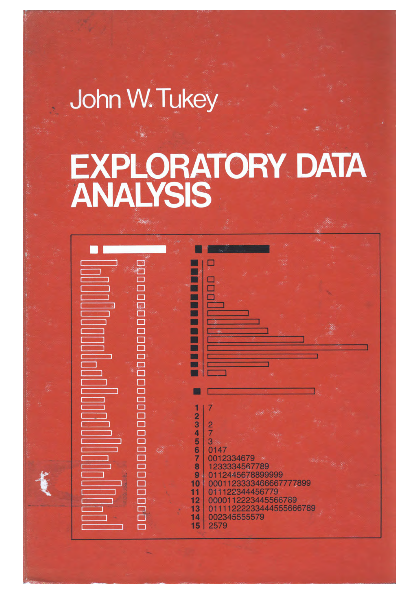 
</center>
::: 

::: {.column width=50%}


::: 
::::

Today we're taking this seriously: [grab a pen and paper]{.monash-orange2}, because for the rest of the lecture, you'll be doing the arithmetic and drawing the pictures yourself.

## Setting the frame of mind 

*Excerpt from the introduction*

::: {.hscroll}
This book is based on an important principle. 

<br>
**It is important to understand  what you CAN DO before you learn to  measure how WELL you seem to have DONE it.** 

<br>
Learning first what you can do will help you to work more easily  and effectively. 

<br>
This book is about exploratory data analysis, about [looking at data to see  what it seems to say]{.monash-blue2}. It concentrates on simple  arithmetic and easy-to-draw pictures. It regards whatever appearances  we have recognized as partial descriptions, and tries to look beneath them for  new insights. Its concern is with  appearance, not with confirmation.

<br>
**Examples, NOT case histories**

<br>
The book does not exist to make the case that exploratory data analysis is useful. Rather it exists to expose its readers and users to a considerable variety of techniques for looking more effectively at one's data.  The examples are not intended to be complete case histories. Rather they should isolated techniques in action on real data. The emphasis is on general techniques, rather than specific problems. 
<br>

A basic problem about any body of [data is to make it more easily and effectively handleable by minds]{.monash-blue2} -- our minds, her mind, his mind. To this general end:

- anything that make a simpler description possible makes the description more easily handleable.
- anything that looks below the previously described surface makes the description more effective.


<br>

So we shall always be glad (a) to simplify description and (b) to describe one layer deeper. In particular, 

- to be able to say that we looked one layer deeper, and found nothing, is a definite step forward -- though not as far as to be able to say that we looked deeper and found thus-and-such.
- to be able to say that "if we change our point of view in the following way ... things are simpler" is always a gain--though not quite so much as to be able to say "if we don't bother to change our point of view (some other) things are equally simple."

<br>
...

<br>
Consistent with this view, we believe, is a clear demand that pictures based on exploration of data should *force* their messages upon us. [Pictures that emphasize what we already know--"security blankets" to reassure us--are frequently not worth the space they take.]{.monash-orange2} Pictures that have to be gone over with a reading glass to see the main point are wasteful of time and inadequate of effect. [**The greatest value of a picture** is when it *forces* us to notice **what we never expected to see.**]{.monash-blue2}

<br>
<center> <b>Confirmation</b> </center>
<br>

The principles and procedures of what we call confirmatory data analysis are both widely used and one of the great intellectual products of our century. In their simplest form, these principles and procedures look at a sample--and at what that sample has told us about the population from which it came--and assess the precision with which our inference from sample to population is made. We can no longer get along without confirmatory data analysis. <b>But we need not start with it.</b>

<br>

The best way to <b>understand what CAN be done is not longer</b>--if it ever was--<b>to ask what things could</b>, in the current state of our skill techniques, <b>be confirmed</b> (positively or negatively). Even more understanding is <em>lost</em> if we consider each thing we can do to data <em>only</em> in terms of some set of very restrictive assumptions under which that thing is best possible--assumptions we <em>know we CANNOT check in practice</em>.

<center> <b>Exploration AND confirmation</b> </center>

Once upon a time, statisticians only explored. Then they learned to confirm exactly--to confirm a few things exactly, each under very specific circumstances. As they emphasized exact confirmation, their techniques inevitably became less flexible. The connection of the most used techniques with past insights was weakened. Anything to which confirmatory procedure was not explicitly attached was decried as "mere descriptive statistics", no matter how much we learned from it. 

<br>

Today, the flexibility of (approximate) confirmation by the [jacknife]{.monash-orange2} makes it relatively easy to ask, for almost any clearly specified exploration, "How far is it confirmed?"

<br>

**Today, exploratory and confirmatory can--and should--proceed side by side**. This book, of course, considers only exploratory techniques, leaving confirmatory techniques to other accounts. 

<br>

<center> <b> About the problems </b> </center>

<br>
The teacher needs to be careful about assigning problems. Not too many, please. They are likely to take longer than you think. The number supplied is to accommodate diversity of interest, not to keep everybody busy. 

<br>
Besides the length of our problems, [both teacher and student need to realise that many problems do not have a single "right answer".]{.monsh-blue2} There can be many ways to approach a body of data. Not all are equally good. For some bodies of data this may be clear, but for others we may not be able to tell from a single body of data which approach is preferred. Even several bodies of data about very similar situations may not be enough to show which approach should be preferred. Accordingly, it will often be quite reasonable for different analysts to reach somewhat different analyses.

<br>
Yet more--to unlock the analysis of a body of day, to find the good way to approach it, may require a key, whose finding is a creative act. Not everyone can be expected to create the key to any one situation. And to continue to paraphrase Barnum, no one can be expected to create a key to each situation he or she meets. 

<br>
**To learn about data analysis, it is right that each of us try many things that do not work**--that we tackle more problems than we make expert analyses of. We often learn less from an expertly done analysis than from one where, by not trying something, we missed--at least until we were told about it--an opportunity to learn more. Each teacher needs to recognize this in grading and commenting on problems. 

<br>
<center><b> Precision</b></center>

The teacher who heeds these words and admits that there need be *no one correct approach* may, I regret to contemplate, still want whatever is done to be digit perfect. (Under such a requirement, the write should still be able to pass the course, but it is not clear whether she would get an "A".) One does, from time to time, have to produce digit-perfect, carefully checked results, but forgiving techniques that are not too distributed by unusual data are also, usually, *little disturbed by SMALL arithmetic errors*. [The techniques we discuss here have been chosen to be forgiving. It is hoped, then, that small arithmetic errors will take little off the problem's grades, leaving severe penalties for larger errors, either of arithmetic or concept.]{.monash-blue2}

:::

## Outline

:::: {.columns .small}

::: {.column width=45%}

1. [Scratching down numbers]{.monash-orange2}
2. [Schematic summary]{.monash-orange2}
3. [Easy re-expression]{.monash-orange2}
4. Effective comparison
5. Plots of relationship
6. Straightening out plots (using three points)
7. Smoothing sequences
8. Parallel and wandering schematic plots
9. Delineations of batches of points
10. Using two-way analyses
::: 

::: {.column width=10%}


:::

::: {.column .small width=45%}
11. Making two-way analyses
12. Advanced fits
13. Three way fits
14. Looking in two or more ways at batched of points
15. Counted fractions
16. Better smoothing
17. Counts in bin after bin
18. Product-ratio plots
19. Shapes of distributions
20. Mathematical distributions
::: 
::::

[Today we're covering the first three (in bold), by hand.]{.monash-blue2}

## Looking at numbers with Tukey {.transition-slide .center style="text-align: center;"}

## What's a stem-and-leaf plot?

:::: {.columns}
::: {.column width=50%}

A quick way to sketch the shape of a batch of numbers using only the digits themselves:

- Split each number into a **stem** (leading digit(s)) and a **leaf** (the next digit).
- Write the stems down a column, smallest to largest.
- Add each leaf to its stem's row, in the order the data arrive.
- Then re-sort the leaves within each row, smallest to largest.

::: 
::: {.column width=50%}

[Stem-and-leaf plot]{.monash-blue2}: still seen in introductory statistics texts, and still one of the fastest ways to *see* a small batch of numbers with just pen and paper.

The plot doubles as a histogram turned on its side, but keeps every original digit, so you can still read off the numbers, the median, quartiles, and so on.

::: 
::::

## Your turn: petrol prices {.activity-slide}

Unleaded 91 price (cents/litre) at `r nrow(fuel_main)` Sydney service stations, most recent report as of end of July 2026.

[Real data from the NSW Government's FuelCheck scheme, via the [FuelCheck open data API](https://data.nsw.gov.au/data/dataset/fuel-check) (`data.nsw.gov.au`).]{.smallest}

```{r}
#| label: petrol-data
options(width = 60)
print(fuel_main$price, digits = 4)
```

::: {.callout-tip title="Pen & paper exercise"}
By hand:

1. Decide on a sensible stem (tens? hundreds?).
2. Write the stems in a column.
3. Add a leaf for each price, then sort the leaves within each stem.
4. What shape do you see? Is it symmetric, or does it lean one way?
:::

## And, in R ...

```{r}
#| label: stem
stem(fuel_main$price)
```

[Compare this to your hand-drawn version. Does the shape match what you expected?]{.monash-blue2}

## Refining the scale

The stem doesn't have to be a single digit. Splitting or stretching stems can reveal more, or less, structure.

```{r}
#| label: stem-scale1
stem(fuel_main$price, scale = 2)
```

::: {.fragment}
[What changed compared to the default?]{.monash-orange2}
:::

## Summary: stem-and-leaf

- Stem-and-leaf plots carry similar information to a histogram, but keep the raw digits.
- Because the numbers are still there, it's easy to then read off the median, Q1, or Q3 by hand.
- It's great for small data sets, when you only have pencil and paper.
- Alternatives: histogram, (jittered) dot plot, density plot, box plot, violin plot, letter-value plot.

## A different style of number-scratching

for categorical variables

:::: {.columns}

::: {.column width=50%}
We know about


but it's too easy to 


make a mistake

::: 
::: {.column width=50%}

Is this easier?

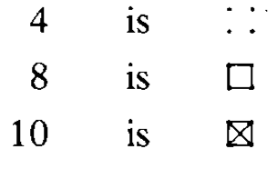

::: {.fragment}
or harder?
:::
::: 
::::

## Your turn: getting to campus {.activity-slide}

24 postgrad students were asked, in a 2026 survey, how they usually get to campus:

[Illustrative values, constructed for this exercise -- not from an actual survey.]{.smallest}

```{r}
#| label: transport-data
options(width = 60)
transport$mode
```

::: {.callout-tip title="Pen & paper exercise"}
By hand, tally these into counts for each mode of transport -- try the five-bar-gate tally first, then try the squares approach. Which method did you find less error-prone?
:::

Actually, wait. This will be a competition, one group using five-bar-gate tally, and the other group using the squares.

## And, in R ...

```{r}
#| label: transport-count
transport |> count(mode)
```

## What does it mean to "feel what the data are like?" {.center}

## 

:::: {.columns}

::: {.column width=50%}
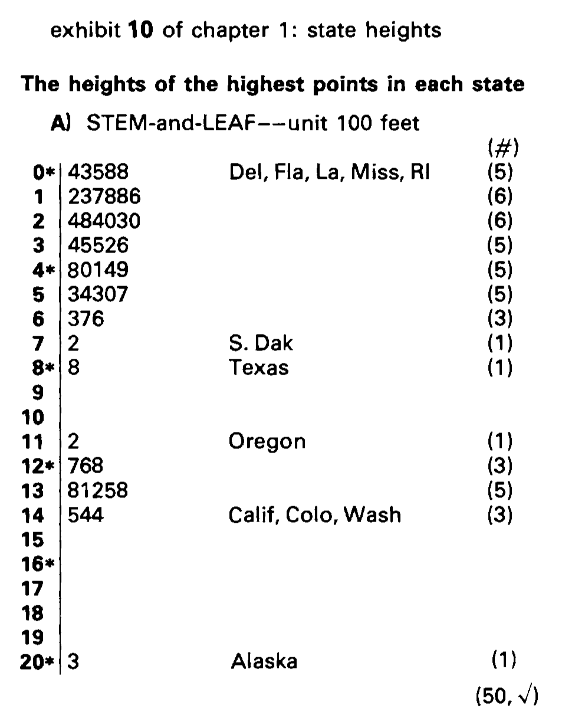
::: 

::: {.column width=50%}

This is a stem and leaf of the height of the highest peak in each of the 50 US states. 

[Data: US Geological Survey elevation records, as tabulated in Tukey (1977).]{.smallest}

<br>

The states roughly fall into three groups.

<br>

[It's not really surprising, but we can imagine this grouping. Alaska is in a group of its own, with a much higher high peak. Then the Rocky Mountain states, California, Washington and Hawaii also have high peaks, and the rest of the states lump together.]{.monash-blue2 .small}

::: 
::::

# *Exploratory data analysis is detective work -- in the purest sense -- finding and revealing the clues.*

## {.transition-slide .center  style="text-align: center;"}

### More summaries of numerical values

## Hinges and 5-number summaries

:::: {.columns}
::: {.column width="50%"}

You know the median is the middle number. What's a **hinge**?

- Find the median: the middle value.
- Split the data at the median into a lower half and an upper half (include the median itself in both halves if $n$ is odd).
- The **hinge** is the median of each half.

Hinges are almost always close to Q1 and Q3, but are simpler to find by hand.

::: 
::: {.column width="50%"}

Our `r nrow(fuel_main)` petrol prices, sorted:

```{r}
#| label: petrol-sorted
options(width = 25)
print(sort(fuel_main$price), digits = 4)
```

[With `r nrow(fuel_main)` values: the median is the ??, and each hinge is the middle of the remaining ?? (the ?? from each end).]{.monash-blue2}

::: 
::::

## Your turn: hinges and the 5-number summary {.activity-slide}

::: {.callout-tip title="Pen & paper exercise"}
Using the stem-and-leaf:

```{r}
#| label: stem-repeat
#| echo: false
stem(fuel_main$price, scale=2)
```

1. Find the median.
2. Find the lower and upper hinge.
3. Find the minimum and maximum.
4. Write out the full 5-number summary: minimum, lower hinge, median, upper hinge, maximum.
:::

## Check in R

```{r}
#| label: fivenum
print(fivenum(fuel_main$price), digits = 4)
```

[`fivenum()` returns min, lower hinge, median, upper hinge, max -- using the same depth rule you just used by hand.]{.small}

## Box-and-whisker display

:::: {.columns}
::: {.column width="50%"}

Starting from your 5-number summary:

- Draw a box from the lower hinge to the upper hinge.
- Mark the median with a line inside the box.
- Draw whiskers out to the min and max.

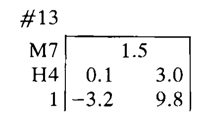

::: 
::: {.column width="50%"}

::: {.callout-tip title="Pen & paper exercise"}
Using your 5-number summary for the petrol prices, draw the box-and-whisker plot by hand on a simple number line.
:::

::: {.panel-tabset}

## Check in R

## boxplot

```{r}
#| label: boxplot
#| out-width: 50%
ggplot(fuel_main, aes(x = "", y = price)) +
  geom_boxplot() +
  xlab("") 
```

:::

::: 
::::


## Fences and outside values {background-image="images/schematic.png" background-size="20%" background-position="99% 50%"}

::: {.column width="80%"}

- H-spread: difference between the hinges (we would call this Inter-Quartile Range)
- step: 1.5 times H-spread
- inner fences: 1 step outside the hinges
- outer fences: 2 steps outside the hinges
- the value at each end closest to, but still inside, the inner fence is "adjacent"
- values between an inner fence and its neighbouring outer fence are "outside"
- values beyond outer fences are "far out"
- these rules produce a SCHEMATIC PLOT
:::

## Your turn: two more stations turn up {.activity-slide}

Two more NSW stations show up in the data: **Independent Goulburn** (200.9c/L) and **Thredbo Service Station** (287.0c/L).

[Goulburn is a regional town on the Hume Highway; Thredbo is a remote alpine resort village -- both plausible reasons for pricier fuel.]{.smallest}

::: {.callout-tip title="Pen & paper exercise"}
1. Using the H-spread from your hinges, compute the inner and outer fences.
2. Where do 200.9 and 287.0 fall: inside, outside, or far out?
3. Would either of the *original* values have been flagged, if you hadn't already seen them as "normal"?
:::

::: {.panel-tabset}

## Check in R

## boxplot

```{r}
#| label: boxplot-fences
#| out-width: 25%
fuel |>
  ggplot(aes(x = "", y = price)) +
  geom_boxplot() +
  xlab("")
```

:::


[Points plotted beyond the whiskers are exactly the "outside" and "far out" values from your fence rule.]{.monash-blue2}

## {.center style="text-align: center;"}

### Isn't this imposing a belief? 

## {.transition-slide .center style="text-align: center;"}

### There is no excuse for failing to plot and look

[Another Tukey wisdom drop]{.smallest}

## New statistics: trimeans

The number that comes closest to 

$$\frac{\text{lower hinge} + 2\times \text{median} + \text{upper hinge}}{4}$$
is the **trimean** -- a measure of centre that leans on the median, but nudges toward the hinges too.

<br>

Think about trimmed means, where we might drop the highest and lowest 5% of observations, as a related idea.

## Your turn: compute the trimean {.activity-slide}

::: {.callout-tip title="Pen & paper exercise"}
Using your median and hinges from the petrol prices, compute the trimean by hand. How does it compare to the plain mean of the values?
:::

## Check in R

```{r}
#| label: trimean
fn <- fivenum(fuel_main$price)
print((fn[2] + 2 * fn[3] + fn[4]) / 4, digits = 4)
print(mean(fuel_main$price), digits = 4)
```

## Letter-value plots: today's solution

:::: {.columns}

::: {.column width="50%"}
Why break the data into quarters? Why not eighths, sixteenths? k-number summaries?

What does a 7-number summary look like?

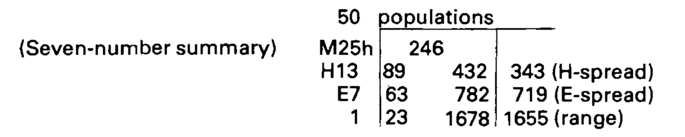

[How would you make an 11-number summary? (This one is easier to explore with more data than by hand -- we'll let R do the arithmetic.)]{.monash-orange2}
::: 
::: {.column width="50%"}

Petrol price (cents/litre), by fuel type, for `r nrow(fuel_by_type)` NSW service station reports in July 2026 -- still more than you'd want to sort by hand.

[Real data: latest price per station and fuel type, via the NSW FuelCheck open data API.]{.smallest}

```{r}
#| label: lvplot
fuel_by_type <- fuel_by_type |>
  mutate(fuel_type = factor(fuel_type, 
    levels = c("DL", "E10", "U91", "P95", "P98")))
ggplot(fuel_by_type, aes(fuel_type, price)) +
  geom_lv(aes(fill = after_stat(LV))) +
  scale_fill_brewer() +
  xlab("fuel type")
```

::: 
::::

## Your turn: choosing k {.activity-slide}

`geom_lv()` picks the number of letter values (`k`) automatically from the sample size, but you can also set it yourself.

::: {.callout-tip title="Using R"}
1. Re-run the plot with `geom_lv(aes(fill = after_stat(LV)), k = 3)`, then again with `k = 6` and `k = 10`.
2. What changes as `k` gets small? As it gets larger?
3. Is there a `k` that feels like "too few" letter values? Too many? Why?
:::

::: {.panel-tabset}

## Check your plots

## k=3

```{r}
#| label: lvplot-k3
#| out-width: 25%
ggplot(fuel_by_type, aes(fuel_type, price)) +
  geom_lv(aes(fill = after_stat(LV)), k = 3) +
  scale_fill_brewer() +
  xlab("fuel type")
```

## k=6

```{r}
#| label: lvplot-k6
#| out-width: 25%
ggplot(fuel_by_type, aes(fuel_type, price)) +
  geom_lv(aes(fill = after_stat(LV)), k = 6) +
  scale_fill_brewer() +
  xlab("fuel type")
```

## k=10

```{r}
#| label: lvplot-k10
#| out-width: 25%
ggplot(fuel_by_type, aes(fuel_type, price)) +
  geom_lv(aes(fill = after_stat(LV)), k = 10) +
  scale_fill_brewer() +
  xlab("fuel type")
```

:::

---
## Box plots are ubiquitous in use today. 

<br><br>
- 🐈🐩  Mostly used to compare distributions, multiple subsets of the data.

- Puts the emphasis on the [middle 50%]{.monash-orange2} of observations, although variations can put emphasis on other aspects.

## Easy re-expression {.transition-slide .center  style="text-align: center;"}

## Logs, square roots, reciprocals

:::: {.columns}

::: {.column width="50%"}

What you need to know about logs?

- how to find good enough logs fast and easily
- that equal differences in logs correspond to equal ratios of raw values. 

[(This means that wherever you find people using products or **ratios**-- even in such things as price indexes--using logs--thus converting producers to sums and ratios to differences--is likely to help.)]{.small}
::: 

::: {.column width="50%"}

::: {.fragment}
The most common transformations are logs, sqrt root, reciprocals, reciprocals of square roots

<center> -1, -1/2, +1/2, +1 </center>

What happened to ZERO?
:::

::: {.fragment}

It turns out that the role of a [zero power]{.monash-orange2}, is for the purposes of re-expression, neatly solved by the [logarithm]{.monash-orange2}.

:::

::: 
::::

## Re-express to symmetrize the distribution

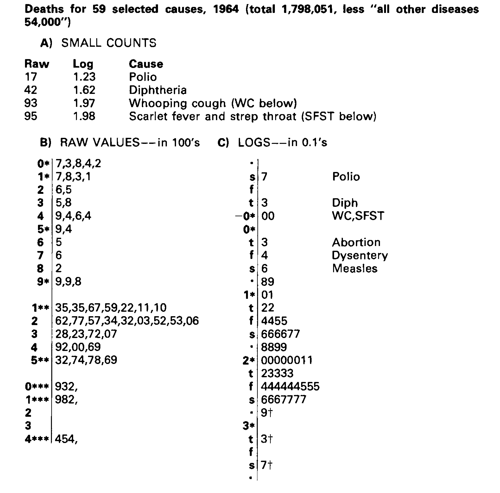

## Your turn: fixing the skew {.activity-slide}

Your stem-and-leaf of the petrol prices likely showed a mild tail on the high side (the Edgecliff station stands apart from the rest).

::: {.callout-tip title="Usinf R"}
1. Take $\log_{10}$ of each of the prices (a calculator is fine here).
2. Sketch a rough stem-and-leaf of the logged values.
3. Compare the shape to your original stem-and-leaf. Is it more symmetric?
:::

::: {.small}
::: {.panel-tabset}
## Check in R

## Original

::: {.smallest}
```{r}
#| label: stem-original
stem(fuel_main$price, scale=2)
```
:::

## Log 10

::: {.smallest}

```{r}
#| label: stem-log
stem(log10(fuel_main$price), scale=2)
```

:::

:::
:::

## Power ladder {.center style="text-align: center;"}
<br>
<br>

[⬅️ fix RIGHT-skewed values]{style="text-align: left;"} 
<br>
<br>

-2, -1, -1/2, 0 (log), 1/3, 1/2, [1]{.monash-orange2 .larger}, 2, 3, 4 

<br>

[fix LEFT-skewed values ➡️ ]{style="text-align: right;"} 

## {.transition-slide .center style="text-align: center;"}

### We now regard re-expression as a tool, something to let us do a better job of grasping. The grasping is done with the eye and the better job is through a more symmetric appearance.

[Another Tukey wisdom drop]{.smallest}

## Linearising bivariate relationships

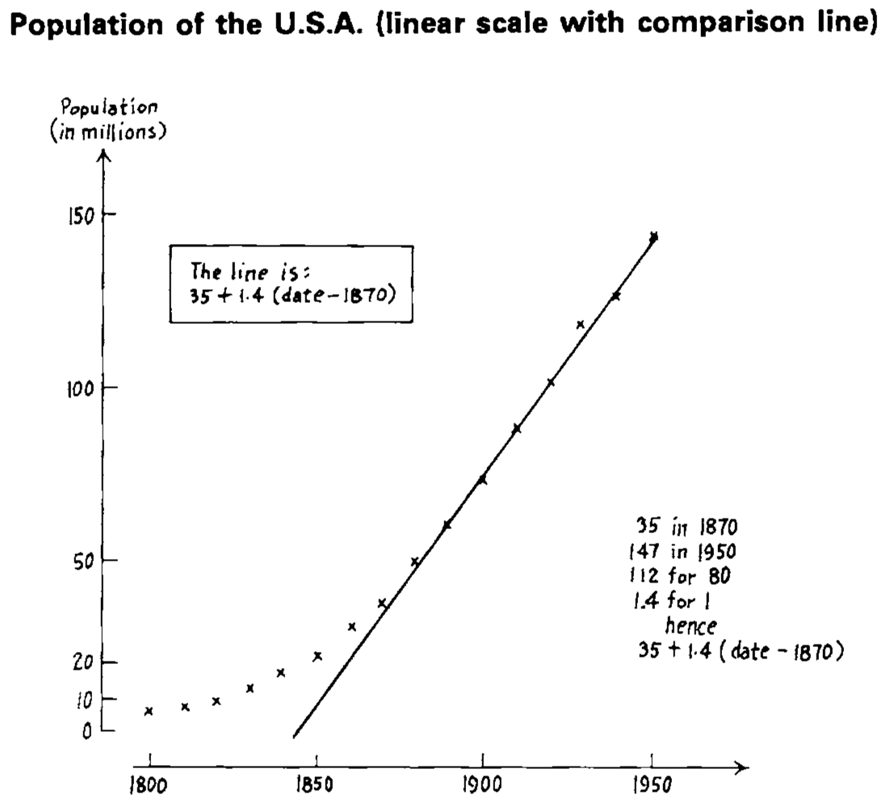 
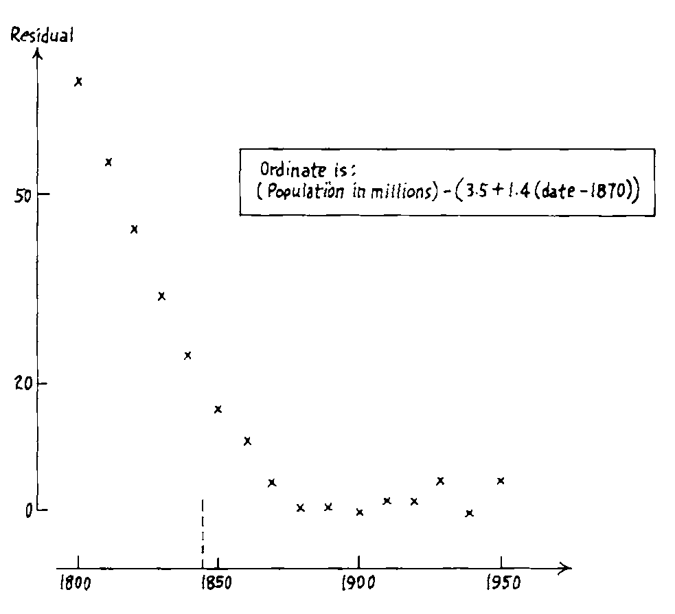 
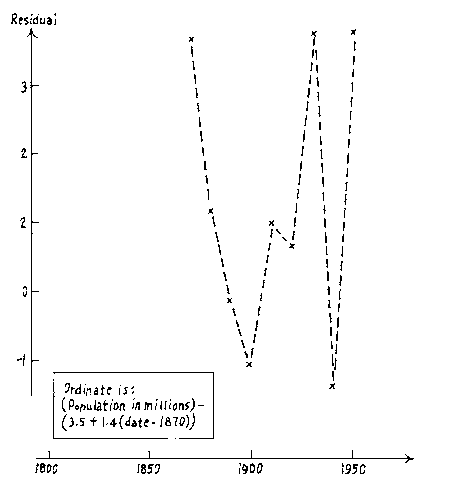 

<br>

[Surprising observation: The small fluctuations in later years]{.monash-orange2}. 

 [What might be possible reasons?]{.monash-blue2}

## Linearising bivariate relationships

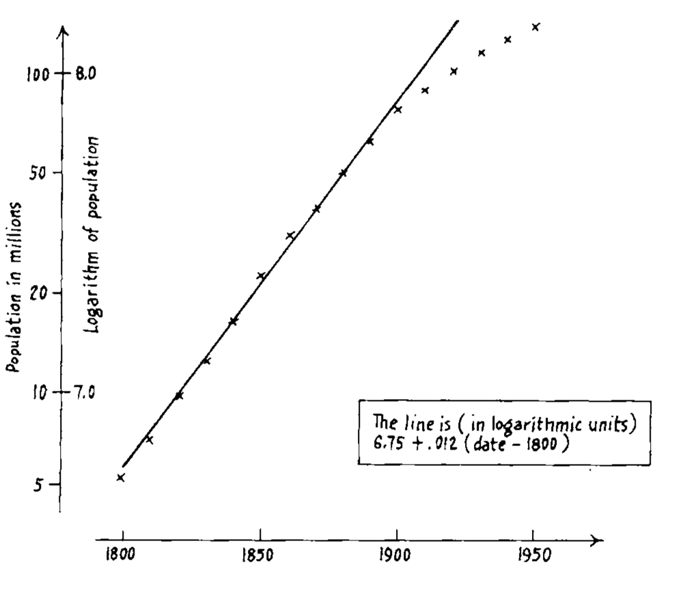 
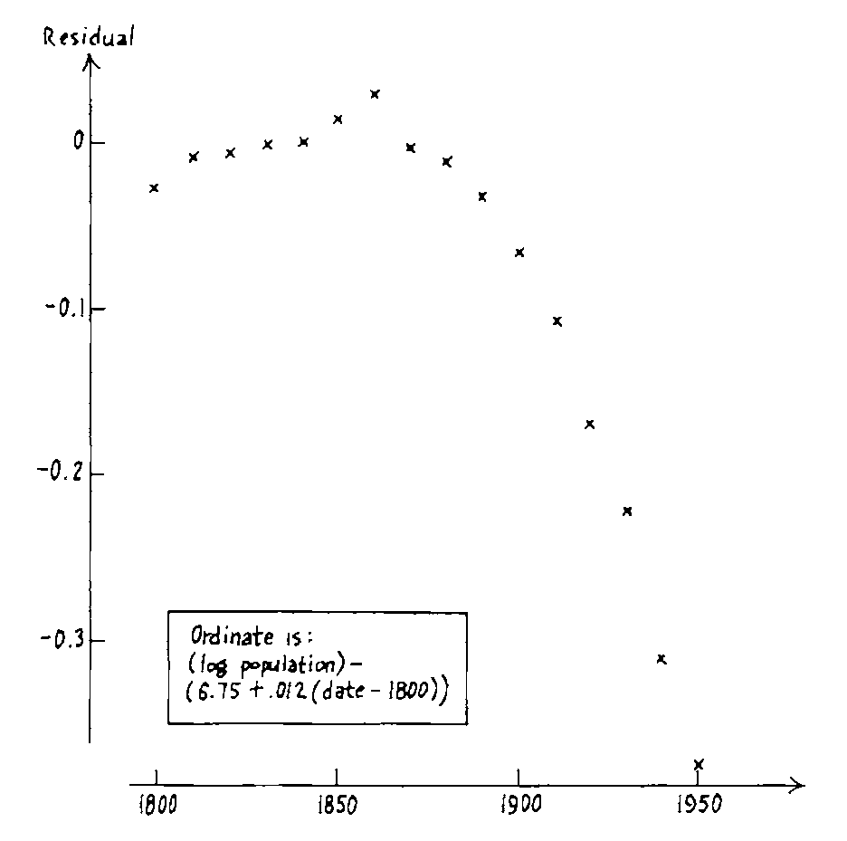 
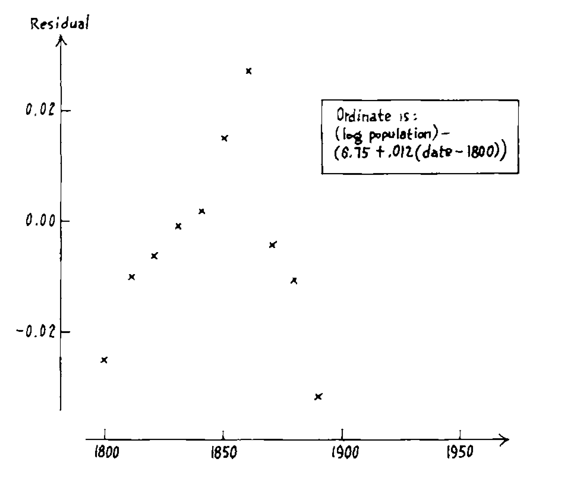 

<br>

See some fluctuations in the early years, too. [Note that the log transformation couldn't linearise.]{.monash-blue2}

# Whatever the data, we can try to gain by straightening or by flattening. 


# When we succeed in doing one or both, we almost always see more clearly what is going on.


## Rules and advice

:::: {.columns}

::: {.column style="font-size: 80%; width: 45%;"}

1. Graphics are friendly.
2. Arithmetic often exists to make graphs possible.
3. [Graphs force us to notice the unexpected]{.monash-orange2}; nothing could be more important.
4. Different graphs show us quite different aspects of the same data.
5. There is [no more reason to expect one graph to "tell all"]{.monash-orange2} than to expect one number to do the same.
6. "Plotting $y$ against $x$" involves significant choices--how we express one or both variables can be crucial.
:::


::: {.column width="5%"}
:::


::: {.column style="font-size: 80%; width: 45%;"}


7. The first step in penetrating plotting is to straighten out the dependence or point scatter as much as reasonable.
8. Plotting $y^2$, $\sqrt{y}$, $log(y)$, $-1/y$ or the like instead of $y$ is one plausible step to take in search of straightness.
9. Plotting $x^2$, $\sqrt{x}$, $log(x)$, $-1/x$ or the like instead of $x$ is another.
10. Once the plot is straightened, we can usually gain much by flattening it, usually by plotting residuals.
11. When plotting scatters, we may need to be careful about how we express $x$ and $y$ in order to avoid concealment by crowding.

:::
::::

## {background-image="https://vignette.wikia.nocookie.net/starwars/images/d/d6/Yoda_SWSB.png/revision/latest?cb=20150206140125" background-size="cover"}

<br><br><br>
[The book is a digest of]{.monash-white} 🌟 
[tricks and treats]{.monash-white}  🌟 [of massaging numbers and drafting displays.]{.monash-white} 

[Many of the tools have made it into today's analyses in various ways. Many have not.]{.monash-white}

[Notice the word developments too:]{.monash-white} [froots, fences.]{.monash-pink2} [Tukey brought you the word]{.monash-white} ["software"]{.monash-white}

[The temperament of the book is an inspiration for the mind-set for this unit. There is such delight in working with numbers!]{.monash-white}

["We love data!"]{.monash-white .larger}

## Summary: what we learned today

:::: {.columns}

::: {.column .small width="50%"}
**Scratching down numbers**

- [Stem-and-leaf plots]{.monash-blue2}: keep every digit, still readable as a histogram shape, by hand.
- [Tallying]{.monash-blue2}: counting categorical data without losing track (five-bar gate, squares).

**Schematic summary**

- [Hinges and the 5-number summary]{.monash-blue2}: median + hinges, found by hand via depth.
- [Box-and-whisker plots]{.monash-blue2}: built directly from the 5-number summary.
- [Fences]{.monash-blue2}: H-spread-based rules for flagging "outside" and "far out" values.
- [Trimean]{.monash-blue2}: a robust measure of centre, weighting the median more than the hinges.
- [Letter-value plots]{.monash-blue2}: extend the idea to more letter values (`k`) for larger data sets.
::: 

::: {.column .small width="50%"}
**Easy re-expression**

- Logs, square roots, and reciprocals can [symmetrize a skewed distribution]{.monash-blue2}.
- The [power ladder]{.monash-blue2} gives a systematic way to choose a transformation, in either direction.
- Straightening and flattening [help us see relationships more clearly]{.monash-blue2}.

**Underlying theme**

- Tukey's tools are [simple arithmetic and easy-to-draw pictures]{.monash-orange2}, designed to be done with pencil and paper.
- The goal throughout is *exploration*: looking at data to see what it seems to say, before any formal confirmation.
::: 
::::

## The meandering of time {.scrollable}

Each step below is a reaction to the one before it:

::: {.timeline .compact-timeline}

::: {.event data-label="Many decades"}
**Hypothesis testing formalised**
:::

::: {.event data-label="1977"}
**Tukey's EDA**
Reaction to too much emphasis on hypothesis testing.
:::

::: {.event data-label="Later 20th C"}
**Testing methodology matures**
Reaction to the ad-hoc nature of data analysis.
:::

::: {.event data-label="Recent decades"}
**Machine learning**
Reaction to statistical models missing non-linear relationships.
:::

::: {.event data-label="Today"}
**Renewed data exploration**
Reaction to the need to explain complex models.
:::

:::

::: {.small}
Throughout, it has become much [easier]{.monash-blue2} to accomplish thanks to [computers]{.monash-blue2}. "Exploratory data analysis" as commonly used today is unfortunately synonymous with "descriptive statistics", but it is truly much more -- it is the tooling to [discover what you don't know]{.monash-orange2}.
:::

## Resources

- [Exploratory Data Analysis in wikipedia](https://en.wikipedia.org/wiki/Exploratory_data_analysis)
- John W. Tukey (1977) Exploratory data analysis
- Data coding using [`tidyverse` suite of R packages](https://www.tidyverse.org) 
- Letter-value plots via the [`lvplot` package](https://cran.r-project.org/package=lvplot)
- Petrol prices: real prices at NSW service stations, retrieved August 2026 from the [NSW FuelCheck open data API](https://data.nsw.gov.au/data/dataset/fuel-check) (`data.nsw.gov.au`). See `week2/fuelcheck-sample.R` for how both were built.
