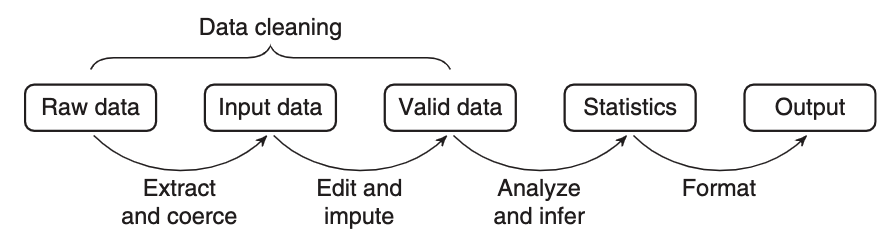
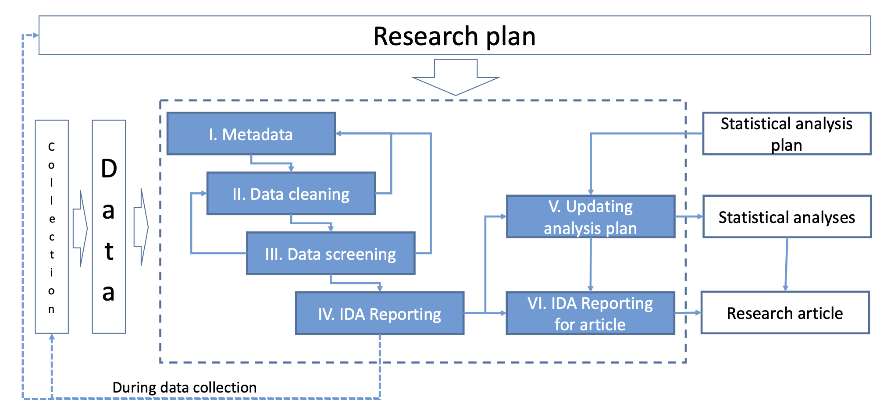
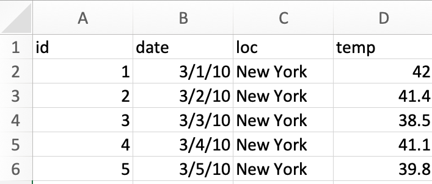
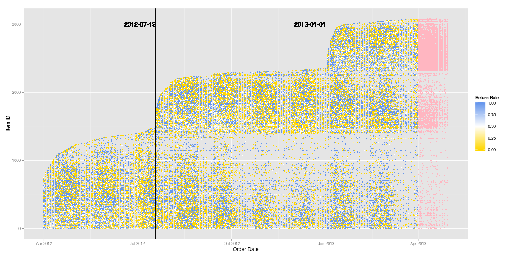

```{r}
#| label: setup
#| message: false
#| warning: false
source("../setup.R")
```

## The role of initial data analysis {background-image="images/crowder_and_hand.jpg" background-size="20%" background-position="95% 85%"}

::: {.column width=60%}
<br><br>

*The first thing to do with data is to [look at them]{.monash-blue2} .... usually means [tabulating]{.monash-blue2} and [plotting]{.monash-blue2} the data in many different ways to [see what’s going on]{.monash-blue2}. With the wide availability of computer packages and graphics nowadays there is no excuse for ducking the labour of this preliminary phase, and it may save some* [**red faces**]{.monash-red2} *later.*

[[Crowder, M. J. & Hand, D. J.  (1990) "Analysis of Repeated Measures"](https://doi.org/10.1201/9781315137421)]{.smallest}

:::

## Initial Data Analysis

:::: {.columns}

::: {.column width=50%}

::: {.info}
Prior to conducting a [confirmatory data analysis]{.monash-black2}, it is important to conduct an [_initial data analysis (IDA)_]{.monash-orange2}. 
:::

::: {.fragment}
* [Confirmatory data analysis (CDA)]{.monash-blue2} is focused on statistical inference and includes procedures for:
  * hypothesis testing, 
  * predictive modelling,
  * parameter estimation including uncertainty,
  * model selection. 

:::  
:::

::: {.column width=50%}

::: {.fragment}

* [IDA]{.monash-orange2} includes:
  * describing the data and collection procedures
  * scrutinise data for errors, outliers, missing observations
  * check assumptions for confirmatory data analysis

::: {style="font-size: 70%;"}  
IDA is sometimes called [preliminary data analysis]{.monash-blue2}.
:::

::: 

::: {.fragment}
::: {.info}
IDA is related to exploratory data analysis (EDA) in the sense that it is primarily conducted graphically, and there are few formal tests available. 
:::
:::

:::
::::

## Model diagnostics

:::: {.columns}

::: {.column width=50%}

::: {.info}
After to conducting a [confirmatory data analysis]{.monash-black2}, it is important to [_check the results_]{.monash-orange2}. 
:::

::: {.fragment}
* [Model diagnostics (MD)]{.monash-blue2} check that the result is fit for making inference:
  * fit statistics, including error
  * residual plots
  * multicollinearity checks
  * influence statistics
  * feature importance
  * not overfitting

:::  
:::

::: {.column width=50%}

::: {.fragment}

* It may lead to, re-ftting after:
  * removing variables and/or observations
  * transforming variables
  * changing the type of model


::: 

::: {.fragment}
::: {.info}
MD is related to exploratory data analysis (EDA) in the sense that it also depends on graphical summaries. 
:::
:::

:::
::::

## Objectives of IDA?

::: {.info}
The [**main objective for IDA**]{.monash-blue2} is to intercept any problems in the data that might adversely affect the confirmatory data analysis. 
:::

::: {.columns width=60%}
* The role of **CDA** is to answer the intended question(s) that the data were collected for.

::: {.fragment}

* **_IDA is often unreported_** in the data analysis reports or scientific papers, for various reasons. It might not have been done, or it may have been conducted but there was no space in the paper to report on it. 
:::


:::


## IDA in government statistics {background-image="images/vanderloo_and_dejong.gif" background-size="15%" background-position="95% 85%"}


The purpose of [data cleaning]{.monash-blue2} is to bring data up to a level of quality such that it can reliably be used for the production of statistical models or statements.

A [statistical value chain]{.monash-blue2} is constructed by defining a number of meaningful intermediate data products, for which a chosen set of quality attributes are well described. 

:::: {.columns}
::: {.column width=99%}
 
:::
::::

[van der Loo & de Jonge (2018) Statistical Data Cleaning with Applications in R]{.small}


## IDA in health and medical data {background-image="images/Huebner.Marianne_v2.jpg" background-size="15%" background-position="95% 5%"}



Huebner et al (2018)'s six steps of IDA: (1) Metadata setup, (2) [Data cleaning]{.monash-orange2}, (3) [Data screening]{.monash-orange2}, (4) [Initial  reporting]{.monash-orange2}, (5) Refining and updating the analysis plan, (6) Reporting IDA in documentation.

## Heed these words

:::: {.columns}
::: {.column width=50%}

::: {.info}
IDA prepares the data for CDA. One needs to be careful about NOT compromising the inference. 
:::

How do you compromise inference?

::: {.fragment style="font-size: 70%;"}
1. Change your inference or questions based on what you find in IDA.
2. Outlier removal or not. 
3. Missing value imputation choices.
4. Treatment of zeros. 
5. Handling of variable type, categorical temporal.
6. Lack of multivariate relationship checking, including subsets based on levels of categorical variables.
7. Choosing variables and observations.
:::

:::
::: {.column width=50%}

::: {.fragment}
How do you avoid these errors?

- Document ALL the IDA, using a reproducible analysis script.
- Pre-register your CDA plan, so that your CDA questions do not change.
- Decisions made on outlier removal, variable selection, recoding, sampling, handling of zeros have known affects on results, and are justifiable.

Insure yourself against accusations of [data snooping]{.monash-blue2}, data dredging, data fishing, data leakage.
:::

:::

::::
## Data screening {.transition-slide .center style="text-align: center;"}


## Data screening 

:::: {.columns}

::: {.column width=50%}

::: {.info}
It's important to check how the data are [understood by the computer]{.monash-blue2}.
:::

that is, checking for _data type_: 

* Was the date read in as character?
* Was a factor read in as numeric?
:::    

::::

## Example: Checking the data type [(1/2)]{.smallest}

:::: {.columns}
::: {.column width=50%}
`lecture3-example.xlsx`

<center>

</center>

:::
::: {.column width=50%}

```{r, echo = TRUE}
library(readxl)
library(here)
df <- read_excel(here("data/lecture3-example.xlsx"))
df
```

- What problems are there with the computer's interpretation of [data type]{.monash-orange2}?
- What [context]{.monash-orange2} specific issues indicate incorrect computer interpretation?

:::
::::


## Example: Checking the data type [(2/2)]{.smallest}

:::: {.columns}
::: {.column width=50%}

```{r, echo = TRUE}
library(lubridate)
df <- read_excel(here("data/lecture3-example.xlsx"), 
                 col_types = c("text", 
                               "date", 
                               "text",
                               "numeric"))

df |> 
  mutate(id = as.factor(id),
         date = ydm(date)) |>
  mutate(
         day = day(date),
         month = month(date),
         year = year(date)) 
```

:::
::: {.column width=50%}

* `id` is now a `factor` instead of `integer`
* `day`, `month` and `year` are now extracted from the `date`
* Is it okay now?

::: {style="font-size: 70%;"}
::: {.fragment}
* In the United States, it's common to use the date format MM/DD/YYYY <a class="font_small black" href="https://twitter.com/statsgen/status/1257959369448161281">(gasps)</a>  while the rest of the world commonly uses DD/MM/YYYY or better still YYYY/MM/DD.
:::


::: {.fragment}

* It's highly probable that the dates are 1st-5th March and not 3rd of Jan-May.

:::

::: {.fragment}

* You can validate interpretation of temperature using [weather database](https://www.wunderground.com/history/monthly/us/ny/new-york-city/KLGA/date/2010-3).

:::
:::
:::
::::


## Example: Specifying the data type with R

:::: {.columns}
::: {.column width=50%}

* You can robustify your workflow by ensuring you have a check for the expected data type in your code.

```{r, echo = TRUE}
xlsx_df <- read_excel(here("data/lecture3-example.xlsx"),
                 col_types = c("text", "date", "text", "numeric"))  |> 
  mutate(id = as.factor(id), 
         date = as.character(date),
         date = as.Date(date, format = "%Y-%d-%m"))
```
:::
::: {.column width=50%}

* `read_csv` has a broader support for `col_types`


```{r, echo = TRUE}
csv_df <- read_csv(here::here("data/lecture3-example.csv"),
                 col_types = cols(
                      id = col_factor(),
                      date = col_date(format = "%m/%d/%y"),
                      loc = col_character(),
                      temp = col_double()))
```

* The checks (or coercions) ensure that even if the data are updated, you can have some confidence that any data type error will be picked up before further analysis.

:::
::::


## Example: Checking the data type with R 


You can have a quick glimpse of the data type with:


```{r, echo = TRUE}
dplyr::glimpse(xlsx_df)
dplyr::glimpse(csv_df)
```


## Example: Checking the data type visually

:::: {.columns}
::: {.column width=50%}

You can also visualise the data type with:

```{r, echo = TRUE}
library(visdat)
vis_dat(xlsx_df)
```

:::

::::

## Your turn: spot the type problems {.activity-slide}

A colleague sends you `lecture3-example2.csv`, an extension of the weather example with a few more rows.

::: {.callout-tip title="Your turn"}
1. Read the file in with `read_csv()` and `glimpse()` it -- don't specify `col_types` yet.
2. What does R guess for each column's type? Is it right?
3. Look closely at the `date` column: the file mixes dates from two different decades. What ambiguity does that create?
4. Is there anything else worth flagging (e.g. missing values)?
:::

::: {.panel-tabset}

## Check in R

## Data

```{r}
#| label: example2-check
ex2 <- read_csv(here::here("data/lecture3-example2.csv"))
glimpse(ex2)
```

## Explanation

The `loc` value is missing for one row, and `date` mixes "3/1/10" and "3/1/20" -- is that a two-digit year of 2010 vs 2020, or March 1 read a different way? Two-digit years are always worth double-checking.

:::

## Data cleaning {.transition-slide .center style="text-align: center;"}

## Data cleaning 

Data quality checks should be one of the first steps in the data analysis to **_assess any problems with the data_**.

These include using [common or domain knowledge]{.monash-blue2} to check if the recorded data have sensible values. 

::: {.fragment}

* Are positive values, e.g. height and weight, recorded as positive values with a plausible range?
* If the data are counts, do the recorded values contain non-integer values?
* For compositional data, do the values add up to 100% (or 1)? If not, is that a measurement error or due to rounding? Or is another variable missing?
* Does the data contain only positives, ie disease occurrences, or warranty claims? If so, what would the no report group look like? 

:::

## Case study: World development indicators [(1/7)]{.smallest}

:::: {.columns}
::: {.column width=70%}

```{r}
options(width=80)
raw_dat <- read_csv(here("data/world-development-indicators.csv"), 
                    na = "..", n_max = 11935)
glimpse(raw_dat)
```

[World Development Indicators (WDI), sourced from the [World Bank Group (2019)](https://databank.worldbank.org/source/world-development-indicators/)]{.smallest}

:::
::: {.column width=30%}

<br><br>

- What are the data types?
- What are the variables?
- What are the observations?
- Is the data in tidy form?


:::
::::

## Case study: World development indicators [(2/7)]{.smallest}

:::: {.columns}
::: {.column width=60%}


```{r}
country_code_df <- raw_dat  |>
  distinct(`Country Name`, `Country Code`)  |>
  rename_all(janitor::make_clean_names)  |>
  left_join(
    countrycode::codelist |> select(iso3c, region, continent),
    by = c("country_code" = "iso3c")
  )  |>
  arrange(continent, region) 
```

::: {style="font-size: 70%;"}
```{r}
options(width=80)
glimpse(country_code_df)

country_code_df |> count(continent)
country_code_df |> count(region)

```
:::
:::
::: {.column width=40%}

<br><br>

- How many countries are included
- How many continents, regions?
- Why are there NAs here?

::: {.fragment style="font-size: 70%;"}

```{r}
country_code_df |> filter(is.na(continent))
```

:::

:::
::::

## Case study: World development indicators [(3/7)]{.smallest}

:::: {.columns}
::: {.column width=60%}


```{r}
wdi_vars <- raw_dat  |>
  select(`Series Name`, `Series Code`) |>
  distinct() |>
  rename_all(janitor::make_clean_names) 
```

::: {style="font-size: 60%; overflow: auto; max-height: 650px;"}

<br>

```{r}
wdi_vars |> gt::gt()
```
:::

:::
::: {.column width=40%}


- Analysis will use the short name (`series_code`) for variables. 

- Store full variable name (`series_name`) and short name (`series_code`) in a separate table.

- The `series_code` will be used as the key whenever the full name is needed.


:::
::::

## Case study: World development indicators [(4/7)]{.smallest}

:::: {.columns}
::: {.column width=50%}


```{r}
wdi <- raw_dat  |>
  select(`Country Code`, `Series Code`, `1969 [YR1969]`:`2018 [YR2018]`) |>
  rename_all(janitor::make_clean_names) |>
  pivot_longer(x1969_yr1969:x2018_yr2018,
               names_to = "year", 
               values_to = "value") |>
  mutate(year = as.numeric(str_sub(year, 2, 5)) ) |>
  pivot_wider(names_from = series_code,
              values_from = value)

wdi2017 <- wdi  |> filter(year == 2017)
```

- Organise data into tidy form
- Check missing value distribution

:::
::: {.column width=50%}

```{r}
#| fig-width: 8
#| fig-height: 6
vis_miss(wdi, sort_miss = TRUE)
```


:::
::::

## Case study: World development indicators [(5/7)]{.smallest}

:::: {.columns}
::: {.column width=20%}

Check missings by 

- variable
- country

:::
::: {.column width=50%}

```{r}
#| fig-width: 8
#| fig-height: 6
gg_miss_var(wdi, show_pct=TRUE)
```


:::
::: {.column width=30%}

```{r}
#| fig-width: 2
#| fig-height: 8
#| out-width: 100%
wdi_cnt_miss <- wdi |> 
  filter(!is.na(country_code)) |>
  bind_shadow() |>
  select(country_code, year,
         SP.ADO.TFRT_NA:SP.URB.GROW_NA) |>
  pivot_longer(SP.ADO.TFRT_NA:SP.URB.GROW_NA,
               names_to="var",
               values_to="value") |>
  group_by(country_code) |>
  count(value) |>
  mutate(value = fct_recode(value, 
                            miss="NA",
                            not="!NA")) |>
  pivot_wider(names_from = value, values_from = n) |>
  mutate(p_miss = miss/(miss+not)) |>
  select(country_code, p_miss)
wdi_cnt_p <- wdi_cnt_miss |> 
  ggplot(aes(x=1, y=p_miss, 
             label=country_code)) +
  geom_quasirandom() +
  ylim(c(0,1)) + ylab("Prop miss") 
ggplotly(wdi_cnt_p)
```

:::
::::

## Case study: World development indicators [(6/7)]{.smallest}

:::: {.columns}
::: {.column width=50%}


Look at Costa Rica (CRI), most complete country

```{r}
#| fig-width: 8
#| fig-height: 6
wdi_cri <- wdi |>
  filter(country_code == "CRI")
vis_miss(wdi_cri, sort_miss=TRUE)
```
:::
::: {.column width=50%}

To illustrate imputation, we'll show one of the variables, that is relatively complete.

```{r}
#| fig-width: 6
#| fig-height: 3
wdi_cri_p <- wdi_cri |>
  ggplot(aes(x=year, y=SE.PRM.CMPT.ZS)) +
  geom_miss_point() +
  theme(aspect.ratio=0.5, 
        legend.position = "none") 
wdi_cri_p
```

Impute a few temporal missings using nearest neighbours.

:::
::::


## Case study: World development indicators [(6/7)]{.smallest}

:::: {.columns}
::: {.column width=50%}

Missings imputed using `imputeTS` using the moving average method. 

```{r}
#| fig-width: 6
#| fig-height: 3
library(imputeTS)

wdi_cri_v1 <- wdi_cri |>
  mutate(SE.PRM.CMPT.ZS = na_ma(SE.PRM.CMPT.ZS))

wdi_cri_v1  |>
  ggplot(aes(x=year, y=SE.PRM.CMPT.ZS)) +
  geom_point() +
  geom_smooth(se=F, colour="#D55E00") +
  theme(aspect.ratio=0.5) 
```

:::
::: {.column width=50%}

- Don't have to impute before scrutinizing data
- What are these numbers supposed to be?

`SE.PRM.CMPT.ZS` is "Primary completion rate, total (% of relevant age group)"


[Do we have any problems?]{.monash-orange2}

::: {.fragment}
Yes. The explanation of the variable suggests the numbers should range between 0-100.

:::


:::
::::

## Your turn: check another country {.activity-slide}

::: {.callout-tip title="Your turn"}
1. Pick a different `country_code` from `wdi` (not `"CRI"`).
2. Produce a `vis_miss()` plot for that country, sorted by missingness.
3. Is it more or less complete than Costa Rica? Would you be comfortable imputing missing values for it?
:::

```{r}
#| echo: false
countdown::countdown(8, 34)
```

::: {.panel-tabset}

## Check in R

## Australia

```{r}
#| label: wdi-country-check
#| fig-width: 8
#| fig-height: 6
wdi |>
  filter(country_code == "AUS") |>
  vis_miss(sort_miss = TRUE)
```

:::

## 📋 Summary of the process 

The steps we took roughly followed these:

<center>
```{r}
DiagrammeR::grViz("digraph {
  graph [layout = circo, rankdir = TB]
  
  node [shape = rectangle, 
  fontname = 'Helvetica']        
  rec1 [label = 'Input data', 
  fontname = 'Helvetica']
  rec2 [label = 'Tidy data', 
  fontname = 'Helvetica']
  rec3 [label = 'Data screening', 
  fontname = 'Helvetica']
  rec4 [label = 'Data cleaning', 
  fontname = 'Helvetica']
  rec5 [label = 'Impute missings', 
  fontname = 'Helvetica']
  rec6 [label = 'Valid data', 
  fontname = 'Helvetica']

  # edge definitions with the node IDs
  rec1 -> rec2 -> rec3 -> rec4 -> rec5  
  rec5 -> rec3 
  rec3 -> rec6
  }",
  height = 300,
  width = 500
  )
```
</center>

::: {.smaller}

At the end of this stage we would have:

- 3 tables of data: country name/code, variables name/key, time series of multiple variables for many countries
- What would you like to learn from this data? What sort of models might be fitted? What types of hypotheses might be tested?
- Have we done anything that might have compromised the later analysis?

:::

## Data collection {.transition-slide .center style="text-align: center;"}


## Case study: Employment Data in Australia [(1/3)]{.smallest}

Below is the data from ABS that shows the total number of people employed in a given month from February 1976 to December 2019 using the original time series.

<br>

```{r}
#| eval: false
# Note: because this downloads data
# run it once, and save the result so 
# data server isn't overloaded
library(readabs)
employed <- read_abs(series_id = "A84423085A")  |> 
  mutate(month = lubridate::month(date),
         year = lubridate::year(date))  |> 
  #filter(year != "2020")  |> 
  select(date, month, year, value) 
save(employed, file="../data/employed.rda")
```


```{r, echo = TRUE}
load(here::here("data/employed.rda"))

glimpse(employed)
```

[Australian Bureau of Statistics, Labour force, Australia, [Table 01](https://www.abs.gov.au/AUSSTATS/abs@.nsf/DetailsPage/6202.0Jul%202020?OpenDocument). Labour force status by Sex, Australia - Trend, Seasonally adjusted and Original]{.smallest}


## Case study:  Employment Data in Australia [(2/3)]{.smallest}

:::: {.columns}
::: {.column width=40%}
What do you notice?

```{r}
#| label: unemp
#| fig-width: 5
#| fig-height: 8
#| out-width: 70%
employed_2000 <- employed |> 
  filter(between(year, 2005, 2014)) |>
  mutate(year = factor(year)) |>
  ungroup() 
labels_2000 <- employed_2000 |>
  group_by(year) |>
  slice_tail(n = 1) |>
  ungroup() 

ggplot() + 
  geom_line(data = employed_2000, 
    aes(x = month, y = value/1000, color = year)) + 
  geom_label_repel(
    data = labels_2000,
    aes(x = month, y = value/1000, 
        label = year, color = year),
    fill = alpha("white", 0.6),
    direction = "y",
    hjust = 0,
    nudge_x = 0.5,
    segment.color = "grey70"
  ) +
  ylab("employed (mil)") +
  scale_x_continuous("month", breaks=seq(1, 12, 1)) +
  scale_color_viridis_d("", end = 0.8) +
  theme(aspect.ratio = 1.5,
        legend.position = "none")
```

:::
::: {.column width=60%}

::: {.fragment}
Why do you think the number of people employed is going up each year?

:::
::: {.fragment}

* Australian population is **25.39 million** in 2019
* 1.5% annual increase in population
* Vic population is 6.681 million (Sep 2020) - 26%
* NSW population is 8.166 (Sep 2020) - 32%

:::
:::
::::

## Case study:  Employment Data in Australia [(3/3)]{.smallest}

:::: {.columns}
::: {.column width=50%}

* Also notice a change in August numbers from 2014.

```{r}
employed_2000  |> 
  filter(month %in% 8:9)  |> 
  pivot_wider(id_cols = year, 
    names_from = month)  |> 
  mutate(diff = `9` - `8`)  |> 
  ggplot(aes(x = diff, y = 1)) + 
  geom_boxplot() 
```


:::
::: {.column width=50%}

::: {.fragment}


* A potential explanation for this is that there was a _change in the survey from 2014_. 


See discussion on this at  [Hyndsight blog (10 October 2014)](https://robjhyndman.com/hyndsight/abs-seasonal-adjustment-2/).

:::

:::
::::

## Your turn: check other month pairs {.activity-slide}

How do we provide evidence that the August-to-September is a genuine problem, that is worth investigating to understand why.

::: {.callout-tip title="Your turn"}
1. Repeat the same check for each consecutive different pair of adjacent months (e.g. June to July).
2. Make the boxplots for each set of differences. You can plot them against month, or use facetting.
3. Does the same kind of step-change show up?
4. What does this tell you about whether the August/September pattern is a specific, real event, versus something you'd see between any two months?
:::

```{r}
#| echo: false
countdown::countdown(5, 22)
```


::: {.panel-tabset}

## Check in R

## Code

```{r}
#| label: employment-month-check
employed_diffs <- employed_2000 |> 
  arrange(date) |> 
  mutate(diff = value - dplyr::lag(value)) |>
  mutate(month_c = factor(month, levels = c(1:12), 
    labels = c("jan", "feb", "mar", "apr", "may", "jun", "jul", "aug", "sep", "oct", "nov", "dec"))) |>
  group_by(month_c) |>
  mutate(diff_m = diff - 
    median(diff, na.rm = TRUE)) |>
  ungroup()
```

## Plot

```{r}
#| label: employment-month-plot
#| out-width: 30%
employed_diffs |> 
  filter(!is.na(diff)) |>
  ggplot(aes(x = month_c, y = diff_m)) + 
    geom_boxplot()
```

:::

## Case study: 2014 Data Mining Cup winners 

<center>
{width=950}
</center>

Ugly plot of all observations provided in training sample, with response variable in colour, and test sample to predict. 

[What does this tell you about the test sample?]{.monash-orange2}

## Case study: french fries/hot chips [(1/2)]{.smallest}

:::: {.columns}
::: {.column width=50%}
```{r}
options(width=50)
load(here::here("data/french_fries.rda"))
glimpse(french_fries)
```
:::
::: {.column width=50%}

10 week sensory experiment, 12 individuals assessed taste of french fries on several scales (how potato-y, buttery, grassy, rancid, paint-y do they taste?), fried in one of 3 different oils, replicated twice. 

- [Is the design complete?]{.monash-blue2}
- Are replicates like each other?
- How do the ratings on the different scales differ?
- Are raters giving different scores on average?
- Do ratings change over the weeks?

:::
::::

## Case study: french fries/hot chips [(2/2)]{.smallest}

:::: {.columns}
::: {.column width=50%}

- Is the design complete?

```{r}
french_fries |> count(subject)
```

:::
::: {.column width=50%}

::: {.fragment style="font-size: 90%;"}

```{r}
french_fries |> count(time)
french_fries |> count(treatment)
french_fries |> count(rep)
```
:::

:::
::::

## Your turn: is this design complete? {.activity-slide}

`lecture3-example3.csv` is a small field trial: yield measured on plots in a `row` x `col` grid, under different `trt` (treatment) and `block`.

::: {.callout-tip title="Your turn"}
1. Read in the data and cross-tabulate `trt` against `block` (e.g. with `count()`).
2. Is every treatment applied in every block the same number of times?
3. If not, which treatment(s) are over- or under-represented, and how might that affect comparisons between treatments?
:::

::: {.panel-tabset}

## Check in R

## Code

```{r}
#| label: design-check
field <- read_csv(here::here("data/lecture3-example3.csv"))
field |> 
  count(trt, block) |> 
  pivot_wider(names_from = block, values_from = n)
```

## Answer

The `"none"` treatment appears 4 times per block, while every other treatment appears only once -- an unbalanced design.

:::

## Case study: Warranty claims 

:::: {.columns}
::: {.column width=50%}

```{r}
warranty <- read_csv(here("data/warranty-kaggle.csv"))
warranty |>
  filter(Product_type == "TV") |>
  select(Region:Consumer_profile,
         TV_2001_Issue:TV_2003_Issue,
         Claim_Value:Purpose) |>
  glimpse()
```

- `TV_2001_Issue`: failure of power supply
- `TV_2002_Issue`: failure of inverter
- `TV_2003_Issue`: failure of motherboard

:::
::: {.column width=50%}


- What is the population that this data is measuring?
- What is not measured?

::: {.fragment}

```{r}
set.seed(635)
warranty |> 
  filter(Product_type == "TV") |> 
  count(City, sort=TRUE) |> 
  slice_sample(n=2)
```

[Can we say that Delhi has fewer problems with TVs than Bangalore?]{.monash-orange2}

:::

:::
::::

[[Source: ExcelR Projects. (2019). Warranty Claims. Kaggle.](https://www.kaggle.com/competitions/warranty-claims)]{.smallest}

## 📋 Summary of checks for data collection

✅ Has the collection process been consistent?

✅ Does the set to be predicted match the training set?

✅ Is the experimental design correctly applied?

✅ Have treatments been appropriately *randomised* or assigned comprehensively across subjects? 

✅ What is the population that the collected data describes?

✅ If the data is observational, can you group them into comparison sets?

## Imputing missing values {.transition-slide .center style="text-align: center;"}

## Example 1: Olympic medals 

:::: {.columns}
::: {.column width=50%}

```{r}
library(VGAM)
data(olym12)
olym12 |> select(country, totalmedal) |>
  arrange(desc(totalmedal)) 
```

<br><br>
Is the average number of medals equal to `r round(sum(olym12$totalmedal), 2)`/`r nrow(olym12)` =  `r round(mean(olym12$totalmedal), 2)`?

:::
::: {.column width=50%}

::: {.fragment}

[What is missing?]{.monash-orange2}

:::

::: {.fragment}

What is the correct average number of medals?
:::

::: {.fragment}

`r round(sum(olym12$totalmedal), 2)`/204 =  `r round(sum(olym12$totalmedal)/204, 2)`

<br><br>
[Working out what is missing can be hard!]{.monash-blue2}
:::

:::
::::

## Example 2: El Nino

:::: {.columns}
::: {.column width=50%}
[Explore missings]{.monash-blue2}

- plotting on edge of plots, or
- using simple imputation like mean 

```{r}
oceanbuoys |>
  ggplot(aes(x=air_temp_c, y=humidity)) +
  geom_miss_point()
```

:::

::: {.column width=50%}
[Impute and check]{.monash-blue2}

- Impute using regression or simulation
- Check distribution relative to complete cases

::: {style="font-size: 70%;"}

```{r}
#| code-fold: true
library(simputation)
ocean_imp_yr <- oceanbuoys %>%
  bind_shadow() %>%
  impute_lm(air_temp_c ~ wind_ew + wind_ns + year + longitude + latitude) %>%
  impute_lm(humidity ~  wind_ew + wind_ns + year + longitude + latitude) %>%
  impute_lm(sea_temp_c ~  wind_ew + wind_ns + year + longitude + latitude) %>%
  add_label_shadow()

ggplot(ocean_imp_yr,
       aes(x = air_temp_c,
           y = humidity,
           color = any_missing)) + 
  geom_point() +
  theme(legend.title = element_blank())
```

:::

:::
::::

## Validators {.transition-slide .center style="text-align: center;"}

Automating some checks

## Case study:  Dutch supermarket revenue and cost [(1/3)]{.smallest}

* Data contains the revenue and cost (in Euros) for 60 supermarkets 
* Data has been anonymised and distorted

```{r}
library(validate)
data("SBS2000", package = "validate")
dplyr::glimpse(SBS2000)
```


## Case study:  Dutch supermarket revenue and cost [(2/3)]{.smallest}

* Checking for completeness of records

```{r, echo = TRUE}
rules <- validator(
          is_complete(id),
          is_complete(id, turnover),
          is_complete(id, turnover, profit))
out <- confront(SBS2000, rules)
summary(out)
```


## Case study:  Dutch supermarket revenue and cost [(3/3)]{.smallest}

* Sanity check derived variables

```{r, echo = TRUE}
rules <- validator(
    total.rev - profit == total.costs,
    turnover + other.rev == total.rev,
    profit <= 0.6 * total.rev
)
out <- confront(SBS2000, rules)
summary(out)
```

## IDA for hypothesis testing {.transition-slide .center style="text-align: center;"}


## Hypothesis testing [(1/3)]{.smallest}

- State the hypothesis (pair), e.g. $H_o: \mu_1 = \mu_2$ vs $H_a: \mu_1 < \mu_2$. 
- Test statistic depends on [assumption about the distribution]{.monash-blue2}, e.g. 
    - $t$-test will assume that distributions are [_normal_]{.monash-blue2}, or small departures from if we have a large sample. 
    - two-sample might assume both groups have the [_same variance_ ]{.monash-blue2}

::: {style="font-size: 70%;"}    
- Steps to complete: 
    - Compute the test statistic
    - Measure it against a standard distribution
    - If it is extreme, $p$-value is small, decision is to reject $H_o$
    - $p$-value is the probability of observing a value as large as this, or large, assuming $H_o$ is true.
:::

## Example 1: Checking variance and distribution [(2/3)]{.smallest}

:::: {.columns}

::: {.column width=50%}

::: {style="font-size: 70%;"}    

```{r sleep}
#| code-fold: true
data(sleep)
ggplot(sleep, aes(x=group, y=extra)) + 
  geom_boxplot() +
  geom_point(colour="#D55E00")
```

:::

[Cushny, A. R. and Peebles, A. R. (1905) The action of optical isomers: II hyoscines. The Journal of Physiology 32, 501–510.]{.smallest}

:::

::: {.column width=50%}

::: {.fragment}
Few observations. Nothing strongly suggests violation of normality and spread of points is similar for each group.

```{r}
tt <- with(sleep,
     t.test(extra[group == 1],
            extra[group == 2], 
            paired = TRUE))
tt
```

:::

:::
::::


## Example 2:  Checking distribution and variance [(3/3)]{.smallest} 

:::: {.columns}

::: {.column width=50%}

::: {style="font-size: 70%;"}    

```{r}
#| code-fold: true
InsectSprays  |> 
  ggplot(aes(x=fct_reorder(spray, count), 
             y=count)) + 
  geom_jitter(width=0.1, height=0, colour="#D55E00", size=3, alpha=0.8) +
  xlab("") 
```

:::

Is it plausible that the samples are from a normal population? Do they have equal variance?
:::

::: {.column width=50%}

::: {.fragment}

```{r echo=TRUE}
fm1 <- aov(count ~ spray, data = InsectSprays)
summary(fm1)
```

What hypothesis being tested? What would the decision be?
:::

::: {.fragment}
Why does [equal variance matter]{.monash-orange2} in this test?
:::

:::
::::

## Summary

:::: {.columns}

::: {.column width=50%}

- IDA is a model-focused exploration to support a CDA with:
    -  data description and collection
    -  data quality checking, and
    -  checking assumptions
    -  model fit without any formal statistical inference.
- IDA is part of EDA, even when no CDA is planned.    
- IDA may never see the limelight BUT it [forms the foundation that the main analysis]{.monash-blue2} is built upon. [Document it! Do it well!]{.monash-orange2}

:::

::: {.column width=50%}

::: {style="font-size: 70%;"}

> *The Census Bureau tabulates same-sex couples in both the American Community Survey (ACS) and the Decennial Census. Two questions are used to identify same-sex couples: relationship and sex. The agency follows edit rules that are used to change data values for seemingly contradictory answers. The edit rules for combining information from relationship and sex have evolved since the category of unmarried partner was added in 1990. In that census, if a household consisted of a married couple and both spouses reported the same sex, the relationship category remained husband or wife, but the sex of the partner who reported being a spouse to the householder was changed.* [[Humans all the way down](https://theory4ida.github.io/tmcf/posts/03-cultures/)]{.smallest}
:::

::: {.fragment}

::: {.info}
Human actions are ubiquitous in every part of data analysis! The most objective methods often have had subjective actions before and after. 
:::

:::

:::

::::
## Data quality check list

:::: {.columns}
::: {.column .smaller}

**Completeness**

- [ ] Check for missing values, and whether random or systematic
- [ ] Check for missing records entirely (e.g., expected rows/groups that don't appear)
- [ ] Verify no truncated or incomplete data pulls (e.g., API/export cut off early)

**Accuracy & validity**

- [ ] Check for suspicious patterns (e.g., too many identical values, default/placeholder values like 9999 or "N/A" strings)
- [ ] Check values fall within expected ranges (e.g., age isn't negative or 200)
- [ ] Validate categorical variables against expected category lists (no typos/variants like "NY" vs "New York" vs "ny")
- [ ] Check date fields are valid and logically ordered (e.g., start date before end date)

:::
::: {.column .smaller}

**Consistency**

- [ ] Check for duplicate records (exact and near-duplicates)
- [ ] Verify consistent formatting (date formats, units of measurement, capitalization)
- [ ] Check consistent coding across related variables (e.g., same ID format across joined tables)
- [ ] Confirm consistent granularity (e.g., not mixing daily and monthly records unintentionally)

**Structural integrity**

- [ ] Confirm column data types match expectations (no numbers stored as text, etc.)
- [ ] Check for structural issues from import (shifted columns, broken delimiters, encoding issues)
- [ ] Verify referential integrity between related tables (foreign keys match)


:::
::::

## 

:::: {.columns}
::: {.column}

### Data quality check list

::: {.smaller}

**Uniqueness**

- [ ] Verify primary keys/IDs are actually unique
- [ ] Check for unintended many-to-many joins when merging datasets

**Timeliness**

- [ ] Confirm data reflects the relevant/expected time period
- [ ] Check for stale or outdated records if freshness matters

**Documentation & provenance**

- [ ] Confirm data source and collection method are known
- [ ] Check for a data dictionary/metadata describing variables
- [ ] Note any known transformations already applied to the data

:::

:::

::: {.column}

### Check list for statistical assumptions

::: {.smaller}
- [ ] Identify (statistical) outliers (z-score, IQR method), data errors or genuine extreme values
- [ ] Univariate distributions are reasonably spread, not skewed or multimodal, or are transformations needed
- [ ] Outcome variable could reasonably support normal error distribution
- [ ] Are observations independently sampled?
- [ ] Do outcome and continuous predictors have a linear relationship?
- [ ] Is the relationship between outcome and predictors homoscedastic?
- [ ] Are predictors not associated?
- [ ] Are training and test sets similar?
- [ ] For categorical variables, do all levels have sufficient sample size?

:::

:::
::::

## Resources

- Huebner et al (2018) [A Contemporary Conceptual Framework for Initial Data Analysis](https://muse.jhu.edu/article/793379/pdf)
- Huebner et al (2020) [Hidden analyses](https://bmcmedresmethodol.biomedcentral.com/articles/10.1186/s12874-020-00942-y)
- Chatfield (1985) The Initial Examination of Data. *Journal of the Royal Statistical Society. Series A (General)* **148** <Br>
- Cox & Snell (1981) Applied Statistics. *London: Chapman and Hall.*
- van der Loo and de Jonge (2018). Statistical Data Cleaning with Applications in R. John Wiley and Sons Ltd.
- Hyndman (2014) [Explaining the ABS unemployment fluctuations](https://robjhyndman.com/hyndsight/abs-seasonal-adjustment-2/)

