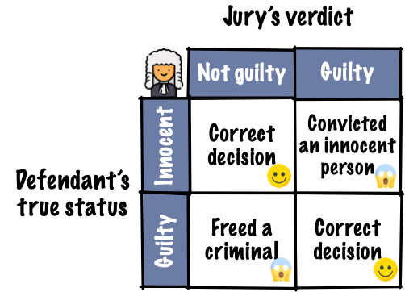
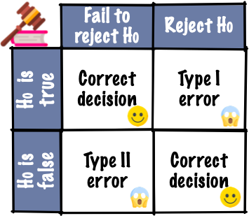
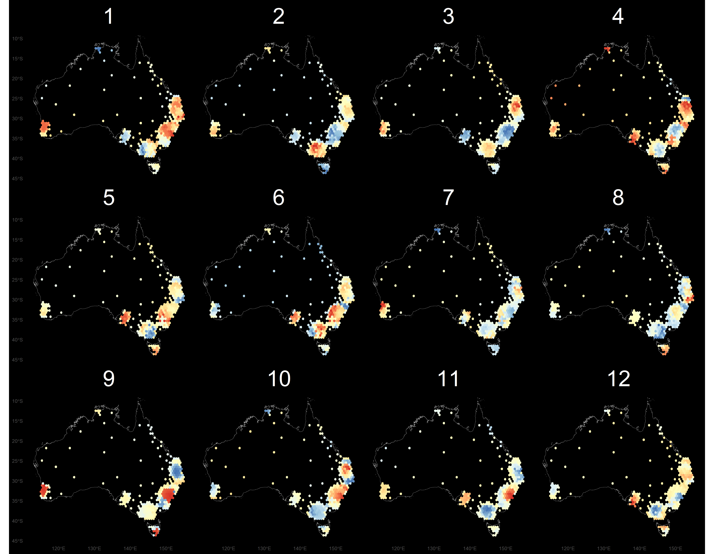

```{r, include = FALSE, echo=FALSE}
source("../setup.R")
```


## What this class is about

<center>



</center>

## Revisiting hypothesis testing {.transition-slide .center style="text-align: center;"}


```{r coin}
#| echo: false
head <- ''
tail <- ''
```

## (Frequentist) hypothesis testing framework

::: {style="font-size: 80%;"}
* Suppose $X$ is the number of heads out of $n$ independent tosses.
* Let $p$ be the probability of getting a `r head` for this coin.

**Hypotheses** 

$H_0: p = 0.5$ vs. $H_a: p > 0.5$. Note $p_0=0.5$. <br> *Alternative* $H_a$ *is saying we believe that the coin is biased to heads.* <br> 

[NOTE: Alternative needs to be decided before seeing data.]{.monash-orange2} 

::: {.fragment}

**Assumptions**  Each toss is independent with equal chance of getting a head.

:::

::: {.fragment}

**Test statistic**  

It has been mathematically shown that $X \sim B(n, p)$. If $H_0$ is true, we expect the number of heads to be $np_0$.<br> We observe $n, x$ and compute the estimate, $\widehat{p} = \frac{x}{n}$. If $np_0 \geq 5, n(1-p_0)\geq 5$ it has been shown mathematically that this test statistic is $\frac{(\widehat{p} - p_0)}{\sqrt{p_0(1-p_0)/n}}$ has a [normal distribution]{.monash-blue2}.

:::

::: {.fragment}

This can be used to compute the [probability of seeing more than]{.monash-blue2} $x$ heads in $n$ coin flips, the $p$-value. 
If this is [small]{.monash-blue2} (e.g. $<$ 0.05), it is [unlikely to have happened]{.monash-blue2}, if $H_0$ was true.

:::

:::

## Computationally testing coin bias  [(1/3)]{.smallest}

* **Experiment 1**: I flipped the coin 10 times and this is the result:

<center>
```{r coin-bias, results='asis'}
set.seed(924)
samp10 <- sample(rep(c(head, tail), c(7, 3)))
cat(paste0(samp10, collapse = ""))
```
</center>

* The result is 7 head and 3 tails. So 70% are heads. 
* Do you believe the coin is biased based on this data?

## Computationally testing coin bias  [(2/3)]{.smallest}

* **Experiment 2**: Suppose now I flip the coin 100 times and this is the outcome:

```{r coin-bias100, results='asis'}
samp100 <- sample(rep(c(head, tail), c(70, 30)))
cat(paste0(samp100, collapse = ""))
```

* We observe 70 heads and 30 tails. So again 70% are heads.
* Based on this data, do you think the coin is biased?

## Computationally testing coin bias  [(3/3)]{.smallest}

### Calculate it

:::: {.columns}
::: {.column width=45%}

**Experiment 1 (n=10)**

- We observed $x=7$, or $\widehat{p} = 0.7$.

- Assuming $H_0$ is true, we expect $np=10\times 0.5=5$.

- Calculate the $P(X \geq 7)$

<br>
<br>

::: {.fragment}
```{r echo=TRUE}
sum(dbinom(7:10, 10, 0.5))
```
:::

:::

::: {.column width=50%}


**Experiment 2 (n=100)**

- We observed $x=70$, or $\widehat{p} = 0.7$.

- Assuming $H_0$ is true, we expect $np=100\times 0.5=50$.

- Calculate the $P(X \geq 70)$

<br>
<br>

::: {.fragment}

```{r echo=TRUE}
sum(dbinom(70:100, 100, 0.5))
```
:::

:::
::::

## Your turn: simulate coin flipping 1 {.activity-slide}

::: {.callout-tip title="Your turn"}
1. Simulate flipping a fair coin 10 times using this code:

::: {.larger}

```{r}
#| label: coin-fair
#| code-fold: false
#| eval: false
coinflips <- sample(c("H", "T"), 10, replace=TRUE)
sum(coinflips == "H")
```

:::

2. Enter your number of heads into the ED.ie response. 

:::

```{r}
#| echo: false
countdown::countdown(8, 34)
```

```{r}
#| label: analyse-results1
#| echo: false
#| eval: false
results1 <- read_csv("data/coinflips1-week4.csv")
ggplot(results1, aes(x=coinflips)) +
  geom_histogram(breaks = seq(-0.5, 10.5, 1), 
    fill = "grey70") +
  geom_vline(x = 7) # observed value
```

## Your turn: simulate coin flipping 2 {.activity-slide}

::: {.callout-tip title="Your turn"}
1. Simulate flipping a fair coin 100 times using this code:

::: {.larger}

```{r}
#| label: coin-100
#| code-fold: false
#| eval: false
coinflips <- sample(c("H", "T"), 100, replace=TRUE)
sum(coinflips == "H")
```

:::

2. Enter your number into the ED.ie response

:::

```{r}
#| echo: false
countdown::countdown(4, 46)
```


```{r}
#| label: analyse-results2
#| echo: false
#| eval: false
results2 <- read_csv("data/coinflips2-week4.csv")
ggplot(results2, aes(x=coinflips)) +
  geom_histogram(breaks = seq(-5, 105, 10), 
    fill = "grey70") +
  geom_vline(x = 70) # observed value
```


## Judicial system

::: {.callout-idea}
**Why is the null hypothesis always specific?**

You need to be able to calculate the probability of something happening, if the null was true. 

:::

:::: {.columns}
::: {.column width=50%}

::: {.fragment}

{width=50%}

:::

:::

::: {.column width=45%}

::: {.fragment}


<center>
{width=50%}
</center>

::: {.small}

**Evidence** by [test statistic]{.monash-blue2} computer using the observations.<br>
**Judgement** by [$p$-value]{.monash-blue2} (probability that the event, or more extreme events, happened assuming the null is true).
:::

:::

::: {.fragment}


[Does the test statistic have to be *numerical*?]{.monash-orange2}

:::

:::
::::


## Testing hypotheses using data plots {.transition-slide .center style="text-align: center;"}

## Motivation

Is this an example of a good residual plot, or does it suggest that there is a problem with the model fit?

```{r}
#| label: cars-residual
cars_fit <- lm(dist ~ speed, data = cars)
cars_lm <- augment(cars_fit)
set.seed(1051)
ggplot(cars_lm, aes(x=speed, y=.resid)) +
  geom_point() 
```

## Visual inference concepts

:::: {.columns}
::: {.column width=50%}


* Hypothesis testing in a visual inference framework is where:
   * the [_test statistic is a plot_]{.monash-blue2} and 
   * judgement is by human visual perception.

::: {.fragment}
[Why is the plot a test statistic?]{.monash-orange2} We'll see why soon. 
:::

:::
::: {.column width=50%}


::: {.fragment}


* *You, we, me* actually do visual inference many times but generally in an *informal* fashion.
* The problem with doing this is we are making an inference on whether the plot has any patterns based on *a single data plot*.
* The single data plot needs to be examined in the context of *what might this look like if different samples were shown.*

::: {.fragment}
[Reading data plots requires calibration.]{.monash-orange2}
:::

:::

:::
::::


## Visual inference steps

:::: {.columns}
::: {.column width=60% .smaller}

1. Write your plot description using ggplot. DON'T MAKE THE DATA PLOT!
2. Based on the description articulate the null and alternate hypotheses, e.g. $H_A:$ the two variables have association $\longrightarrow$ $H_0:$ there is no association between the two variables.
3. Decide on a method to generate **null data**, sample that are consistent with the null hypothesis.
4. Make $m-1$ null samples.
6. Make a <b class="monash-blue">lineup</b> of the plots of the null samples with the plot of the data plots randomly inserted. All plots use the same ggplot description, just different samples.
7. Ask $n$ human viewers to select a plot in the lineup that looks different to others. Don't give any context, and disguise axes.

The `nullabor::lineup()` function can do simple lineups.

:::
::: {.column width=40% .smaller}


Using the same type of calculation as done for the coi flipping, compute the probability that $x$ out of $n$ people detected the data plot from a lineup, then

* the [**visual inference p-value**]{.monash-blue2} is given as $$P(X \geq x)$$ where $X \sim B(n, 1/m)$, and 
* the [**power of a lineup**]{.monash-blue2} is estimated as $x/n$.

Easier, still use the `nullabor::pvisual()` function to compute it.

:::
::::

## Example: residual plots [(1/4)]{.smallest}

Which plot has a pattern that is most different from other plots?

:::: {.columns}
::: {.column width=60%}

```{r}
#| label: cars-lineup
#| echo: false
#| out-width: 90%
#| fig-width: 9
#| fig-height: 7
library(nullabor)
cars_fit <- lm(dist ~ speed, data = cars)
cars_lm <- augment(cars_fit)
set.seed(1051)
ggplot(lineup(null_lm(dist ~ speed, method="rotate"), cars_lm), aes(x=speed, y=.resid)) +
  geom_point() +
  facet_wrap(~.sample, ncol=5) +
  theme(axis.text=element_blank(),
        axis.title=element_blank())
```

:::

::: {.column width=40%}


::: {.fragment}

Residuals from `dist~speed` using `datasets::cars`. 

```{r}
#| eval: false
#| echo: true
lm(dist ~ speed, data = cars)
```

::: {style="font-size: 80%;"}

* This is a lineup of the residual plot
* Which plot (if any) looks different from the others?
* Why do you think it looks different? 

:::

:::

::: {.fragment style="font-size: 80%;"}

```
> decrypt("clZx bKhK oL 3OHohoOL 0B")
[1] "True data in position  11"
```
<br>

```{r}
nullabor::pvisual(2, 16, 20)
```

:::
:::
::::

## Residual plots need context 

<br>
You are asked to decide IF THERE IS NO PATTERN. [This is hard!]{.monash-orange2}
<br>
<br>

- Numerical tests (e.g. Breusch-Pagan, Shapiro-Wilk) are either insensitive or overly-sensitive
- Visual inspection is effective but **subjective and unscalable**
- Different analysts reading the same plot reach different conclusions

::: {.info}
Residual plots are better when viewed in the [context of good residual plots]{.monash-blue2}, where we know the assumptions of the model are satisfied.
:::

## Example: residual plots [(2/4)]{.smallest}

:::: {.columns}
::: {.column width=60%}

```{r}
#| label: diamonds-lineup
#| out-width: 80%
#| fig-width: 9
#| fig-height: 7
library(broom)
diamonds <- diamonds %>%
  mutate(lprice = log10(price),
         lcarat = log10(carat))
d_fit <- lm(lprice ~ lcarat, data=diamonds)
d_res <- augment(d_fit, diamonds)

set.seed(923)
l <- lineup(null_lm(lprice ~ lcarat,
                      method="rotate"), d_res)
ggplot(l, aes(lcarat, .resid)) + 
  geom_hline(yintercept=0, colour="grey70") +
  geom_point(alpha = 0.01) +
  geom_smooth(data=l, method = "lm", colour="orange", se=F) +
  facet_wrap(~.sample, ncol=5) +
  theme_bw() +
  theme(axis.text=element_blank(),
        axis.title=element_blank())

```

:::

::: {.column width=40%}

Residuals from log-transformed `price` and `carat` `ggplot2::diamonds`. Did it linearise the relationship nicely?

```{r}
#| eval: false
d_fit <- lm(lprice ~ lcarat, data=diamonds)
```


* Which plot (if any) looks different from the others? 
* Why do you think it looks different? 

::: {.fragment}

```
> decrypt("clZx bKhK oL 3OHohoOL 0Q")
[1] "True data in position  15"
```

```{r}
#| echo: true
nullabor::pvisual(8, 12, 20)
```

:::

:::

::::


## Example: Residual plots [(3/4)]{.smallest}

:::: {.columns}
::: {.column width=30%}

<br><br>
Is there a problem with the model?

<br><br>
Let's see what the computer vision model suggests: [**Shiny web app**](https://autoviweb.netlify.app/)

:::

::: {.column width=70%}

```{r}
#| echo: false
#| out-width: 60%
#| fig-width: 3
#| fig-height: 3
set.seed(332)
d <- tibble(.fitted = -rexp(n=84*12),
            .resid = rnorm(n=84*12),
            .sample = rep(1:12, 84))

d |>
  dplyr::filter(.sample == 1) |>
  ggplot(aes(x=.fitted, y=.resid)) +
    geom_hline(yintercept = 0, colour = "red") +
    geom_point(alpha = 0.8) +
    theme_bw() +
    theme(axis.text = element_blank())
```

:::
::::

## Residual plot [(4/4)]{.smallest}

:::: {.columns}
::: {.column}

Use the app to check how the computer vision model performs with the lineup of residual plots from the cars model.

:::

::: {.column}

::: {.fragment}
Use the app to check how the computer vision model performs on the second example data set provided in the app.
:::

:::
::::


## It's not only for residual plots {.transition-slide .center style="text-align: center;"}

## Sports analytics: basketball

:::: {.columns}
::: {.column width=30%}

<br><br>
Which plot is most different?
:::

::: {.column width=70%}


```{r}
#| echo: false
#| out-width: 80%
#| fig-width: 7
#| fig-height: 6
threept <- subset(lal, type == "3pt" & !is.na(x) & !is.na(y))
threept <- threept[c(".id", "period", "time", "team", "etype", "player", "points", "result", "x", "y")]
threept <- transform(threept, 
  x = x + runif(length(x), -0.5, 0.5),
  y = y + runif(length(y), -0.5, 0.5))
threept <- transform(threept, 
  r = sqrt((x - 25) ^ 2 + y ^ 2),
  angle = atan2(y, x - 25))

# Focus in on shots in the typical range
threept_sub <- threept %>% 
  filter(between(r, 20, 39)) %>%
  mutate(angle = angle * 180 / pi) %>%
  select(angle, r)

ggplot(lineup(null_lm(r ~ poly(angle, 2)), 
              true=threept_sub, n = 20, pos = 2), 
       aes(x=angle, y=r)) + 
  geom_point(alpha=0.3) + 
  scale_x_continuous("Angle (degrees)", 
  breaks = c(0, 45, 90, 135, 180), limits = c(0, 180)) +
  facet_wrap(~ .sample, ncol = 5) +
  theme_bw() +
  theme(axis.text=element_blank(),
        axis.title=element_blank())

```
:::
::::

## Time series: cross-currency rates

:::: {.columns}
::: {.column width=30%}

<br><br>
Which plot is most different?
:::

::: {.column width=70%}


```{r}
#| label: lineup-aud
#| echo: false
#| out-width: 80%
#| fig-width: 7
#| fig-height: 6
library(forecast)

l <- lineup(null_ts("rate", auto.arima), aud, pos=10)
ggplot(l, aes(x=date, y=rate)) + geom_line() +
  facet_wrap(~.sample, scales="free_y") +
  theme(axis.text = element_blank()) +
  xlab("") + ylab("")

```

:::
::::

## Association: cars


:::: {.columns}
::: {.column width=30%}

<br><br>
Which plot is most different?
:::

::: {.column width=70%}

```{r}
#| label: lineup-cars
#| echo: false
#| out-width: 80%
#| fig-width: 7
#| fig-height: 6
ggplot(lineup(null_permute('mpg'), mtcars), aes(mpg, wt)) +
  geom_point() +
  facet_wrap(~ .sample, ncol=5) +
  theme(axis.text = element_blank()) +
  xlab("") + ylab("")
```

:::
::::

## Spatial analysis: cancer incidence

:::: {.columns}
::: {.column width=30%}

<br><br>
Which plot is most different?

<br><br><br><br>
[From [Steff Kobakian's Master's thesis](https://github.com/srkobakian/experiment)]{.smallest}

:::

::: {.column width=70%}

{width=900}

:::
::::


## Reading any plot is easier in the context of null plots {.transition-slide .center style="text-align: center;"}

## Why is a data plot a statistic? {.transition-slide .center style="text-align: center;"}


## Why is a data plot a statistic? [(1/2)]{.smallest}

- The concept of tidy data matches elementary statistics
- Tabular form puts [variables in columns]{.monash-blue2} and observations in rows

$$X = \left[ \begin{array}{rrrr}
           X_1 & X_2 & ... & X_p 
           \end{array} \right] \\
  = \left[ \begin{array}{rrrr}
           X_{11} & X_{12} & ... & X_{1p} \\
           X_{21} & X_{22} & ... & X_{2p} \\
           \vdots & \vdots & \ddots& \vdots \\
           X_{n1} & X_{n2} & ... & X_{np}
           \end{array} \right]$$

- Variables can have distributions, e.g. $X_1 \sim N(0,1), ~~X_2 \sim \text{Exp}(1) ...$


## Why is a data plot a statistic? [(2/2)]{.smallest}

::: {style="font-size: 80%;"}
- [A statistic is a function on the values of items in a sample]{.monash-blue2}, e.g. for $n$ iid random variates $\bar{X}_1=\sum_{i=1}^n X_{i1}$, $s_1^2=\frac{1}{n-1}\sum_{i=1}^n(X_{i1}-\bar{X}_1)^2$
- We study the behaviour of the statistic over all possible samples of size $n$. 
- The [grammar of graphics is the mapping of (random) variables to graphical elements]{.monash-blue2}, making plots of data into statistics
:::

:::: {.columns}

::: {.column width=33%}

::: {.fragment}

**Example 1:**

::: {style="font-size: 120%;"}

```
ggplot(threept_sub, 
       aes(x=angle, y=r)) + 
  geom_point(alpha=0.3)
```
:::

::: {style="font-size: 80%;"}

<br>

`angle` is mapped to the x axis

`r` is mapped to the y axis

:::
:::


:::

::: {.column width=33%}

::: {.fragment}

**Example 2:**

::: {style="font-size: 120%;"}

```
ggplot(penguins, 
      aes(x=bl, 
          y=fl, 
          colour=species)) +
  geom_point()
```
:::

::: {style="font-size: 80%;"}

<br>

`bl` is mapped to the x axis

`fl` is mapped to the y axis

`species` is mapped to colour

:::
:::
:::

::: {.column width=33%}

::: {.fragment}

**Example 3:**

::: {style="font-size: 120%;"}

```
ggplot(aud, aes(x=date, y=rate)) + 
  geom_line() 
```
:::

::: {style="font-size: 80%;"}

<br>

`date` is mapped to the x axis

`rate` is mapped to the y axis

displayed as a line `geom` 

:::
:::

:::
::::

## Determining the null hypothesis {.transition-slide .center style="text-align: center;"}


## What is the null hypothesis? [(1/2)]{.smallest}

To determine the null hypothesis, you need to think about [what pattern would NOT be interesting]{.monash-blue2}. 

:::: {.columns}
::: {.column width=50%}

A
```
ggplot(data) + 
  geom_point(aes(x=x1, y=x2))
```

<br>


B
```
ggplot(data) + 
  geom_point(aes(x=x1, 
    y=x2, colour=cl))
```

:::
::: {.column width=50%}

C
```
ggplot(data) + 
  geom_histogram(aes(x=x1))
```

<br>

D
```
ggplot(data) + 
  geom_boxplot(aes(x=cl, y=x1))
```
:::
::::

<br><br>

::: {style="font-size: 80%;"}

🤔 Which of these plot definitions would most match to a null hypothesis stating *there is no difference in the distribution between the groups?*

:::


## What is the null hypothesis? [(2/2)]{.smallest}

<br><br>


:::: {.columns}
::: {.column width=50%}


A

$H_o:$ no association between `x1` and `x2`

<br>
<br>


B

$H_o:$ no difference in association of between `x1` and `x2` between levels of `cl`

:::
::: {.column width=50%}


C

$H_o:$ the distribution of `x1` is XXX

<br>
<br>


D

$H_o:$ no difference in the distribution of `x1` between levels of `cl`
:::
::::

## How do you generate null samples {.transition-slide .center style="text-align: center;"}


## Primary null-generating mechanisms

<br>

Null samples can be generated using two basic approaches:

- [Permutation]{.monash-blue2}: randomizing the order of one of the variables breaks association, but keeps marginal distributions the same.
- [Simulation]{.monash-blue2}: from a given distribution, or model. Assumption is that the data comes from that model. 

applied to subsets, or conditioning on other variables. Simulation may require computing summary statistics from the data to use as parameter estimates.

## Association: cars

:::: {.columns}
::: {.column width=70%}
```{r}
#| label: lineup-cars
#| echo: false
#| out-width: 80%
#| fig-width: 7
#| fig-height: 6
```
:::
::: {.column width=30%}

<br><br>

Null plots generated by [permuting]{.monash-blue2} `x` variable.

:::
::::

<!--
## New example: Temperatures of stars [(1/2)]{.smallest}

* The data consists of the surface temperature in Kelvin degrees of 96 stars.
* We want to check if the surface temperature has an exponential distribution. 
* We use histogram with 30 bins as our visual test statistic.
* For the null data, we will generate from an exponential distribution.

```{r star-null, message = TRUE}
line_df <- lineup(null_dist("temp", "exp", 
    list(rate = 1 / mean(dslabs::stars$temp))),
  true = dslabs::stars,
  n = 10
)
```
* Note: the rate in an exponential distribution can be estimated from the inverse of the sample mean.

## New example: Temperatures of stars [(2/2)]{.smallest}

:::: {.columns}
::: {.column width=50%}

::: {.panel-tabset}

## Plot

```{r stars-lineup, echo = FALSE, fig.width = 14}
ggplot(line_df, aes(temp)) +
  geom_histogram(color = "white") +
  facet_wrap(~.sample, nrow = 2) +
  theme(
    axis.text = element_blank(),
    axis.title = element_blank()
  )
```

## R
```{r stars-lineup, eval = FALSE}
```

:::
:::
::::
-->

## Time series: cross-currency rates

:::: {.columns}
::: {.column width=70%}

```{r}
#| label: lineup-aud
#| echo: false
#| out-width: 80%
#| fig-width: 7
#| fig-height: 6
```

:::
::: {.column width=30%}

<br><br>
Nulls generated by [simulating]{.monash-blue2} from an ARIMA model.

:::
::::


## Beyond $p$-value to power {.transition-slide .center style="text-align: center;"}


## What is power?

:::: {.columns}
::: {.column width=70%}

* A statistic is said to be [more powerful]{.monash-blue2} than another statistic if it has a higher probability of correctly rejecting the null hypothesis when the alternative hypothesis is true.
* The effectiveness of two plots designs for the same data can be compared by computing power from a lineup. 
* The power of a lineup is calculated as $x/n$ where $x$ is the number of people who detected the data plot out of $n$ people.

:::
::::

## Power of plot design {.activity-slide}

We're going to play a game to determine, **which of these plots is more effective for assessing difference between groups**.

<br><br>
Each group will see **only one** of the next four plots for 3 second. Choose which of the plots, 1, ..., 10, is most different, and record it until we are ready to collect the data.

## 

Make a note whether it is plot `r paste0(1:10, sep = ",")` which is most different.

::: {.panel-tabset}

## Blank

```{r}
#| echo: false
#| fig-width: 8
#| fig-height: 5
#| out-width: 60%
ggplot(lineup(null_permute("species"), penguins, n=10),
       aes(x=species, y=bill_len, colour=species)) +
  geom_point(alpha=0) +
  facet_wrap(~.sample, ncol=5) +
  colorspace::scale_color_discrete_divergingx(palette="Temps") +
  theme_bw() +
  theme(
    legend.position="none",
    axis.title = element_blank(),
    axis.text = element_blank()
  )
```

## Plot 1

```{r}
#| echo: false
#| fig-width: 8
#| fig-height: 5
#| out-width: 60%
set.seed(400)
ggplot(lineup(null_permute("species"), penguins, n=10),
       aes(x=species, y=bill_len, colour=species)) +
  geom_point(alpha=0.4) +
  facet_wrap(~.sample, ncol=5) +
  colorspace::scale_color_discrete_divergingx(palette="Temps") +
  theme_bw() +
  theme(
    legend.position="none",
    axis.title = element_blank(),
    axis.text = element_blank()
  )
```

## Blank

```{r}
#| echo: false
#| fig-width: 8
#| fig-height: 5
#| out-width: 60%
ggplot(lineup(null_permute("species"), penguins, n=10),
       aes(x=species, y=bill_len, colour=species)) +
  geom_point(alpha=0) +
  facet_wrap(~.sample, ncol=5) +
  colorspace::scale_color_discrete_divergingx(palette="Temps") +
  theme_bw() +
  theme(
    legend.position="none",
    axis.title = element_blank(),
    axis.text = element_blank()
  )
```

## Plot 2

```{r}
#| echo: false
#| fig-width: 8
#| fig-height: 5
#| out-width: 60%
ggplot(lineup(null_permute("species"), penguins, n=10),
       aes(x=species, y=bill_len, fill=species), colour="white") +
  geom_boxplot() +
  facet_wrap(~.sample, ncol=5) +
  colorspace::scale_fill_discrete_divergingx(palette="Temps") +
  theme_bw() +
  theme(
    legend.position="none",
    axis.title = element_blank(),
    axis.text = element_blank()
  )
```

## Blank

```{r}
#| echo: false
#| fig-width: 8
#| fig-height: 5
#| out-width: 60%
ggplot(lineup(null_permute("species"), penguins, n=10),
       aes(x=species, y=bill_len, colour=species)) +
  geom_point(alpha=0) +
  facet_wrap(~.sample, ncol=5) +
  colorspace::scale_color_discrete_divergingx(palette="Temps") +
  theme_bw() +
  theme(
    legend.position="none",
    axis.title = element_blank(),
    axis.text = element_blank()
  )
```


## Plot 3

```{r}
#| echo: false
#| fig-width: 8
#| fig-height: 5
#| out-width: 60%
ggplot(lineup(null_permute("species"), penguins, n=10),
       aes(x=species, y=bill_len, fill=species), colour="white") +
  geom_violin() +
  facet_wrap(~.sample, ncol=5) +
  colorspace::scale_fill_discrete_divergingx(palette="Temps") +
  theme_bw() +
  theme(
    legend.position="none",
    axis.title = element_blank(),
    axis.text = element_blank()
  )
```

## Blank

```{r}
#| echo: false
#| fig-width: 8
#| fig-height: 5
#| out-width: 60%
ggplot(lineup(null_permute("species"), penguins, n=10),
       aes(x=species, y=bill_len, colour=species)) +
  geom_point(alpha=0) +
  facet_wrap(~.sample, ncol=5) +
  colorspace::scale_color_discrete_divergingx(palette="Temps") +
  theme_bw() +
  theme(
    legend.position="none",
    axis.title = element_blank(),
    axis.text = element_blank()
  )
```

## Plot 4

```{r}
#| echo: false
#| fig-width: 8
#| fig-height: 5
#| out-width: 60%
ggplot(lineup(null_permute("species"), penguins, n=10),
       aes(x=species, y=bill_len, colour=species)) +
  ggbeeswarm::geom_quasirandom(alpha=0.8) +
  facet_wrap(~.sample, ncol=5) +
  colorspace::scale_color_discrete_divergingx(palette="Temps") +
  theme_bw() +
  theme(
    legend.position="none",
    axis.title = element_blank(),
    axis.text = element_blank()
  )
```

## Blank

```{r}
#| echo: false
#| fig-width: 8
#| fig-height: 5
#| out-width: 60%
ggplot(lineup(null_permute("species"), penguins, n=10),
       aes(x=species, y=bill_len, colour=species)) +
  geom_point(alpha=0) +
  facet_wrap(~.sample, ncol=5) +
  colorspace::scale_color_discrete_divergingx(palette="Temps") +
  theme_bw() +
  theme(
    legend.position="none",
    axis.title = element_blank(),
    axis.text = element_blank()
  )
```

:::

```{r}
#| echo: false
countdown::countdown(0, 3)
```

## Compiling the results

Share your group, and which plot you chose.

## Computing the power

Note: Different people evaluated each lineup. 

Plot type | $x$ | $n$ | Power
--- | --- | --- | --- 
`geom_point` | $x_1=??$ | $n_1=??$ | $x_1 / n_1=??$
`geom_boxplot` | $x_2=??$ | $n_2=??$ | $x_2 / n_2=??$
`geom_violin` | $x_3=??$ | $n_3=??$ | $x_3 / n_3=??$
`ggbeeswarm::geom_quasirandom` | $x_4=??$ | $n_4=??$ | $x_4 / n_4=??$

<br>

::: {.fragment}


* The plot type with a higher power is preferable 
* You can use this framework to find the optimal plot design
* Which is the winner?

:::

## The process for choosing a plot design

:::: {.columns}
::: {.column}

```{r}
#| echo: false
#| fig-width: 10
#| fig-height: 6
#| out-width: 90%
library(DiagrammeR)
grViz("
digraph process {
  graph [rankdir = TB, nodesep = 0.4, ranksep = 0.4]
  node [fontname = Helvetica, shape = box, style = filled, fillcolor = white, color = '#006dae', fontcolor = '#006dae']
  edge [color = '#006dae']

  A [label = 'Generate a lineup:\ntrue data plot hidden among null plots']
  B [label = 'Show the lineup to blind evaluators\nfor a fixed viewing time']
  C [label = 'Each evaluator picks the panel\nthat looks most different']
  D [label = 'Record x = number of evaluators who picked\nthe true data plot, out of n evaluators']
  E [label = 'Compute power = x / n\nfor this plot design']
  F [label = 'Repeat for every candidate\nplot design', shape = diamond]
  G [label = 'Compare power across designs']
  H [label = 'Choose the design\nwith the highest power']

  A -> B -> C -> D -> E -> F
  F -> A [label = '  geom_point, geom_boxplot,\n  geom_violin, geom_quasirandom  ']
  F -> G -> H
}
")
```

:::
::: {.column}

1. Decide on your best plot designs
2. Make lineups, using the same data, same position with each
3. Show independent groups the lineups to evaluate
4. Calculate the power for each, or use speed as an alternative
5. Whichever design produces the higher power, is the one where the reader can best see the structure.

:::
::::

## Main takeaways

* Hypothesis tests can be built computationally, by simulating or permuting data under $H_0$, instead of relying on textbook reference distributions.
* A data plot can itself be a test statistic: the [lineup protocol]{.monash-blue2} embeds the data plot among null plots generated under $H_0$, and a viewer "rejects" $H_0$ if they pick out the data plot.
* Choosing how to generate null plots matters: use [permutation]{.monash-blue2} when the null implies no association, and [simulation]{.monash-blue2} (e.g. from a fitted model) when the null specifies a particular data-generating process.
* Any plot — residual plots, sports analytics, time series, associations, spatial maps — is easier to read and trust when compared against null plots as a reference.
* The effectiveness of competing plot designs can be measured empirically and quantitatively as [power]{.monash-blue2} ($x/n$, the proportion of viewers who spot the real data), giving an evidence-based way to choose between visualization designs.

## Resources 

- [nullabor](https://dicook.github.io/nullabor/) R package
- [vinference](https://heike.github.io/vinference/) R packge
- Wickham, Hadley, Dianne Cook, Heike Hofmann, and Andreas Buja. 2010. [“Graphical Inference for Infovis.”](https://vita.had.co.nz/papers/inference-infovis.pdf) IEEE Transactions on Visualization and Computer Graphics 16 (6): 973–79.
- Hofmann, H., L. Follett, M. Majumder, and D. Cook. 2012. [“Graphical Tests for Power Comparison of Competing Designs.”](https://www.computer.org/csdl/journal/tg/2012/12/ttg2012122441/13rRUy0qnGj#:~:text=10.1109/TVCG.2012.230) IEEE Transactions on Visualization and Computer Graphics 18 (12): 2441–48.

