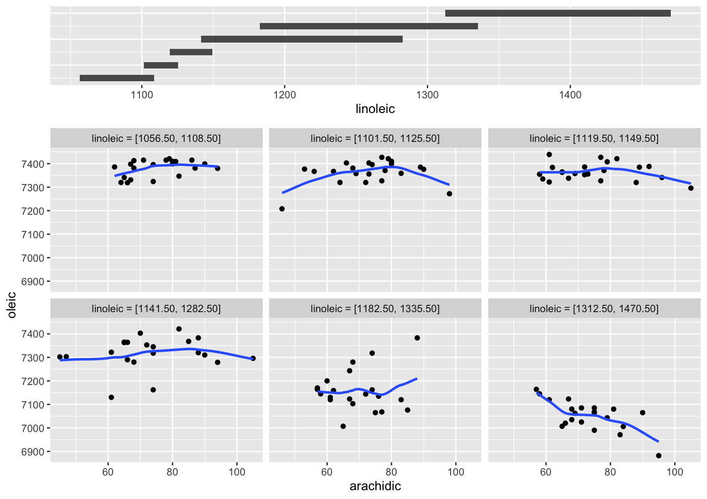
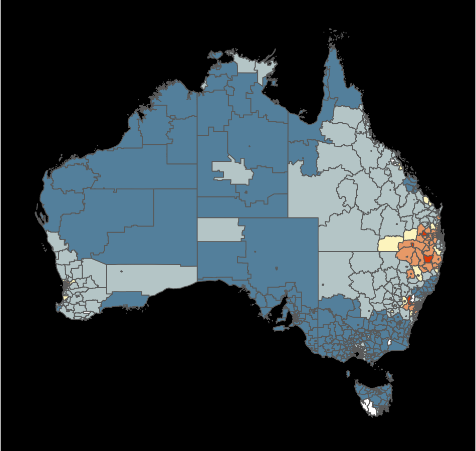
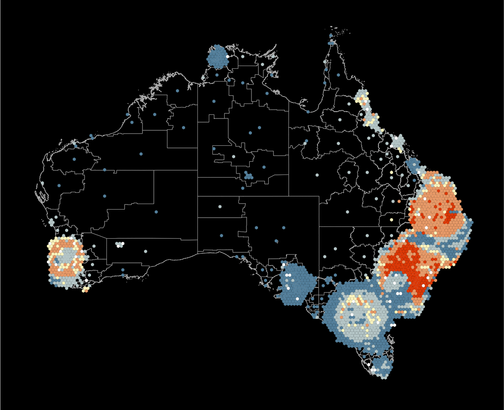
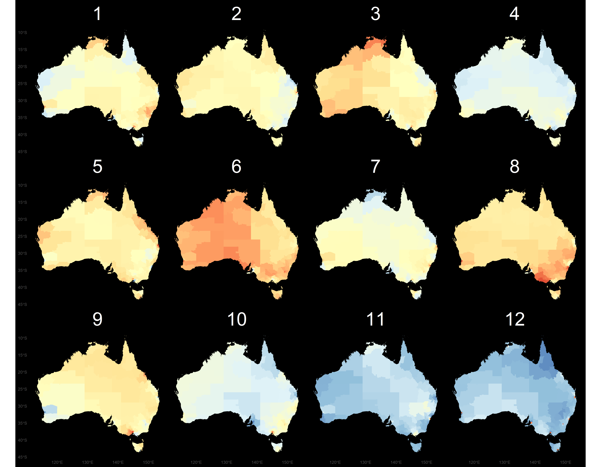
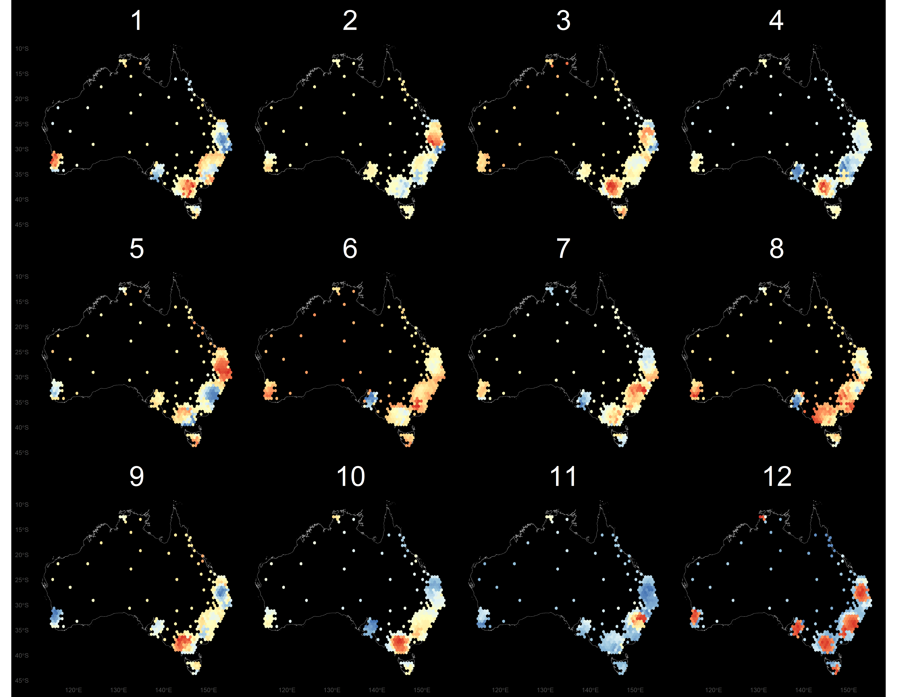
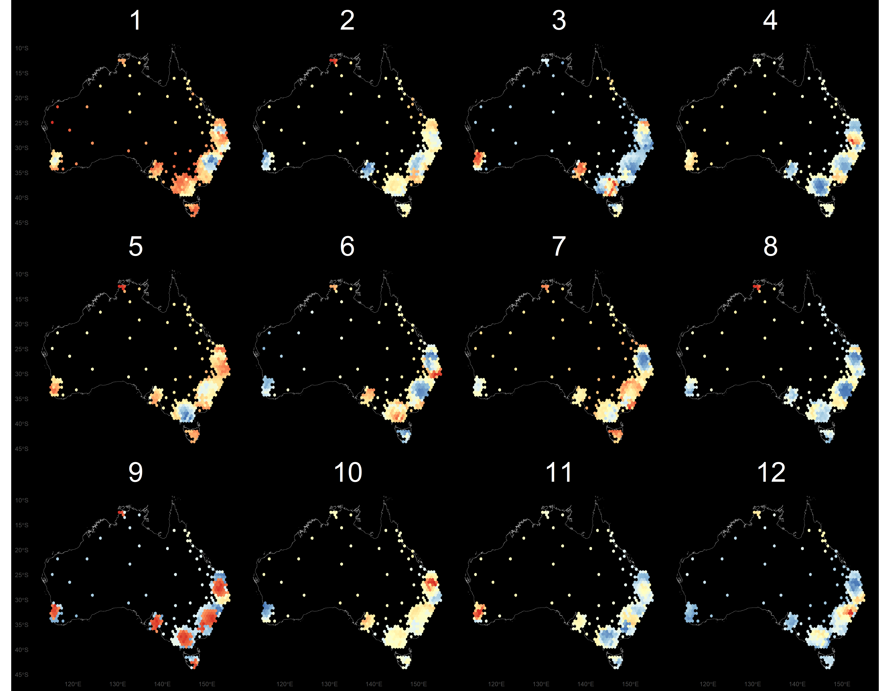
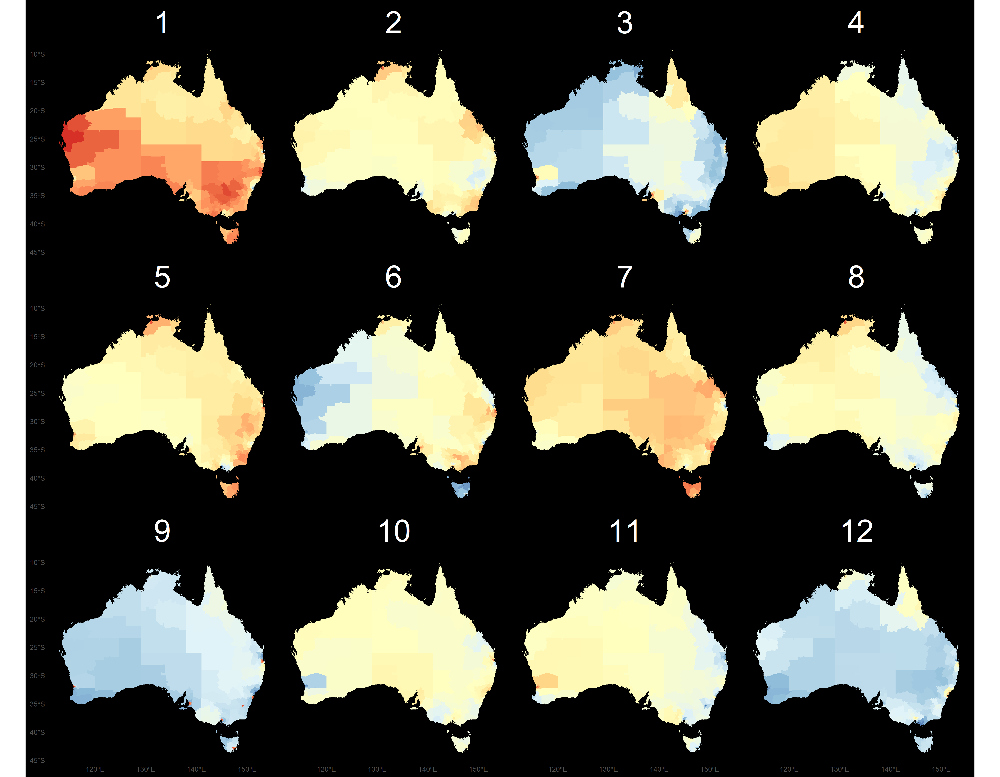

```{r}
#| label: setup
#| include: false
#| echo: false
source("../setup.R")
```

```{r DT-options, include = FALSE}
toggle_select <- DT::JS(
  "table.on('click.dt', 'tbody tr', function() {",
  "$(this).toggleClass('selected');",
  "})"
)
table_options <- function(scrollY, title, csv) {
  list(
    dom = "Bft",
    pageLength = -1,
    searching = TRUE,
    scrollX = TRUE,
    scrollY = scrollY,
    buttons = list(
      list(
        extend = "copy",
        filename = title
      ),
      list(
        extend = "csv",
        filename = csv
      )
    )
  )
}
```

## At the heart of quantitative reasoning is a single question: Compared to what? {.transition-slide .center style="text-align: center;"}

<br>
[-Edward Tufte]{.smallest}

## Making comparisons

- Groups defined by [strata]{.monash-blue2} labelled in categorical variables
- [Observations]{.monash-blue2} in strata, same or different?
- Is there a [baseline]{.monash-blue2}, or normal value?
- What are the [dependencies]{.monash-blue2} in the way the data was collected?
- Are multiple samples recorded for the same individual, or recorded on different individuals?

::: {.info}
Determining the appropriate comparison is not always easy, but important to document when decided.
:::

## How would you answer these questions?

- Are housing prices increasing more in Sydney or Melbourne?

::: {.fragment}
- Is the rental price of the unit/apartment too high?
:::

::: {.fragment}
- Is the Alfred or Epworth Hospital better for giving birth? 
:::

::: {.fragment}
- It's hot and dry today, is the risk of bushfires too high to go hiking?
:::

*ED-ie*

## Outline

- Comparing strata
- Paired, matched or repeated measurements
- Normalising, standardising, baseline, calibration
- When there is no data
- Including uncertainty
- The problem of making thousands of comparisons
- Generating comparison samples


<!--
- choropleth vs hexagon tile
- bushfire risk: what temperatures are normal
- kaggle study
- temperature at different locations
- cross-rates
- pedestrian sensor
- pisa: different cohorts for years; different countries
- tuberculosis
- before and after data
- hospital ranking: level of service
- propensity score matching
- relative risk, disease
- joy plot
- problems with multiple segmented bars
- population pyramids
- parallel sets: flow

Principles:

- paired samples vs independent samples
- heterogeneous strata
- relative to what
- normalising samples
-->

## Comparing strata {.transition-slide .center style="text-align: center;"}

## Case study: Melbourne's daily maximum temperature [(1/2)]{.smallest}

```{r}
#| label: temp-data
#| echo: false
#| include: false
melb_temp <- read_csv(here::here("data", "melb_temp.csv")) |>
  janitor::clean_names() |>
  rename(temp = maximum_temperature_degree_c) |>
  filter(!is.na(temp)) |>
  dplyr::select(year, month, day, temp)
skimr::skim(melb_temp)
```

::: {.panel-tabset}

## 📊

:::: {.columns}

::: {.column}

```{r}
#| label: temp-plot1
#| echo: false
ggplot(melb_temp, aes(x=month, y=temp)) +
  geom_violin(draw_quantiles=c(0.25, 0.5, 0.75), fill= "#56B4E9") +
  labs(x = "month", y = "max daily temp (°C)") +
  theme(aspect.ratio=0.5)
```

:::

::: {.column}

Melbourne's daily maximum temperature from 1970 to 2020.

What are the [strata]{.monash-blue2} in temporal data?

::: {.fragment}

* How are the temperatures different across months?
* What about the temperature within a month?

:::

:::

::::

## data

```{r render = knitr::normal_print}
#| label: temp-data
#| echo: true
#| eval: true
```


## R

```{r}
#| label: temp-plot1
#| echo: true
#| eval: false
```


:::


## Case study: Melbourne's daily maximum temperature [(2/2)]{.smallest}


:::: {.columns}
::: {.column}

<br>
Why can we make the comparison across months?

::: {.fragment}

*Because it is the same location, and same years, for each month subset.*

:::

::: {.fragment}
<br>
Is some variation in temperature each month due to changing climate?

*How would you check this?*
:::

:::
::: {.column style="font-size: 80%;"}

::: {.fragment}

```{r}
#| label: temp-year
#| code-fold: true
#| fig-width: 8
#| fig-height: 5
#| out-width: 100%
melb_temp |>
  group_by(year, month) |>
  summarise(temp = mean(temp)) |>
  ggplot(aes(x=year, y=temp)) +
  geom_point(alpha=0.5) +
  geom_smooth(se=F) + 
  facet_wrap(~month, ncol=4, scales="free_y") +
  scale_x_continuous("year", breaks=seq(1970, 2020, 20)) +
  ylab("max daily temp (°C)") +
  theme(aspect.ratio=0.7)
```

What is `scales="free_y"` for? *ED-ie*

:::
:::
::::

## Activity: Seasonality over years {.activity-slide}

::: {.callout-tip title="Your turn"}

What does change in seasonality mean?
 
1. Using `melb_temp`, compute the average max daily temperature for each `year` and `month`.

2. Make a line plot of temperature by month (x-axis), with one line connecting the dots for each year. Is there any evidence that the shape of the seasonal cycle has changed over time?

3. Years differ in their overall average temperature, which can make it hard to compare the *shape* of the seasonal cycle rather than its level. Try calibrating each year by dividing its monthly temperatures by that year's average temperature, then remake the plot. Does this change what you see?

4. What does this calibration achieve, and what does it hide?
:::

```{r}
#| echo: false
countdown::countdown(5, 43)
```

::: {.panel-tabset}

## Code

*ED-ie*

```{r}
#| label: temp-seasonality-answer
#| code-fold: true
#| eval: false
melb_temp_month <- melb_temp |>
  group_by(year, month) |>
  summarise(temp = mean(temp), .groups = "drop")

# raw comparison
ggplot(melb_temp_month, 
    aes(x = month, 
    y = temp, 
    group = year,
    colour = year)) +
  geom_line(alpha = 0.4) +
  geom_point(alpha = 0.4) +
  ylab("max daily temp (°C)") +
  scale_x_discrete("", labels = c("J","F", "M", "A", "M", "J", "J", "A", "S", "O", "N", "D"))

# calibrated by each year's average temperature
melb_temp_month |>
  group_by(year) |>
  mutate(temp_cal = temp / mean(temp)) |>
  ungroup() |>
  ggplot(aes(x = month, 
             y = temp_cal, 
             group = year, 
             colour = year)) +
  geom_line(alpha = 0.4) +
  geom_point(alpha = 0.4) +
  ylab("temp relative to yearly average") +   scale_x_discrete("", labels = c("J","F", "M", "A", "M", "J", "J", "A", "S", "O", "N", "D"))
```

## Learn

::: {.vscroll-small style="font-size:70%;"}

- The raw line plot is dominated by [year-to-year differences in overall temperature]{.monash-blue2}: warmer years sit above cooler years across all months, which makes it hard to compare the *shape* of the seasonal cycle.
- Dividing by each year's average [removes the level differences]{.monash-blue2} between years, so the lines overlap more and it becomes easier to compare the *timing* and *shape* of the seasonal peak and trough across years.
- This calibration also [removes information]{.monash-orange2} about whether some years were warmer overall than others — it isn't appropriate if the question of interest is about overall warming rather than seasonal shape.

:::

:::

## Case study: olive oils [(1/4)]{.smallest}

```{r}
#| label: olives-data
#| include: false
data(olives, package = "classifly")
df2 <- olives |>
  mutate(Region = factor(Region, labels = c("South", "Sardinia", "North")))

skimr::skim(df2)
```


::: {.panel-tabset}

## 📊

:::: {.columns}
::: {.column width=70%}

```{r}
#| label: olives-plot1
#| echo: false
#| fig-height: 10
#| fig-width: 10
#| out-width: 60%
g1 <-
  df2 |>
  mutate(Area = fct_reorder(Area, palmitic)) |>
  ggplot(aes(Area, palmitic, color = Region)) +
  geom_boxplot() +
  scale_color_discrete_divergingx(palette="Zissou 1") +
  guides(color = FALSE, x = guide_axis(n.dodge = 2)) +
  theme(aspect.ratio=0.5)

g2 <- ggplot(df2, aes(Region, palmitic, color = Region)) +
  geom_boxplot() +
  scale_color_discrete_divergingx(palette="Zissou 1") +
  guides(color = FALSE) +
  theme(axis.text = element_blank())

g3 <- ggplot(df2, aes(palmitic, color = Region)) +
  geom_density() +
  scale_color_discrete_divergingx(palette="Zissou 1") +
  guides(color = FALSE) +
  theme(axis.text = element_blank())

g4 <- ggplot(df2, aes(palmitic, color = Region)) +
  stat_ecdf() +
  scale_color_discrete_divergingx(palette="Zissou 1") +
  guides(color = FALSE) +
  theme(axis.text = element_blank())

g5 <- g2 + g3 + g4 + plot_layout(ncol=3)
  
g1 + g5 + plot_layout(ncol=1, heights=c(2,1),
  guides = "collect")
```

:::
::: {.column style="font-size: 80%; width: 30%;"}

* The olive oil data consists of the percentage composition of 8 fatty acids (palmitic, palmitoleic, stearic, oleic, linoleic, linolenic, arachidic, eicosenoic) found in the lipid fraction of 572 Italian olive oils. 
* There are 9 collection areas, 4 from southern Italy (North and South Apulia, Calabria, Sicily), two from Sardinia (Inland and Coastal) and 3 from northern Italy (Umbria, East and West Liguria).

:::
::::

## data

```{r render = knitr::normal_print}
#| label: olives-data
#| echo: true
```

## R

```{r}
#| label: olives-plot1
#| echo: true
#| eval: false
```

:::

## Case study: olive oils [(2/4)]{.smallest}


::: {.panel-tabset}

## 📊

:::: {.columns}
::: {.column}

```{r}
#| label: color-olives
#| echo: false
ggplot(olives, aes(palmitoleic, palmitic, color = Area)) +
  geom_point() +
  scale_color_discrete_divergingx(palette="Zissou 1") 
```

:::
::: {.column}

Colour is generally good to differentiate strata but if there are too many categories then it becomes hard to compare.
 

:::
::::

## R

```{r}
#| label: color-olives
#| eval: false
```

:::

## Case study: olive oils [(3/4)]{.smallest}

::: {.panel-tabset}

## 📊

:::: {.columns}
::: {.column}

```{r}
#| label: no-shadow
#| echo: false
#| fig-width: 7
#| fig-height: 7
#| out-width: 80%
ggplot(olives, aes(palmitoleic, palmitic, color = Area)) +
  geom_point() +
  facet_wrap(~Area) +
  scale_color_discrete_divergingx(palette="Zissou 1") +
  guides(color = FALSE) 
```
:::
::: {.column}
It can be hard to compare across plots, because we need to remember what the previous pattern was when focusing on the new cell.

:::
::::

## R

```{r}
#| label: no-shadow
#| eval: false
```

:::

## Case study: olive oils [(4/4)]{.smallest}

::: {.panel-tabset}

## 📊

:::: {.columns}
::: {.column}

```{r}
#| label: shadow
#| echo: false
#| fig-width: 7
#| fig-height: 7
#| out-width: 80%
ggplot(olives, aes(palmitoleic, palmitic)) +
  geom_point(data = dplyr::select(olives, -Area), color = "gray") +
  geom_point(aes(color = Area), size=2) +
  facet_wrap(~Area) +
  scale_color_discrete_divergingx(palette="Zissou 1") +
  guides(color = FALSE)
```
:::
::: {.column}
Comparison to all, by putting a shadow of all the data underneath the subset in each cell.
:::
::::

## R

```{r}
#| label: shadow
#| eval: false
```

:::

## Strata from quantitative variable

:::: {.columns}
::: {.column width=40%}
The [coplot]{.monash-blue2} divides the numerical variable into chunks, and facets by these.
The chunks traditionally we overlapping.

<br><br><br>
[Becker, Cleveland and Shyu,  (1996); Cleveland (1993)]{.smallest}
:::
::: {.column style="font-size: 80%; width: 60%;"}
```{r}
#| label: olives-coplot
#| code-fold: true
#| fig-width: 10
#| fig-height: 6
#| out-width: 100%
#| eval: false
# Sizing of figure is difficult, so save it
library(ggcleveland)
olives_sard <- df2 |>
  filter(Region == "Sardinia")
p <- gg_coplot(olives_sard,
  x=arachidic, y=oleic, 
  faceting = linoleic,
  number_bins = 6, 
  overlap = 1/4) +
  theme(aspect.ratio=0.5)
```



:::
::::

## Strata for categorical variables

:::: {.columns}
::: {.column}

```{r}
#| label: generate-data
set.seed(42)

# Simulate a small employee-engagement survey
# 5 questions, 5-point Likert scale, 200 respondents

levels_5pt <- c(
  "Strongly disagree", "Disagree", "Neutral", "Agree", "Strongly agree"
)

survey_questions <- c(
  "My manager gives useful feedback",
  "I have the tools I need to do my job",
  "I understand how my work connects to company goals",
  "I feel comfortable raising concerns",
  "I would recommend this company as a place to work"
)

# Give each question a different underlying 
# sentiment so the charts actually show 
# a mix of positive/negative/mixed results
probs <- list(
  c(0.05, 0.10, 0.15, 0.40, 0.30),  # mostly positive
  c(0.20, 0.30, 0.20, 0.20, 0.10),  # skews negative
  c(0.05, 0.15, 0.50, 0.20, 0.10),  # mostly neutral
  c(0.15, 0.20, 0.10, 0.30, 0.25),  # mixed / bimodal-ish
  c(0.10, 0.15, 0.20, 0.30, 0.25)   # mildly positive
)

n_resp <- 200

survey_wide <- as_tibble(
  setNames(
    lapply(seq_along(survey_questions), function(i) {
      factor(
        sample(levels_5pt, n_resp, replace = TRUE, prob = probs[[i]]),
        levels = levels_5pt,
        ordered = TRUE
      )
    }),
    as.character(1:5)
  )
)

survey_long <- survey_wide |>
  pivot_longer(everything(), 
    names_to = "question_num", 
    values_to = "response") |>
  mutate(question = survey_questions[as.numeric(question_num)]) |>
  mutate(response = factor(response, 
    levels = levels_5pt, ordered = TRUE),
    question = factor(question, 
      levels = survey_questions))

stacked_data <- survey_long |>
  count(question_num, response) |>
  group_by(question_num) |>
  mutate(pct = n / sum(n)) |>
  ungroup()

```

```{r}
#| label: stacked-bar
#| out-width: 80%
plain_stacked_bar <- ggplot(stacked_data, 
    aes(x = pct, 
        y = question_num, 
        fill = response)) +
  geom_col(position = position_stack(reverse = TRUE)) +
  scale_fill_brewer(palette = "RdBu", direction = 1) +
  scale_x_continuous(labels = scales::percent) +
  scale_y_discrete(limits = rev) +
  labs(
    x = "Percent of respondents", y = NULL, fill = NULL
  ) +
  theme_minimal()
plain_stacked_bar
```

::: {.smallest}
The questions are: `r paste(1:5, survey_questions)`
:::

Rank the 5 questions by "most disagreement".

*ED-ie*

:::
::: {.column}
::: {.fragment}

A Likert plot centres the bar on the neutral category.

::: {.panel-tabset}

## gglikert

```{r}
#| label: likert-plot
#| out-width: 80%
library(ggstats)
likert_plot <- gglikert(
  survey_wide,
  add_labels = FALSE,
  add_totals = FALSE
) +
  scale_fill_brewer(palette = "RdBu", direction = 1) 
likert_plot
```

::: {.smallest}
NOTE: Also a good idea to sort questions (not done here).
:::

## Sorted

```{r}
#| label: likert-plot-sorted
#| out-width: 80%
library(ggstats)
likert_plot <- gglikert(
  survey_wide,
  add_labels = FALSE,
  add_totals = FALSE,
  sort = "ascending"
) +
  scale_fill_brewer(palette = "RdBu", direction = 1) 
likert_plot
```

:::

:::
:::

::::


## Simple rearranging comparisons: tuberculosis [(1/3)]{.smallest}

```{r}
#| label: tb-data
#| echo: false
# https://www.who.int/teams/global-tuberculosis-programme/data
tb <- read_csv(here::here("data/TB_notifications_2023-08-21.csv"))
tb_oz <- tb |>
  filter(iso3 == "AUS", between(year, 1997, 2012)) |>
  select(year, contains("new_sp")) |>
  select(-new_sp, -new_sp_m04, -new_sp_m514,
         -new_sp_m014, -new_sp_f014,
         -new_sp_mu, -new_sp_f04, -new_sp_f514,
         -new_sp_fu) |>
  pivot_longer(new_sp_m1524:new_sp_f65, 
              names_to="var", values_to="count") |>
  mutate(var = str_remove(var, "new_sp_")) |>
  mutate(sex = str_sub(var, 1, 1),
         age = str_sub(var, 2, length(var))) |>
  select(-var)
```

::: {style="font-size: 80%;"}
```{r}
#| label: tb-plot-sex
#| code-fold: true
#| fig-width: 15
#| fig-height: 3
#| out-width: 100%
tb_oz |>
  ggplot(aes(x=year, y=count, fill=sex)) +
    geom_col(position="fill") +
    scale_fill_discrete_divergingx(palette = "Zissou 1") +
    facet_wrap(~age, ncol=6) +
    xlab("") + ylab("proportion")
```

:::

Primary comparison is `sex`, relative to yearly trend. 


## Simple rearranging comparisons: tuberculosis [(2/3)]{.smallest}

::: {style="font-size: 80%;"}
```{r}
#| label: tb-plot-age
#| code-fold: true
#| fig-width: 10
#| fig-height: 5
#| out-width: 70%
tb_oz |>
  ggplot(aes(x=year, y=count, fill=age)) +
    geom_col(position="fill") +
    scale_fill_discrete_divergingx(palette = "Zissou 1") +
    facet_wrap(~sex, ncol=2) +
    xlab("") + ylab("proportion")
```

:::

Primary comparison is `age`, relative to yearly trend. 

## Simple rearranging comparisons: tuberculosis [(3/3)]{.smallest}


::: {style="font-size: 80%;"}
```{r}
#| label: tb-plot-year
#| code-fold: true
#| fig-width: 12
#| fig-height: 4
#| out-width: 80%
tb_oz |>
  ggplot(aes(x=year, y=count, fill=age)) +
    geom_col() +
    scale_fill_discrete_divergingx(palette = "Zissou 1") +
    facet_grid(sex~age, scales="free") +
    xlab("") + ylab("count") +
    theme(legend.position = "none")
```

:::

Primary comparison is `year` trend, separately for age and sex. 

## Paired, matched or repeated measurements {.transition-slide .center style="text-align: center;"}

## Pairing adjusts for individual differences

If we were wanting to measure the effect of incorporating a data analytics competition on student learning which is the best design?

:::: {.columns}
::: {.column style="font-size: 70%;"}

METHOD A

- Divide students into two groups. Make sure that each group has similar types of students, so both groups are as similar as possible.
- One group gets an extra traditional assignment, and the other group participates in a data competition. 
- Each student takes an exam on the content being taught. 
- The scores are compared using side-by-side boxplots and a two-sample permutation test

:::
::: {.column style="font-size: 70%;"}

METHOD B

- Each student takes an exam on the content being taught. We'll call this their [BEFORE]{.monash-blue2} score.
- Divide students into two groups. Make sure that each group has similar types of students, so both groups are as similar as possible.
- One group gets an extra traditional assignment, and the other group participates in a data competition. 
- Each student takes an exam on the content being taught. We'll call this their [AFTER]{.monash-blue2} score.
- The [difference]{.monash-blue2} between the before and after scores are compared using side-by-side boxplots and a two-sample permutation test

:::
::::

::: {.fragment}
What other modifications to the design can you think of?
:::

## Case study: choropleth vs hexagon tile [(1/3)]{.smallest}

The goal is to demonstrate that the *hexagon tile map is better than the choropleth* for communicating disease incidence across Australia.

:::: {.columns}
::: {.column}
<center>
{width=500}
</center>
:::
::: {.column}
<center>
{width=500}
</center>
:::

::::

::: {style="font-size: 60%;"}
The choropleth fills geographic regions (LGAs, SA2s, ...) with colour corresponding to the thyroid cancer relative difference from the overall mean. The hexagons, are also filled this way.
:::

[[Kobakian et al](https://github.com/srkobakian/experiment/blob/master/paper/paper.pdf)]{.smallest}

## Case study: choropleth vs hexagon tile [(2/3)]{.smallest}

:::: {.columns}
::: {.column}
- Each participant can [only see the (same) data once]{.monash-blue2}.
- Need to test for different types of spatial patterns.
- Need to repeat measure each type of pattern, and each participant.

[Pairing is done on the data set.]{.monash-blue2} Four different data sets used for each pattern.

:::
::: {.column style="font-size: 70%; width: 25%;"}

**Trial 1**

*Participant 1*




*Participant 2*



:::

::: {.column style="font-size: 70%; width: 25%;"}

::: {.fragment}

**Trial 2**

*Participant 1*




*Participant 2*



:::
:::

::::

## Case study: choropleth vs hexagon tile [(3/3)]{.smallest}

:::: {.columns}
::: {.column style="font-size: 80%;"}

**Ignore the pairing**

```{r}
#| label: read-hexmap-data
#| code-fold: true
#| out-width: 80%
hstudy <- read_csv("https://raw.githubusercontent.com/srkobakian/experiment/master/data/DAT_HexmapPilotData_V1_20191115.csv")
hstudy |>
  filter(trend == "three cities") |>
  ggplot(aes(x=detect)) + geom_bar() + facet_wrap(~type, ncol=2)
```
Looks like detection rate about 50-50 for hexagon tile map, which is better than almost zero for choropleth map. 

:::
::: {.column style="font-size: 80%;"}

::: {.fragment}

**Account for the pairing**

```{r}
#| label: plot-hexmap-results
#| code-fold: true
#| out-width: 90%
hstudy |>
  filter(trend == "three cities") |>
  select(type, replicate, detect) |>
  group_by(type, replicate) |>
  summarise(pdetect = length(detect[detect == 1])/length(detect)) |>
  ggplot(aes(x=type, y=pdetect)) +
    geom_point() +
    geom_line(aes(group=replicate)) +
    ylim(c(0,1)) +
    xlab("") +
    ylab("Proportion detected")
```

For each data set, the hexagon tile map performed better.

:::
:::
::::

## Normalising, standardising, baseline, calibration {.transition-slide .center style="text-align: center;"}

## Famous example: trade 

```{r}
#| label: trade-data
#| include: false
data(EastIndiesTrade, package = "GDAdata")
skimr::skim(EastIndiesTrade)
```

::: {.panel-tabset}

## 📊

:::: {.columns}
::: {.column}

```{r}
#| label: trade-plot1
#| echo: false
#| fig-height: 6
#| fig-width: 7.5
#| out-width: 100%
g1 <- ggplot(EastIndiesTrade, aes(Year, Exports)) +
  annotate("rect",
    xmin = 1701, xmax = 1714,
    ymin = -Inf, ymax = Inf,
    fill = "red", alpha = 0.3
  ) +
  annotate("rect",
    xmin = 1756, xmax = 1763,
    ymin = -Inf, ymax = Inf,
    fill = "red", alpha = 0.3
  ) +
  annotate("rect",
    xmin = 1775, xmax = 1780,
    ymin = -Inf, ymax = Inf,
    fill = "red", alpha = 0.3
  ) +
  geom_line(color = "#339933", size = 2) +
  geom_line(aes(Year, Imports), color = "red", size = 2) +
  geom_ribbon(aes(ymin = Exports, ymax = Imports), fill = "gray") +
  labs(y = "<span style='color:#339933'>Export</span>/<span style='color:red'>Import</span>", tag = "(A)") +
  theme(aspect.ratio=0.7, axis.title.y = ggtext::element_markdown())

g2 <- ggplot(EastIndiesTrade, aes(Year, Imports - Exports)) +
  annotate("rect",
    xmin = 1701, xmax = 1714,
    ymin = -Inf, ymax = Inf,
    fill = "red", alpha = 0.3
  ) +
  annotate("rect",
    xmin = 1756, xmax = 1763,
    ymin = -Inf, ymax = Inf,
    fill = "red", alpha = 0.3
  ) +
  annotate("rect",
    xmin = 1775, xmax = 1780,
    ymin = -Inf, ymax = Inf,
    fill = "red", alpha = 0.3
  ) +
  geom_line(size = 2) +
  labs(tag = "(B)") +
  theme(aspect.ratio=0.7)

g3 <- ggplot(EastIndiesTrade, aes(Year, (Imports - Exports) / (Exports + Imports) * 2)) +
  annotate("rect",
    xmin = 1701, xmax = 1714,
    ymin = -Inf, ymax = Inf,
    fill = "red", alpha = 0.3
  ) +
  annotate("rect",
    xmin = 1756, xmax = 1763,
    ymin = -Inf, ymax = Inf,
    fill = "red", alpha = 0.3
  ) +
  annotate("rect",
    xmin = 1775, xmax = 1780,
    ymin = -Inf, ymax = Inf,
    fill = "red", alpha = 0.3
  ) +
  geom_line(color = "#001a66", size = 2) +
  labs(y = "Relative difference", tag = "(C)") +
  theme(aspect.ratio=0.7)

g1 + g1 + g2 + g3 + plot_layout(ncol=2)
```

:::
::: {.column style="font-size: 80%;"}

* The export from England to the East Indies and the import to England from the East Indies in millions of pounds (A).
* Import and export figures are easier to compare by [plotting the difference]{.monash-blue2} like in (B).
* Relative difference may be more of an interest: (C) plots the relative difference with respect to the average of export and import values. 
* The red area correspond to War of the Spanish Succession (1701-14), Seven Years' War (1756-63) and the American Revolutionary War (1775-83).

:::
::::

## data

```{r render = knitr::normal_print}
#| label: trade-data
```

## R

```{r}
#| label: trade-plot1
#| echo: true
#| eval: false
```


:::

## Am I short?

```{r}
#| label: height-data
#| echo: false
set.seed(744)
df22 <- tibble(
  sex = c(rep("F", 95), 
          rep("M", 82), 
          rep("U", 16)),
  height = c(rnorm(95, 165, 6.9),
             rnorm(82, 175, 7.9),
             rnorm(16, 170, 14.1)))
```

:::: {.columns}
::: {.column}
I am 165 cms tall. 

::: {style="font-size: 70%;"}
```{r}
#| label: height-hist
#| code-fold: true
#| fig-width: 6
#| fig-height: 4
#| out-width: 100%
ggplot(df22, aes(x=height)) +
  geom_histogram(breaks = seq(132.5, 205, 5),
    colour="white") +
  geom_vline(xintercept = 165, colour="#D55E00",
    linewidth=2)
```
:::

:::
::: {.column}

::: {.fragment}
But, there are strata in humans, so compared to what would be better?
:::

::: {.fragment style="font-size: 70%;"}

```{r}
#| label: height-hist-facet
#| code-fold: true
#| fig-width: 10
#| fig-height: 4
#| out-width: 100%
ggplot(df22, aes(x=height)) +
  geom_histogram(breaks = seq(137.5, 205, 5),
    colour="white") +
  geom_vline(xintercept = 165, colour="#D55E00",
    linewidth=2) +
  facet_wrap(~sex, ncol=3, scales="free_y")
```

:::

::: {.fragment}
Nope, I'm average height.
:::

:::

::::

## Standardising

:::: {.columns}
::: {.column}

Within each strata convert values to a z-score.

$$ z = \frac{x-\bar{x}}{s} $$

```{r}
#| label: zscore-calc
df22 <- df22 |>
  group_by(sex) |>
  mutate(zscore = (height -
    mean(height))/sd(height))
```

```{r}
#| label: zscore-hist
#| echo: false
#| fig-width: 10
#| fig-height: 4
#| out-width: 100%
ggplot(df22, aes(x=zscore)) +
  geom_histogram(breaks = seq(-3.75, 3.75, 0.5),
    colour="white") +
  facet_wrap(~sex, ncol=3, scales="free_y")
```

:::
::: {.column}

```{r}
#| label: zscore-summary
#| echo: false
df22_smry <- df22 |>
  group_by(sex) |>
  summarise(m = mean(height), 
            s = sd(height))
```

- females: $\bar{x}=$ `r df22_smry$m[1]`, $s=$ `r df22_smry$s[1]`
- males: $\bar{x}=$ `r df22_smry$m[2]`, $s=$ `r df22_smry$s[2]`
- unknown: $\bar{x}=$ `r df22_smry$m[3]`, $s=$ `r df22_smry$s[3]`

My z-score is `r (165-df22_smry$m[1])/df22_smry$s[1]`. 

::: {.fragment}
<br>

Rob's height is 170 cms. His z-score is `r (170-df22_smry$m[2])/df22_smry$s[2]`.

[I am relatively TALLER than Rob.]{.monash-blue2}
:::

:::

::::


## Range of standardising methods

::: {.small}
*Put values on the same footing so different subgroups can be compared*

| Method | Formula | Use when |
|---|---|---|
| **Z-score** | $(x-\mu)/\sigma$ | Roughly normal, no big outliers |
| **Min-max** | $(x-x_{min})/(x_{max}-x_{min})$ | Need a bounded [0,1] range |
| **Robust scaling** | $(x-\text{median})/\text{IQR}$ | Outliers / skew present |
| **Unit vector norm** | $x/\lVert x \rVert$ | Care about direction, not magnitude |
| **Rate / per-unit** | $x/\text{exposure}$ | Comparing groups of different size |
| **Index / rebase** | $100 \times x/x_{base}$ | Comparing trends across units |
| **Percentile rank** | rank$(x)$ | Compare relative standing |

What happens when denominator is small with some of these metrics? *ED-ie*

:::

## Common ways to standardise observations

::: {.small}

*Put rows on the same footing so different individuals/units can be compared*

| Method | Formula | Use when |
|---|---|---|
| **Ipsatization** | $x_{ij}-\bar{x}_i$ | Respondents differ in baseline scale use |
| **Row z-score** | $(x_{ij}-\bar{x}_i)/s_i$ | Respondents differ in spread too |
| **Compositional %** | $x_{ij}/\sum_j x_{ij}$ | Compare *allocation pattern*, not scale |
| **Library-size norm.** | adjust for exposure/depth | Unequal measurement effort per unit |
| **Unit norm (row)** | $x/\lVert x \rVert$ | Compare pattern, not magnitude (e.g. text) |
| **Rank-within-row** | rank across own items | Avoid scale-use differences entirely |

:::

## Comparing with a baseline

:::: {.columns}
::: {.column}

```{r}
#| label: anorexia-scatter
#| code-fold: true
#| fig-width: 10
#| fig-height: 4
#| out-width: 100%
data(anorexia, package="MASS")
ggplot(data=anorexia, 
 aes(x=Prewt, y=Postwt, 
	colour=Treat)) + 
 coord_equal() +
 xlim(c(70, 110)) + ylim(c(70, 110)) +
 xlab("Pre-treatment weight (lbs)") +  
 ylab("Post-treatment weight (lbs)") +
 geom_abline(intercept=0, slope=1,  
   colour="grey80", linewidth=1.25) + 
 geom_density2d() + 
 geom_point(size=3) +
 facet_grid(.~Treat) +
 theme(legend.position = "none")
```

- Primary comparison is before treatment weight, and after treatment weight. 
- Three different treatments.

[[Unwin, Hofmann and Cook (2013)](https://journal.r-project.org/articles/RJ-2013-012/)]{.smallest}

:::

::: {.column}

```{r}
#| label: anorexia-relative
#| code-fold: true
#| fig-width: 10
#| fig-height: 4
#| out-width: 100%
ggplot(data=anorexia, 
  aes(x=Prewt, colour=Treat,
    y=(Postwt-Prewt)/Prewt*100)) + 
  xlab("Pre-treatment weight (lbs)") +  
  ylab("Percent increase in weight") +
  geom_hline(yintercept=0, linewidth=1.25, 
    colour="grey80") + 
  geom_point(size=3) +   
  facet_grid(.~Treat) +
 theme(legend.position = "none")
```

- Compute the difference
- Compare difference relative to before weight
- [Before weight is used as the baseline]{.monash-blue2}
:::
::::

## Famous calibration error: ovarian cancer proteomics (2002–2005)

:::: {.columns}
::: {.column .small}
A 2002 study claimed a mass-spectrometry blood test could detect ovarian cancer with near-perfect accuracy — using mass spectroscopy to display proteins in serum as a series of peaks, with a computer algorithm finding patterns unique to patients with the disease. It generated enormous excitement (a commercial test, "OvaCheck," was being built on it). 

Keith Baggerly and Kevin Coombes at MD Anderson reanalyzed the underlying data and could not reproduce the reported sensitivity and specificity, tracing the problem not to the biology but to how the data had been collected and processed.

See [New York Times article](https://www.biostars.org/p/52561).

Baggerly called this style of work *forensic bioinformatics*.

:::
::: {.column .small}
- Discriminating peaks were spread across the entire spectrum, when true cancer-related protein changes should only affect a few specific peaks — a sign the "signal" wasn't biological.
- Some of the "important" peaks fell in regions of the spectrum where the machine couldn't have been reliably sampling proteins at all — meaning the signal was probably just instrument noise.
- Crucially, Baggerly pointed to incomplete randomization of samples as a likely source of these problems — cancer and control samples tended to be run in different batches, on different days, so any drift in the machine's calibration between runs became perfectly confounded with disease status. The "biomarker" was [picking up which day the sample went through the machine, not cancer]{.monash-orange2}.
:::
::::

## When there is no data {.transition-slide .center style="text-align: center;"}

## Comparison when only have positives [(1/2)]{.smallest}

:::: {.columns}
::: {.column}

```{r}
#| label: ecodata
library(ecotourism)
data(orchids)        # 302,123 rows: one row PER SIGHTING (presence-only)
data(weather)        # daily weather for every day, 2014-2024, per station
data(top_stations)

orchid_stations <- top_stations |>
  filter(organism == "orchids") |>
  pull(ws_id)

# Sightings by day and station
orchid_obs <- orchids |>
  filter(year == 2024) |>
  filter(ws_id %in% orchid_stations) |>
  summarise(count = n(), .by = c(date, ws_id))

# Weather by day and station
weather_2024 <- weather |>
  filter(year == 2024) |>
  filter(ws_id %in% orchid_stations)
```

```{r}
#| label: ignore-missings
orchid_date <- orchid_obs |>
  left_join(weather_2024, by = c("ws_id", "date")) |>
  filter(!is.na(prcp)) |>
  mutate(zero_prcp = if_else(prcp < 0.001, "dry", "rain")) 

ggplot(orchid_date, aes(x=zero_prcp, y=count+0.1)) + 
  geom_lv(aes(fill = after_stat(LV))) +
  scale_fill_lv() +
  scale_y_log10() +
  xlab("")
```

Are there less sightings of orchids on rainy days?

:::
::: {.column}

::: {.fragment .smaller}

Make sure all days are included. 

```{r}
#| label: include-missings1
weather_2024_tsb <- as_tsibble(weather_2024, index = date, key = ws_id)

weather_2024_tsb |> has_gaps()

orchid_obs_tsb <- as_tsibble(orchid_obs, index = date, key = ws_id)

orchid_obs_tsb |> has_gaps()

ggplot(orchid_obs_tsb, aes(x=ws_id, y=date)) +
  geom_point(shape = "|") +
  xlab("") + ylab("") +
  coord_flip() +
  theme(aspect.ratio = 0.5)
```
:::

:::
::::

## Comparison when only have positives [(2/2)]{.smallest}


:::: {.columns}
::: {.column}

Join using the full time data as the primary set.

```{r}
#| label: include-missings2
weather_orchid <- weather_2024 |>
  left_join(orchid_obs, by = c("ws_id", "date")) |>
  filter(!is.na(prcp)) |>
  mutate(zero_prcp = if_else(prcp < 0.001, "dry", "rain")) |>
  mutate(count = replace_na(count, 0))

ggplot(weather_orchid, aes(x=zero_prcp, y=count+0.1)) + 
  geom_lv(aes(fill = after_stat(LV))) +
  scale_fill_lv() +
  scale_y_log10() +
  xlab("")
```


:::
::: {.column}

::: {.fragment}

Orchids are a seasonal sighting, and there might be a difference in precipitation between seasons. *Solution*: Restrict to a month where orchids are typically visible.

```{r}
#| label: plot-missings
weather_orchid |>
  filter(month == 10) |>
  ggplot(aes(x=zero_prcp, y=count+0.1)) + 
  geom_lv(aes(fill = after_stat(LV))) +
  scale_fill_lv() +
  scale_y_log10() +
  xlab("")
```
:::

:::
::::

## Including uncertainty in plots {.transition-slide .center style="text-align: center;"}


## The usual approach: Error bars bolted on

:::: {.columns}
::: {.column}

```{r}
#| label: with-ci
#| echo: true
#| fig-width: 4
#| fig-height: 6
#| out-width: 60%

set.seed(1134)
county_name_sample <-
  toy_temp |> 
  select(county_name) |>
  distinct() |>
  sample_frac(0.5) |>
  pull(county_name)

toy_temp_eg <- toy_temp |>
  filter(county_name %in% county_name_sample) |>
  group_by(county_name) |>
  summarise(
    mean_temp = mean(recorded_temp),
    se_temp   = sd(recorded_temp) / sqrt(n())
  )

ggplot(toy_temp_eg, aes(x = fct_reorder(county_name, mean_temp), y = mean_temp)) +
  geom_point() +
  geom_errorbar(aes(ymin = mean_temp - 2*se_temp,
                     ymax = mean_temp + 2*se_temp), width = 0.2) +
  labs(y = "Mean recorded temp (°C)", x = NULL) +
  coord_flip() +
  theme_minimal()
```

:::
::: {.column}

Uncertainty is a *separate layer* added after the fact — easy to skip, easy to ignore.
:::
:::

## ggdibbler: Uncertainty *is* the data {background-image="https://raw.githubusercontent.com/harriet-mason/ggdibbler/main/man/figures/logo.png" background-size="120px" background-position="95% 5%" background-repeat="no-repeat"}

:::: {.columns}
::: {.column}

```{r}
#| label: with-distribution
#| echo: true
#| fig-width: 4
#| fig-height: 6
#| out-width: 60%
library(ggdibbler)
library(distributional)

# Same summary, but the estimate becomes a DISTRIBUTION, not a number
toy_temp_dist <- toy_temp |>
  filter(county_name %in% county_name_sample) |>
  group_by(county_name) |>
  summarise(
    temp_dist = 
      dist_normal(mu = mean(recorded_temp),
                             sigma = sd(recorded_temp) / sqrt(n()))
  ) |>
  mutate(county_name = fct_reorder(county_name, temp_dist, .fun = mean))

ggplot(toy_temp_dist, 
    aes(x = county_name, 
    y = temp_dist)) +
  geom_point_sample(times = 50, alpha = 0.4) +
  labs(y = "Mean recorded temp (°C)", x = NULL) +
  coord_flip() +
  theme_minimal()
```

:::
::: {.column}

<br><br>
Swap the number for a `dist_normal()`, use the `_sample` geom, and ggdibbler draws
`times` plausible realisations — uncertainty shows up as visual spread/noise, the same
plot you'd already make, just fed a random variable instead of a point estimate.

:::
::::

## The problem of making thousands of comparisons {.transition-slide .center style="text-align: center;"}

## Case study: gene expression [(1/2)]{.smallest}

:::: {.columns}
::: {.column}

A typical experiment tests **every gene** for a difference between conditions:
often 20,000+ tests at once, each with its own $p$-value.

::: {.small}
- At $\alpha = 0.05$, **5% of truly null genes will look "significant" by chance alone**
- With 20,000 genes and (say) 18,000 truly unaffected by the treatment:

$18{,}000 \times 0.05 \approx 900$ false positives, even if nothing real is happening

- A single-test error rate ($\alpha$) controls the wrong thing here: it bounds the
  false-positive rate *per test*, not across the whole gene list you'll actually report
:::

:::
::: {.column}

::: {.fragment}

The fix: control the **False Discovery Rate**, not $\alpha$ used in each test

::: {.small}


**Benjamini–Hochberg** procedure: rank $p$-values, adjust each against its rank, relative to number of tests, keep
  everything below the corresponding threshold.

:::
:::
:::
::::

## Case study: gene expression [(1/2)]{.smallest}

:::: {.columns}
::: {.column}

Gene expression studies rarely have more than a handful of replicates per group
(often $n = 3$–$5$). A t-statistic depends on the **variance estimate**:

$$t = \frac{\bar{x}_1 - \bar{x}_2}{s_{\text{pooled}} \sqrt{2/n}}$$

::: {.small}
- By chance, some genes get an *artificially small* $s^2$ → an inflated $t$ →
  a "highly significant" result that's really just an unlucky variance estimate,
  not a real effect
- This is the same fragility problem as small-sample A/B tests — but multiplied
  across thousands of genes simultaneously

(Also can think of this as some genes have more impact than others with smaller expression.)
:::

:::
::: {.column}

::: {.fragment}

The fix: **Empirical Bayes shrinkage** of variance estimates, or **moderated t-statistic**

::: {.small}
- Each gene has too little data on its own, but *thousands of other genes* are
  measured in the same experiment
- Borrow strength across genes: shrink each gene's variance estimate toward the
  **typical variance seen across all genes**, weighted by how reliable that gene's
  own estimate is.
:::


::: {.info}
The common thread: both are about *not letting one noisy comparison
speak for itself* — FDR corrects for volume of tests, empirical Bayes corrects for
scarcity of data per test.
:::

:::

:::
::::

## Generating comparison samples {.transition-slide .center style="text-align: center;"}

## Bootstrap confidence intervals

::: {.panel-tabset}

## 📊

:::: {.columns}

::: {.column style="font-size: 80%;"}

- Confidence intervals show what might happen to estimates with different samples,
- with the [same dependence structure]{.monash-blue2}.
- Sample the current sample, but don't change anything else.
- Reason for sampling with replacement, is to keep sample size the same - we know that variance decreases with smaller sample size.

<br>
For choropleth vs hexagon tiles, [sample participants with replacement]{.monash-blue2}.

:::
::: {.column}

```{r}
#| label: boot-hstudy
#| echo: false
#| fig-width: 8
#| fig-height: 9
#| out-width: 70%
hstudy_sub <- hstudy |>
  filter(trend == "three cities") |>
  select(id, type, replicate, detect) 

# Function to compute proportions
prop_func <- function(df) {
  df_smry <- df |>
    group_by(type, replicate) |>
    summarise(pdetect = length(detect[detect == 1])/length(detect)) |> 
    ungroup() |>
    pivot_wider(names_from = c(type, replicate),
               values_from = pdetect)
  df_smry
}

nboots <- 100
set.seed(1023)
bsamps <- tibble(samp="0", prop_func(hstudy_sub))
for (i in 1:nboots) {
  samp_id <- sort(sample(unique(hstudy_sub$id),
    replace=TRUE))
  hs_b <- NULL
  for (j in samp_id) {
    x <- hstudy_sub |>
      filter(id == j)
    hs_b <- bind_rows(hs_b, x)
  }
  bsamps <- bind_rows(bsamps,
    tibble(samp=as.character(i), prop_func(hs_b)))
}

bsamps_long <- bsamps |>
  pivot_longer(Geography_9:Hexagons_12, 
    names_to = "treatments", 
    values_to = "pdetect") |> 
  separate(treatments, into=c("type", "replicate"))

ggplot() +
    geom_line(data=filter(bsamps_long, samp != "0"),
      aes(x=type, 
          y=pdetect, 
          group=samp),
     linewidth=0.5, alpha=0.6, colour="grey70") +
    geom_line(data=filter(bsamps_long, 
                     samp == "0"),
      aes(x=type, 
          y=pdetect, 
          group=samp),
     linewidth=2) +
    facet_wrap(~replicate) +
    ylim(c(0,1)) +
    xlab("") +
    ylab("Proportion detected")
```


:::

::::

## data

```{r}
#| label: hstudy-count
hstudy |> filter(trend == "three cities") |> count(type, replicate)
```

## R

```{r}
#| label: boot-hstudy
#| echo: true
#| eval: false
```

:::

## Lineups

:::: {.columns}

::: {.column}

- Lineups show what might happen to estimates with null samples, where (by construction) there is no relationship.
- Thus you need to [break dependence structure]{.monash-blue2}.

<br>
For choropleth vs hexagon tiles, randomise the type of plot each participant received. This breaks any dependence between type and detection rate.

:::
::: {.column style="font-size: 70%;"}

```{r}
#| label: lineup-plot
#| code-fold: true
#| fig-width: 10
#| fig-height: 8
#| out-width: 100%
n_nulls <- 11
set.seed(1110)
lsamps <- tibble(samp="0", prop_func(hstudy_sub))
for (i in 1:n_nulls) {

  hs_b <- hstudy_sub |>
    group_by(id) |>
    mutate(type = sample(type)) |>
    ungroup()
  lsamps <- bind_rows(lsamps,
    tibble(samp=as.character(i), prop_func(hs_b)))
}

lsamps_long <- lsamps |>
  pivot_longer(Geography_9:Hexagons_12, 
    names_to = "treatments", 
    values_to = "pdetect") |> 
  separate(treatments, into=c("type", "replicate"))

lsamps_long |> ggplot() +
    geom_line(aes(x=type, 
          y=pdetect, 
          group=replicate)) +
    facet_wrap(~samp, ncol=4) +
    ylim(c(0,1)) +
    xlab("") +
    ylab("Proportion detected")

```
:::

::::

## Activity: Comparisons gone wrong, for real {.activity-slide}

::: {.smallest}
On December 5, 2025, the University of Nebraska Board of Regents voted 7-1 to eliminate the Department of Statistics at UNL entirely, along with three other departments (Earth and Atmospheric Sciences, Educational Administration, and Textiles, Merchandising and Fashion Design), as part of a \$6.74 million cut affecting 51.5 positions — Statistics alone accounted for \$1.75 million and 12 eliminated positions. All degree programs (BS, MS, PhD) were closed, and tenured and tenure-track faculty were let go, with their last day of employment set for May 14, 2027.
:::

The decision leaned heavily on a set of cross-department performance metrics — exactly the kind of *comparison* problems from today's lecture.

::: {.callout-tip title="Your turn"}
Look at the 7 slides under "Comparisons" in the [UNL Statistics faculty's rebuttal deck](https://unl-statistics.github.io/2025-metrics-seminar/#/comparisons).

Can you see what comparison calculation was wrong?
:::

```{r}
#| echo: false
countdown::countdown(6, 44)
```

::: {.panel-tabset}

## ?

*ED-ie*

## Learn

::: {.vscroll-small style="font-size:70%;"}

- Bundling every department's SRI into [one distribution]{.monash-blue2} ignores that fields differ enormously in citation norms, grant sizes, and publishing rates — comparable to the "fruit salad" mixture-distribution problem: a mixture is fine for describing the whole university, but not for ranking individual departments against each other.
- A department's position in a "shift" plot depends on which comparison group and time window it's judged against; without a consistent, disclosed baseline for every department, claims of "equal treatment" [can't be verified]{.monash-orange2} — this is the same transparency issue as the OvaCheck calibration failure.
- Taking a [difference relative to a reference group]{.monash-blue2} (e.g. public AAU institutions) is exactly the *baseline comparison* idea from today: it controls for field-wide norms so the number reflects relative standing, not just which discipline you're in.
- Ranking departments on raw, un-standardised metrics compares [apples to pumpkins]{.monash-orange2} — the fix is the same one we used all lecture: identify the correct strata, standardise within them, and always ask "compared to what?" before trusting a ranking.

:::

:::

## Key points

:::: {.columns}
::: {.column .smaller}

- *Compared to what* is especially important for exploring [observational data]{.monash-blue2} — the strata, dependencies, and baseline all need to be identified before comparing.
- Adjust for individual variation, by
    - pairing (or repeated measures on the same unit)
    - comparing relative to a baseline
    - standardising onto a common scale (z-score, rate, index, ...)
- Calibration matters: comparisons across batches, instruments, or samples can produce spurious "signals" if not properly randomised or normalised — [it's the process being compared, not the effect of interest]{.monash-orange2}.
:::

::: {.column .smaller}

- When data only records presence (not absence), join against the complete set of possibilities so [missing combinations count as zero, not nothing]{.monash-blue2}.
- Uncertainty should be part of the estimate, not an afterthought bolted on with error bars.
- Making [many comparisons at once]{.monash-orange2} inflates the chance of false discoveries — correct for multiplicity.
- Bootstrap samples and permutation lineups let you [simulate what the comparison would look like]{.monash-blue2} under resampling or under no real effect, to judge whether an observed difference is real.

:::
::::

## Resources

- Wilke (2019) [Fundamentals of Data Visualization ](https://clauswilke.com/dataviz/) Chapters 9, 10, 11
- Unwin (2015) [Graphical Data Analysis with R](http://www.gradaanwr.net) Chapter 10
- UNL Statistics faculty (2025) [The Metrics: The Good, the Bad, and the Ugly](https://unl-statistics.github.io/2025-metrics-seminar/) — rebuttal seminar on the metrics used to justify the elimination of the UNL Department of Statistics
