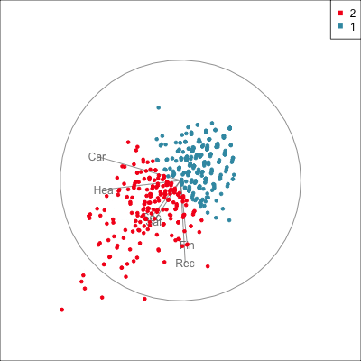
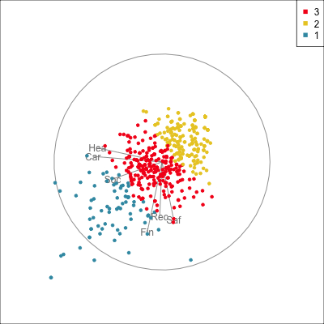
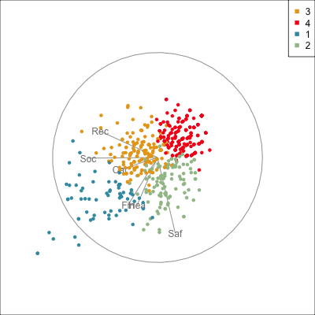
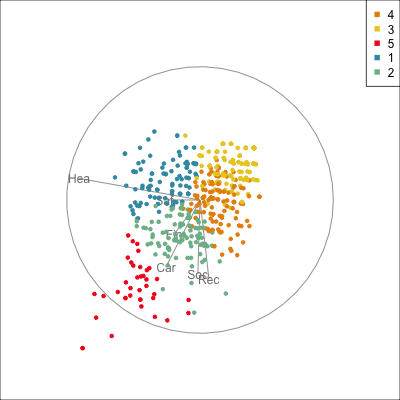

```{r include=FALSE}
#| echo: false
library(tidyverse)
library(patchwork)
library(colorspace)
library(tourr)
library(cassowaryr)
library(plotly)
library(ggstats)
library(MSA)
library(kableExtra)
library(conflicted)

# Set up chunk for all slides
knitr::opts_chunk$set(
  fig.width = 6,
  fig.height = 4,
  fig.align = "center",
  out.width = "100%",
  code.line.numbers = FALSE,
  fig.retina = 4,
  echo = TRUE,
  message = FALSE,
  warning = FALSE,
  cache = FALSE,
  dev.args = list(pointsize = 11)
)
options(
  digits = 2,
  width = 80,
  ggplot2.continuous.colour = "viridis",
  ggplot2.continuous.fill = "viridis",
  ggplot2.discrete.colour = c("#D55E00", "#0072B2", "#009E73", "#CC79A7", "#E69F00", "#56B4E9", "#F0E442"),
  ggplot2.discrete.fill = c("#D55E00", "#0072B2", "#009E73", "#CC79A7", "#E69F00", "#56B4E9", "#F0E442")
)
theme_set(theme_bw(base_size = 14) +
   theme(
     aspect.ratio = 1,
     plot.background = element_rect(fill = 'transparent', colour = NA),
     plot.title.position = "plot",
     plot.title = element_text(size = 24),
     panel.background = element_rect(fill = 'transparent', colour = NA),
     legend.background = element_rect(fill = 'transparent', colour = NA),
     legend.key = element_rect(fill = 'transparent', colour = NA)
   )
)

conflicts_prefer(dplyr::filter)
conflicts_prefer(dplyr::select)
conflicts_prefer(dplyr::slice)

```

### Exercise 1: Risk taking on vacation

The book “Market Segmentation Analysis - Understanding It, Doing It, and Making It Useful” by Sara Dolnicar, Bettina Grün and Friedrich Leisch has a selection of useful data sets. These can be used by installing the package:

```
install.packages("https://statistik.boku.ac.at/nachlass_leisch/MSA/packages/MSA_0.3-1.tar.gz", repos = NULL, type = "source")
```

If you can't install the package, you can download the data from [the book website](https://statistik.boku.ac.at/nachlass_leisch/MSA/).

Load the `risk` data. This data has 563 observations and 6 variables. 

The data was collected by academic researchers using a permission based online panel.

The sample was taken from adult Australian residents who have undertaken at least one holiday in the last year which involved staying away from home for at least four nights.

The respondents were asked: “Which risks have you taken in the past?” and answered on a 5-point scale with options:

- Never (1)
- Rarely (2)
- Quite often (3)
- Often (4)
- Very often (5)

The six types of risk, which form the variables were:

- Recreational risks (e.g., rock-climbing, scuba diving)
- Health risks (e.g., smoking, poor diet, high alcohol consumption)
- Career risks (e.g., quitting a job without another to go to)
- Financial risks (e.g., gambling, risky investments)
- Safety risks (e.g., speeding)
- Social risks (e.g., standing for election, publicly challenging a rule or decision)

a. Use AI to find an explanation of market segmentation. Write a few sentences to explain it.

::: unilur-solution

Market segmentation divides customers into groups with similar characteristics so a business can serve each group more effectively. It is sometimes achieved by using cluster analysis to discover groups in the data. 

Then so what is cluster analysis?

:::

b. What type of plots should you make for this data?

::: unilur-solution

Because this is categorical (ordinal) data a good choice would be to make Likert plots.

```{r}
#| label: likert
data(risk)
risk_f <- as_tibble(risk) |>
  mutate_if(is.numeric, as.factor)
risk_likert <- gglikert(
  risk_f,
  add_labels = FALSE,
  add_totals = FALSE,
  sort = "ascending"
) +
  scale_fill_brewer(palette = "RdBu", direction = -1) 
risk_likert
```

:::

c. What this doesn't consider is whether some customers respond similarly to other customers. How would you check this?

::: unilur-solution

This data can be considered to be numeric, and so we would compute the correlation.

```{r}
#| label: cor
cor(risk)
```

Another way to look at this is using a tour.

```{r}
#| label: tour
#| eval: false
animate_xy(risk)
```

There is moderate association between the responses. It is strictly linear, also.

:::

d. A common approach to do market segmentation is to conduct a cluster analysis (outside the scope of this class), which will divide the observations into groups. The question becomes "how many groups would be suitable to summarise the customer behaviour?" We are going to use the guided tour to help make the decision.

This is code that will do the clustering:

```{r}
risk_d <- apply(risk, 2, function(x) (x - mean(x)) / sd(x))

# Clustering
nc <- 5 # Set the number of clusters
set.seed(1145)
r_km <- kmeans(risk_d, centers = nc, iter.max = 500, nstart = 5)

r_km_d <- risk_d |>
  as_tibble() |>
  mutate(cl = factor(r_km$cluster)) |>
  bind_cols(model.matrix(~ as.factor(r_km$cluster) - 1))
colnames(r_km_d)[(ncol(r_km_d) - nc + 1):ncol(r_km_d)] <- paste0(
  "cluster",
  1:nc
)
r_km_d <- r_km_d |>
  mutate_at(vars(contains("cluster")), function(x) x + 1)
```

Change the number of clusters `nc` starting with 2 up to maybe 5. Examine how it is breaking the data, and what the groups would mean using the 6 types of risk. 

```{r}
#| label: tour-clusters
#| eval: false
animate_xy(r_km_d[, 1:6], guided_tour(lda_pp(r_km_d$cl)), col = r_km_d$cl)
```

::: unilur-solution









Two and three clusters breaks the data along the main direction of association, into low and high risk taker groups. Probably we'd choose the three groups here to have low, medium and high risk.

Four clusters breaks the moderate group into two, which balances recreational and social (possibly also career) against safety. This could be a useful grouping.

Five clusters breaks out this group further into health against social and recerational. Possibly this is also useful. 

I'd tend to stick wih the three groups, as the clearest distinction between customers, but I'm not a tourism operator.

:::


### Exercise 2: Parkinsons

This dataset is composed of a range of biomedical voice measurements from 31 people, 23 with Parkinson's disease (PD). Each column in the table is a particular voice measure, and each row corresponds one of 195 voice recording from these individuals ("name" column). The main aim of the data is to discriminate healthy people from those with PD, according to "status" column which is set to 0 for healthy and 1 for PD. 

The data is available at [The UCI Machine Learning Repository](https://archive.ics.uci.edu/ml/datasets/Parkinsons) in ASCII CSV format. The rows of the CSV file contain an instance corresponding to one voice recording. There are around six recordings per patient, the name of the patient is identified in the first column. There are 24 variables in the file, including the persons name in column 1. 

The data are originally analysed in:
Max A. Little, Patrick E. McSharry, Eric J. Hunter, Lorraine O. Ramig (2008), 'Suitability of dysphonia measurements for telemonitoring of Parkinson's disease', IEEE Transactions on Biomedical Engineering (to appear).

```{r}
#| label: load-data
#| eval: true
#| echo: true
library(cassowaryr)
# Load the data
data(pk)
```

a. How many pairwise plots would you need to look at, to look at all of them?

::: unilur-solution

There are 23 numeric variables in the data set, which would require `r 23*22/2` pairwise plots to be made.
:::

b. Compute several of the scagnostics (monotonic, outlying, clumpy2) for the first five variables of variables, except for `name`. (*Note*: We are using just five for computing speed, but the scagnostics could be calculated on all variables.)

```{r}
#| label: compute-scagnostics
#| eval: false
#| echo: true
# Compute the scagnostics on the relevant variables
s <- calc_scags_wide(pk[,2:5],
                scags=c("outlying","monotonic",
                        "clumpy2"))
s
```

::: unilur-solution

```{r}
#| eval: true
#| echo: false
#| message: false
#| label: compute-scagnostics
```

:::

c. Sort the scagnostics, separately by the values on (i) monotonic (ii) outlying (iii) clumpy2, and plot the pair of variables with the highest values on each.

::: unilur-solution

```{r}
#| label: monotonic
# Check the results for monotonic
s |> 
  select(Var1, Var2, monotonic) |> 
  arrange(desc(monotonic)) 
ggplot(data=pk, 
       aes(x=`MDVP:Fhi(Hz)`, y=`MDVP:Fo(Hz)`)) + 
  geom_point() + theme(aspect.ratio = 1)
```

The top pair of variables on monotonic has a strong positive association with the majority of points, and a few outliers. The top pair of variables on outlying, is also the top pair on clumpy2, and has outliers with some clumpiness in the mass of points with low values.

:::

d. Make an interactive scatterplot matrix. Browse over it to choose other interesting pairs of variables and make the plots.

::: unilur-solution

```{r}
#| label: splom
#| message: false
# Create an interactive splom
s <- s |>
  mutate(vars = paste(Var1, Var2))
highlight_key(s) |>
  GGally::ggpairs(columns = 3:5, mapping = aes(label = vars)) |>
  ggplotly(tooltip = "all", 
           width=500, 
           height=500) |>
  highlight("plotly_selected") 
```

:::

e. The scagnostics help us to find interesting associations between pairs of variables. However, the problem here is to detect differences between Parkinsons' patients and normal patients. How would you go about that? Think about some ideas long the line of scagnostics but look for differences between the two groups.

::: unilur-solution

```{r}
#| label: differences
# One way to examine difference between Parkinsons and healthy
pk_med <- pk |> 
  select(-name) |> 
  group_by(status) |>
  summarise_all(list(median, sd)) |>
  pivot_longer(
    cols=`MDVP:Fo(Hz)_fn1`:`PPE_fn2`,
    names_to="var", 
    values_to="value") |>
  separate(var, c("var","stat"), "_") |>
  mutate(stat = fct_recode(stat,
                           "m"="fn1",
                           "s"="fn2")) |>
  pivot_wider(names_from=stat,
              values_from=value) |>
  group_by(var) |>
  summarise(
    d = (m[status==0]-m[status==1])/sqrt(s[status==0]^2+s[status==1]^2))
pk_med |> arrange(desc(d)) |> head()

ggplot(pk, aes(x=factor(status), y=`MDVP:Fo(Hz)`)) + 
  geom_boxplot()

```

Generally we are looking for variables where the differences between the Parkinsons and normal patients are big. You need to measure big, relative to the variance of each group. Doing a two sample t-test for each variable is one approach. Here, I've computed the median for each group of patients and compared the difference in medians relative to the pooled standard deviation in each group.

:::

f. Now try to do this using the scagnostics.

::: unilur-solution

```{r}
#| label: pairs
# Check the pair of variables already examined
ggplot(data=pk, 
       aes(x=`MDVP:Fhi(Hz)`, 
           y=`MDVP:Fo(Hz)`, 
           colour=factor(status))) + 
  geom_point(alpha=0.5) + 
  scale_colour_discrete_divergingx(palette="Zissou 1") +
  theme(aspect.ratio = 1,
        legend.title = element_blank())
```

```{r}
#| label: compare
# Compute scagnostics separately for each group and compare differences
pk_0 <- pk |>
  filter(status == 0)
pk_1 <- pk |>
  filter(status == 1)
s_0 <- calc_scags_wide(pk_0[,2:5],
                scags=c("outlying","monotonic",
                        "clumpy2"))
s_1 <- calc_scags_wide(pk_1[,2:5],
                scags=c("outlying","monotonic",
                        "clumpy2"))
s_0 <- s_0 |>
  mutate(status = 0)
s_1 <- s_1 |>
  mutate(status = 1)
s <- bind_rows(s_0, s_1)  
s_wide <- s |>
  pivot_longer(outlying:monotonic, names_to="scag", values_to="value") |>
  pivot_wider(names_from = status, values_from = "value") |>
  mutate(d = abs(`1`-`0`)) |>
  arrange(desc(d))

```

```{r}
#| label: top
# Plot top pair
ggplot(data=pk, 
       aes(x=`MDVP:Jitter(%)`, 
           y=`MDVP:Fo(Hz)`, 
           colour=factor(status))) + 
  geom_point(alpha=0.5) + 
  scale_colour_discrete_divergingx(palette="Zissou 1") +
  theme(aspect.ratio = 1,
        legend.title = element_blank())
```

:::